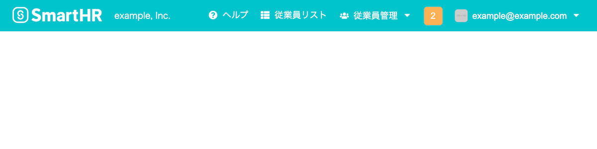
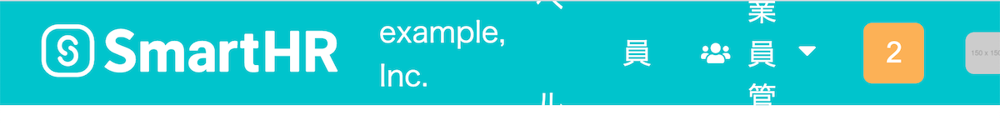

import { Table, Td, Th, DefinitionList } from 'smarthr-ui'

import { TableWrapper } from '@Components/contents/shared/TableWrapper'

<!-- textlint-disable -->

## 試験の結果および実施方法

<DefinitionList items={
  [
    {
      term: '表明日',
      description: <time datatime="2021-05-20">2021年5月20日</time>
    },
    {
      term: '規格の規格番号および改正年',
      description: 'JIS X 8341-3:2016'
    },
    {
      term: '満たしている適合レベル及び対応度',
      description: 

        
レベルA 一部準拠

        
<small>※ 本試験結果における「準拠」という対応度の表記は、情報通信アクセス協議会のウェブアクセシビリティ基盤委員会による<a href="https://waic.jp/docs/jis2016/compliance-guidelines/201603/">ウェブコンテンツのJIS X 8341-3:2016 対応度表記ガイドライン 2016年3月版</a>で定められた表記によるものです。</small>

        

    },
    {
      term: '対象となるウェブページに関する簡潔な説明',
      description: '開発中のコンポーネントを除く、SmartHR UIの全コンポーネント'
    },
    {
      term: '依存したウェブコンテンツ技術',
      description: 'HTML5、CSS、JavaScript、WAI-ARIA'
    },
    {
      term: '試験実施期間',
      description: <time datatime="2020-08-17">2020年8月17日</time> 〜 <time datatime="2021-05-11">2021年5月11日</time>
    },
    {
      term: '試験を行なったウェブページのURL',
      description: 末尾に<a href="#h2-3">試験を行なったウェブページのURL</a>をまとめて掲載
    },
    {
      term: '例外事項',
      description: '試験開始時に開発中だったコンポーネント'
    }
  ]
} />

## 達成基準チェックリスト

その達成基準に該当するコンポーネントがある場合には適用を「○」、該当箇所がない場合「－」と表記し、その達成基準を満たしている場合に結果を「○」、満たしていない場合「×」と表記します。

該当箇所がなく、適用が「－」の場合、その達成基準を満たしているとみなすため、結果は「○」とします。

達成基準のリンクは<abbr title="Web Contents Accessibility Guidelines">WCAG</abbr> 2.0解説書へのリンクです。

<TableWrapper type="narrow">
  <Table>
    <thead>
      <tr>
        <Th>達成基準</Th>
        <Th>等級</Th>
        <Th>適用</Th>
        <Th>結果</Th>
      </tr>
    </thead>
    <tbody>

<tr>
    <Td><a href="https://waic.jp/docs/UNDERSTANDING-WCAG20/text-equiv-all.html">1.1.1 非テキストコンテンツ</a></Td>
    <Td>A</Td>
    <Td>○</Td>
    <Td>○</Td>
</tr>
<tr>
    <Td><a href="https://waic.jp/docs/UNDERSTANDING-WCAG20/media-equiv-av-only-alt.html">1.2.1 音声だけ及び映像だけ（収録済み）</a></Td>
    <Td>A</Td>
    <Td>－</Td>
    <Td>○</Td>
</tr>
<tr>
    <Td><a href="https://waic.jp/docs/UNDERSTANDING-WCAG20/media-equiv-captions.html">1.2.2 キャプション（収録済み）</a></Td>
    <Td>A</Td>
    <Td>－</Td>
    <Td>○</Td>
</tr>
<tr>
    <Td><a href="https://waic.jp/docs/UNDERSTANDING-WCAG20/media-equiv-audio-desc.html">1.2.3 音声解説又はメディアに対する代替コンテンツ（収録済み）</a></Td>
    <Td>A</Td>
    <Td>－</Td>
    <Td>○</Td>
</tr>
<tr>
    <Td><a href="https://waic.jp/docs/UNDERSTANDING-WCAG20/content-structure-separation-programmatic.html">1.3.1 情報及び関係性</a></Td>
    <Td>A</Td>
    <Td>○</Td>
    <Td>×</Td>
</tr>
<tr>
    <Td><a href="https://waic.jp/docs/UNDERSTANDING-WCAG20/content-structure-separation-sequence.html">1.3.2 意味のある順序</a></Td>
    <Td>A</Td>
    <Td>○</Td>
    <Td>○</Td>
</tr>
<tr>
    <Td><a href="https://waic.jp/docs/UNDERSTANDING-WCAG20/content-structure-separation-understanding.html">1.3.3 感覚的な特徴</a></Td>
    <Td>A</Td>
    <Td>○</Td>
    <Td>○</Td>
</tr>
<tr>
    <Td><a href="https://waic.jp/docs/WCAG21/Understanding/use-of-color.html">1.4.1 色の使用</a></Td>
    <Td>A</Td>
    <Td>○</Td>
    <Td>○</Td>
</tr>
<tr>
    <Td><a href="https://waic.jp/docs/UNDERSTANDING-WCAG20/visual-audio-contrast-dis-audio.html">1.4.2 音声の制御</a></Td>
    <Td>A</Td>
    <Td>－</Td>
    <Td>○</Td>
</tr>
<tr>
    <Td><a href="https://waic.jp/docs/WCAG21/Understanding/contrast-minimum.html">1.4.3 コントラスト（最低限）</a></Td>
    <Td>AA</Td>
    <Td>○</Td>
    <Td>×</Td>
</tr>
<tr>
    <Td><a href="https://waic.jp/docs/WCAG21/Understanding/resize-text.html">1.4.4 テキストのサイズ変更</a></Td>
    <Td>AA</Td>
    <Td>○</Td>
    <Td>×</Td>
</tr>
<tr>
    <Td><a href="https://waic.jp/docs/WCAG21/Understanding/images-of-text.html">1.4.5 文字画像</a></Td>
    <Td>AA</Td>
    <Td>－</Td>
    <Td>○</Td>
</tr>
<tr>
    <Td><a href="https://waic.jp/docs/WCAG21/Understanding/keyboard.html">2.1.1 キーボード</a></Td>
    <Td>A</Td>
    <Td>○</Td>
    <Td>○</Td>
</tr>
<tr>
    <Td><a href="https://waic.jp/docs/WCAG21/Understanding/no-keyboard-trap.html">2.1.2 キーボードトラップなし</a></Td>
    <Td>A</Td>
    <Td>○</Td>
    <Td>○</Td>
</tr>
<tr>
    <Td><a href="https://waic.jp/docs/UNDERSTANDING-WCAG20/time-limits-required-behaviors.html">2.2.1 タイミング調整可能</a></Td>
    <Td>A</Td>
    <Td>○</Td>
    <Td>×</Td>
</tr>
<tr>
    <Td><a href="https://waic.jp/docs/UNDERSTANDING-WCAG20/time-limits-pause.html">2.2.2 一時停止、停止、非表示</a></Td>
    <Td>A</Td>
    <Td>○</Td>
    <Td>○</Td>
</tr>
<tr>
    <Td><a href="https://waic.jp/docs/UNDERSTANDING-WCAG20/seizure-does-not-violate.html">2.3.1 3回のせん（閃）光、又はしきい（閾）値以下</a></Td>
    <Td>A</Td>
    <Td>○</Td>
    <Td>○</Td>
</tr>
<tr>
    <Td><a href="https://waic.jp/docs/UNDERSTANDING-WCAG20/navigation-mechanisms-skip.html">2.4.1 ブロックスキップ</a></Td>
    <Td>A</Td>
    <Td>－</Td>
    <Td>○</Td>
</tr>
<tr>
    <Td><a href="https://waic.jp/docs/UNDERSTANDING-WCAG20/navigation-mechanisms-title.html">2.4.2 ページタイトル</a></Td>
    <Td>A</Td>
    <Td>－</Td>
    <Td>○</Td>
</tr>
<tr>
    <Td><a href="https://waic.jp/docs/WCAG21/Understanding/focus-order.html">2.4.3 フォーカス順序</a></Td>
    <Td>A</Td>
    <Td>○</Td>
    <Td>○</Td>
</tr>
<tr>
    <Td><a href="https://waic.jp/docs/WCAG21/Understanding/link-purpose-in-context.html">2.4.4 リンクの目的（コンテキスト内）</a></Td>
    <Td>A</Td>
    <Td>○</Td>
    <Td>○</Td>
</tr>
<tr>
    <Td><a href="https://waic.jp/docs/WCAG21/Understanding/focus-visible.html">2.4.7 フォーカスの可視化</a></Td>
    <Td>AA</Td>
    <Td>○</Td>
    <Td>○</Td>
</tr>
<tr>
    <Td><a href="https://waic.jp/docs/UNDERSTANDING-WCAG20/meaning-doc-lang-id.html">3.1.1 ページの言語</a></Td>
    <Td>A</Td>
    <Td>－</Td>
    <Td>○</Td>
</tr>
<tr>
    <Td><a href="https://waic.jp/docs/WCAG21/Understanding/on-focus.html">3.2.1 フォーカス時</a></Td>
    <Td>A</Td>
    <Td>－</Td>
    <Td>○</Td>
</tr>
<tr>
    <Td><a href="https://waic.jp/docs/WCAG21/Understanding/on-input.html">3.2.2 入力時</a></Td>
    <Td>A</Td>
    <Td>－</Td>
    <Td>○</Td>
</tr>
<tr>
    <Td><a href="https://waic.jp/docs/WCAG21/Understanding/error-identification.html">3.3.1 エラーの特定</a></Td>
    <Td>A</Td>
    <Td>－</Td>
    <Td>○</Td>
</tr>
<tr>
    <Td><a href="https://waic.jp/docs/WCAG21/Understanding/labels-or-instructions.html">3.3.2 ラベル又は説明</a></Td>
    <Td>A</Td>
    <Td>○</Td>
    <Td>×</Td>
</tr>
<tr>
    <Td><a href="https://waic.jp/docs/WCAG21/Understanding/parsing.html">4.1.1 構文解析</a></Td>
    <Td>A</Td>
    <Td>○</Td>
    <Td>○</Td>
</tr>
<tr>
    <Td><a href="https://waic.jp/docs/WCAG21/Understanding/name-role-value.html">4.1.2 名前（name），役割（role）及び値（value）</a></Td>
    <Td>A</Td>
    <Td>○</Td>
    <Td>×</Td>
</tr>
    </tbody>
  </Table>
</TableWrapper>

- 「2.4.2 ページタイトル」および「3.1.1 ページの言語」は、ページが検証対象ではないため該当箇所なしとした。
- 「3.2.1 フォーカス時」および「3.2.2 入力時」は、実際の操作が与えられない状態での検証のため該当箇所なしとした。
- 「3.3.1 エラーの特定」は、コンポーネント単体で検討できないため該当箇所なしとした。

## 満たしていない達成基準の事例と対応策

今回の試験で見つかった、達成基準を満たせていない事例とそれらへの対応策を示します。<small style={{ display: 'block' }}>※すべての事例を紹介するものではありません。</small>

### 1.3.1 情報及び関係性

#### `<FieldSet>` 入力要素とラベルが関連付けされていない

<DefinitionList items={[
  {
    term: '対象のページ',
    description: <a href="https://story.smarthr-ui.dev/iframe.html?id=forms（フォーム）-fieldset（非推奨）--all">FieldSet</a>
  },
  {
    term: '対応方法',
    description: 'Filedsetコンポーネントは非推奨とし、代わりに適合したFormGroupコンポーネントの利用を推奨する'
  },
  ]} />

### 1.3.2 意味のある順序

#### `<DatePicker>` 表形式の日付選択と入力欄のDOMが離れているが関連付けられていない

<DefinitionList items={[
  {
    term: '対象のページ',
    description: <><a href="https://story.smarthr-ui.dev/iframe.html?id=forms（フォーム）-datepicker--all">DatePicker</a></>
  },
  {
    term: '対応方法',
    description: 'aria-controlsとaria-expandedで関連付けをする'
  }
  ]} />

### 1.4.3 コントラスト (最低限)

#### ブランドカラーと白の組み合わせ

<DefinitionList items={[
  {
    term: '対象のページ',
    description: <><a href="https://story.smarthr-ui.dev/iframe.html?id=navigation（ナビゲーション）-header">Header</a>, Footer</>
  },
  {
    term: '対応方法',
    description: 'Header, Footer コンポーネントをコントラスト比も担保される形で作り直す予定です'
  }
  ]} />

#### オレンジと白の組み合わせ

<DefinitionList items={[
  {
    term: '対象のページ',
    description: <><a href="https://story.smarthr-ui.dev/iframe.html?id=states（状態）-statuslabel">StatusLabel</a>, <a href="https://story.smarthr-ui.dev/iframe.html?id=navigation（ナビゲーション）-header">Header</a></>
  },
  {
    term: '対応方法',
    description: '白との組み合わせでコントラスト比が確保される警告色を検討します'
  }
  ]} />

### 1.4.4 テキストのサイズ変更

#### テキストサイズを200%に拡大すると、隠れて読めないテキストがある

<DefinitionList items={[
  {
    term: '対象のページ',
    description: <><a href="https://story.smarthr-ui.dev/iframe.html?id=navigation（ナビゲーション）-header">Header</a>, Footer</>
  },
  {
    term: '対応方法',
    description: 'Headerを作り直す際にテキストの拡大に対応します'
  }
  ]} />

### 2.2.1 タイミング調整可能

#### `<FlashMessage>` の標準動作が8秒で消える

<DefinitionList items={[
  {
    term: '対象のページ',
    description: <><a href="https://story.smarthr-ui.dev/iframe.html?id=states（状態）-flashmessage（非推奨）--demo">FlashMessage - Demo</a></>
  },
  {
    term: '対応方法',
    description: 'FlashMessageに重要なコンテンツを記載しない、または重要なコンテンツをFlashMessageで表示せざるを得ない場合は、自動で消えない設定で利用する'
  }
  ]} />

### 3.3.2 ラベル、または説明

#### `<RightFixedNote>` のtextareaにラベルがない

### 4.1.2 名前（name），役割（role）及び値（value）

#### `<MultiCombobox>` で選択された項目がvalueとなっていない

<DefinitionList items={[
  {
    term: '対象のページ',
    description: <><a href="https://story.smarthr-ui.dev/iframe.html?id=forms（フォーム）-combobox">Combobox</a></>
  },
  {
    term: '内容',
    description: 'すでに選択した項目がComboboxのvalueとして機械可読な形になっていない'
  },
  {
    term: '対応方法',
    description: 'すでに選択した項目に選択していることを示すセマンティクスを付与する'
  }
  ]} />

## 試験を行なったウェブページのURL

試験をしたコンポーネントの代表的なURLのみを掲載します。

- [AccordionPanel](https://story.smarthr-ui.dev/iframe.html?id=data-display（データ表示）-accordionpanel)
- [AppNavi](https://story.smarthr-ui.dev/iframe.html?id=navigation（ナビゲーション）-appnavi)
- [Balloon](https://story.smarthr-ui.dev/iframe.html?id=data-display（データ表示）-balloon)
- [Base](https://story.smarthr-ui.dev/iframe.html?id=data-display（データ表示）-base)
- [BottomFixedArea](https://story.smarthr-ui.dev/iframe.html?id=navigation（ナビゲーション）-bottomfixedarea)
- [Button](https://story.smarthr-ui.dev/iframe.html?id=buttons（ボタン）-button)
- [Calendar](https://story.smarthr-ui.dev/iframe.html?id=data-display（データ表示）-calendar)
- [CheckBox](https://story.smarthr-ui.dev/iframe.html?id=forms（フォーム）-checkbox)
- CheckBoxLabel
- [Combobox](https://story.smarthr-ui.dev/iframe.html?id=forms（フォーム）-combobox)
- [DatePicker](https://story.smarthr-ui.dev/iframe.html?id=forms（フォーム）-datepicker)
- [DefinitionList](https://story.smarthr-ui.dev/iframe.html?id=data-display（データ表示）-definitionlist)
- [Dialog](https://story.smarthr-ui.dev/iframe.html?id=dialog（ダイアログ）-dialog)
- [DropZone](https://story.smarthr-ui.dev/iframe.html?id=forms（フォーム）-dropzone)
- [Dropdown](https://story.smarthr-ui.dev/iframe.html?id=buttons（ボタン）-dropdown)
- [FilterDropdown](https://story.smarthr-ui.dev/iframe.html?id=buttons（ボタン）-dropdown--filter-dropdown)
- [FieldSet](https://story.smarthr-ui.dev/iframe.html?id=forms（フォーム）-fieldset（非推奨）)
- [FlashMessage](https://story.smarthr-ui.dev/iframe.html?id=states（状態）-flashmessage（非推奨）)
- Footer
- [Header](https://story.smarthr-ui.dev/iframe.html?id=navigation（ナビゲーション）-header)
- [Heading](https://story.smarthr-ui.dev/iframe.html?id=text（テキスト）-heading)
- [HeadlineArea](https://story.smarthr-ui.dev/iframe.html?id=data-display（データ表示）-headlinearea)
- [Icon](https://story.smarthr-ui.dev/iframe.html?id=media（メディア）-icon)
- BlankImage
- IndexNav
- [InformationPanel](https://story.smarthr-ui.dev/iframe.html?id=data-display（データ表示）-informationpanel)
- [Input](https://story.smarthr-ui.dev/iframe.html?id=forms（フォーム）-input)
- [Loader](https://story.smarthr-ui.dev/iframe.html?id=states（状態）-loader)
- [MessageScreen](https://story.smarthr-ui.dev/iframe.html?id=page-templates（ページテンプレート）-messagescreen)
- [Pagination](https://story.smarthr-ui.dev/iframe.html?id=navigation（ナビゲーション）-pagination)
- [RadioButton](https://story.smarthr-ui.dev/iframe.html?id=forms（フォーム）-radiobutton)
- RadioButtonLabel
- [RightFixedNote](https://story.smarthr-ui.dev/iframe.html?id=data-display（データ表示）-rightfixednote)
- [SegmentedControl](https://story.smarthr-ui.dev/iframe.html?id=buttons（ボタン）-segmentedcontrol)
- [Select](https://story.smarthr-ui.dev/iframe.html?id=forms（フォーム）-select)
- [SmartHRLogo](https://story.smarthr-ui.dev/iframe.html?id=media（メディア）-smarthrlogo)
- [StatusLabel](https://story.smarthr-ui.dev/iframe.html?id=states（状態）-statuslabel)
- [TabBar](https://story.smarthr-ui.dev/iframe.html?id=navigation（ナビゲーション）-tabbar)
- [Table](https://story.smarthr-ui.dev/iframe.html?id=data-display（データ表示）-table)
- [Textarea](https://story.smarthr-ui.dev/iframe.html?id=forms（フォーム）-textarea)
- [Tooltip](https://story.smarthr-ui.dev/iframe.html?id=data-display（データ表示）-tooltip)

<!-- textlint-enable -->
