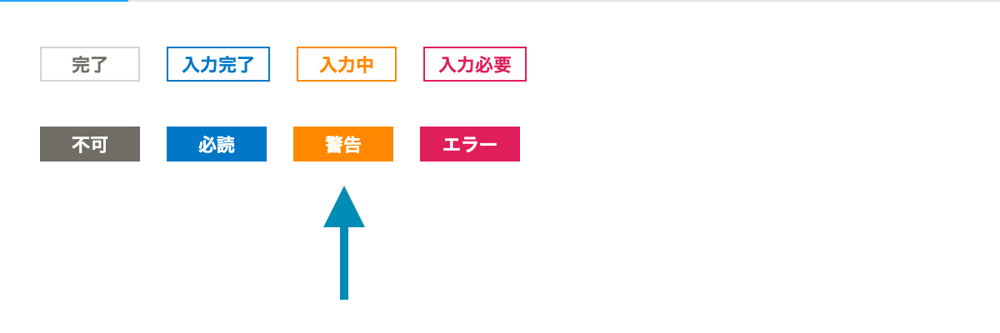

import { Table, Body, Head, Row, Cell, DefinitionList } from 'smarthr-ui'

## 試験概要

[ウェブアクセシビリティ試験結果 - 2021年5月](../202105/)にて満たせていなかった達成基準の改善と、新規に開発されたコンポーネントについての試験です。

## 試験の結果および実施方法

<!-- textlint-disable -->

<DefinitionList items={
  [
    {
      term: '表明日',
      description: <time datatime="2021-12-24">2021年12月24日</time>
    },
    {
      term: '規格の規格番号および改正年',
      description: 'JIS X 8341-3:2016'
    },
    {
      term: '満たしている適合レベル及び対応度',
      description: 

        
レベルA 一部準拠

        
<small>※ 本試験結果における「準拠」という対応度の表記は、情報通信アクセス協議会のウェブアクセシビリティ基盤委員会による<a href="https://waic.jp/docs/jis2016/compliance-guidelines/201603/">ウェブコンテンツのJIS X 8341-3:2016 対応度表記ガイドライン 2016年3月版</a>で定められた表記によるものです。</small>

        

    },
    {
      term: '対象となるウェブページに関する簡潔な説明',
      description: 'SmartHR UIのコンポーネント（非推奨を除く）'
    },
    {
      term: '依存したウェブコンテンツ技術',
      description: 'HTML5、CSS、JavaScript、WAI-ARIA'
    },
    {
      term: '試験実施期間',
      description: <time datatime="2021-08-11">2021年8月11日</time> 〜 <time datatime="2021-11-30">2021年11月30日</time>
    },
    {
      term: '試験を行なったウェブページのURL',
      description: 末尾に<a href="#h2-5">試験を行なったウェブページのURL</a>をまとめて掲載
    }
  ]
} />

<!-- textlint-enable -->

### 非推奨のコンポーネント

- [FieldSet](https://smarthr-ui.netlify.app/?path=/story/fieldset--all)
- Header（削除済）

## 達成基準チェックリスト

その達成基準に該当するコンポーネントがある場合には適用を「○」、該当箇所がない場合「－」と表記し、その達成基準を満たしている場合に結果を「○」、満たしていない場合「×」と表記します。

該当箇所がなく、適用が「－」の場合、その達成基準を満たしているとみなすため、結果は「○」とします。

達成基準のリンクは<abbr title="Web Contents Accessibility Guidelines">WCAG</abbr> 2.0解説書へのリンクです。

<Table>
  <Head>
    <Row>
      <Cell>達成基準</Cell>
      <Cell>等級</Cell>
      <Cell>適用</Cell>
      <Cell>結果</Cell>
    </Row>
  </Head>
  <Body>

<Row>
    <Cell><a href="https://waic.jp/docs/UNDERSTANDING-WCAG20/text-equiv-all.html">1.1.1 非テキストコンテンツ</a></Cell>
    <Cell>A</Cell>
    <Cell>○</Cell>
    <Cell>○</Cell>
</Row>
<Row>
    <Cell><a href="https://waic.jp/docs/UNDERSTANDING-WCAG20/media-equiv-av-only-alt.html">1.2.1 音声だけ及び映像だけ（収録済み）</a></Cell>
    <Cell>A</Cell>
    <Cell>－</Cell>
    <Cell>○</Cell>
</Row>
<Row>
    <Cell><a href="https://waic.jp/docs/UNDERSTANDING-WCAG20/media-equiv-captions.html">1.2.2 キャプション（収録済み）</a></Cell>
    <Cell>A</Cell>
    <Cell>－</Cell>
    <Cell>○</Cell>
</Row>
<Row>
    <Cell><a href="https://waic.jp/docs/UNDERSTANDING-WCAG20/media-equiv-audio-desc.html">1.2.3 音声解説又はメディアに対する代替コンテンツ（収録済み）</a></Cell>
    <Cell>A</Cell>
    <Cell>－</Cell>
    <Cell>○</Cell>
</Row>
<Row>
    <Cell><a href="https://waic.jp/docs/UNDERSTANDING-WCAG20/content-structure-separation-programmatic.html">1.3.1 情報及び関係性</a></Cell>
    <Cell>A</Cell>
    <Cell>○</Cell>
    <Cell>○</Cell>
</Row>
<Row>
    <Cell><a href="https://waic.jp/docs/UNDERSTANDING-WCAG20/content-structure-separation-sequence.html">1.3.2 意味のある順序</a></Cell>
    <Cell>A</Cell>
    <Cell>○</Cell>
    <Cell>○</Cell>
</Row>
<Row>
    <Cell><a href="https://waic.jp/docs/UNDERSTANDING-WCAG20/content-structure-separation-understanding.html">1.3.3 感覚的な特徴</a></Cell>
    <Cell>A</Cell>
    <Cell>○</Cell>
    <Cell>○</Cell>
</Row>
<Row>
    <Cell><a href="https://waic.jp/docs/WCAG21/Understanding/use-of-color.html">1.4.1 色の使用</a></Cell>
    <Cell>A</Cell>
    <Cell>○</Cell>
    <Cell>○</Cell>
</Row>
<Row>
    <Cell><a href="https://waic.jp/docs/UNDERSTANDING-WCAG20/visual-audio-contrast-dis-audio.html">1.4.2 音声の制御</a></Cell>
    <Cell>A</Cell>
    <Cell>－</Cell>
    <Cell>○</Cell>
</Row>
<Row>
    <Cell><a href="https://waic.jp/docs/WCAG21/Understanding/contrast-minimum.html">1.4.3 コントラスト（最低限）</a></Cell>
    <Cell>AA</Cell>
    <Cell>○</Cell>
    <Cell>×</Cell>
</Row>
<Row>
    <Cell><a href="https://waic.jp/docs/WCAG21/Understanding/resize-text.html">1.4.4 テキストのサイズ変更</a></Cell>
    <Cell>AA</Cell>
    <Cell>○</Cell>
    <Cell>×</Cell>
</Row>
<Row>
    <Cell><a href="https://waic.jp/docs/WCAG21/Understanding/images-of-text.html">1.4.5 文字画像</a></Cell>
    <Cell>AA</Cell>
    <Cell>－</Cell>
    <Cell>○</Cell>
</Row>
<Row>
    <Cell><a href="https://waic.jp/docs/WCAG21/Understanding/keyboard.html">2.1.1 キーボード</a></Cell>
    <Cell>A</Cell>
    <Cell>○</Cell>
    <Cell>○</Cell>
</Row>
<Row>
    <Cell><a href="https://waic.jp/docs/WCAG21/Understanding/no-keyboard-trap.html">2.1.2 キーボードトラップなし</a></Cell>
    <Cell>A</Cell>
    <Cell>○</Cell>
    <Cell>○</Cell>
</Row>
<Row>
    <Cell><a href="https://waic.jp/docs/UNDERSTANDING-WCAG20/time-limits-required-behaviors.html">2.2.1 タイミング調整可能</a></Cell>
    <Cell>A</Cell>
    <Cell>○</Cell>
    <Cell>×</Cell>
</Row>
<Row>
    <Cell><a href="https://waic.jp/docs/UNDERSTANDING-WCAG20/time-limits-pause.html">2.2.2 一時停止、停止、非表示</a></Cell>
    <Cell>A</Cell>
    <Cell>○</Cell>
    <Cell>○</Cell>
</Row>
<Row>
    <Cell><a href="https://waic.jp/docs/UNDERSTANDING-WCAG20/seizure-does-not-violate.html">2.3.1 3回のせん（閃）光、又はしきい（閾）値以下</a></Cell>
    <Cell>A</Cell>
    <Cell>○</Cell>
    <Cell>○</Cell>
</Row>
<Row>
    <Cell><a href="https://waic.jp/docs/UNDERSTANDING-WCAG20/navigation-mechanisms-skip.html">2.4.1 ブロックスキップ</a></Cell>
    <Cell>A</Cell>
    <Cell>－</Cell>
    <Cell>○</Cell>
</Row>
<Row>
    <Cell><a href="https://waic.jp/docs/UNDERSTANDING-WCAG20/navigation-mechanisms-title.html">2.4.2 ページタイトル</a></Cell>
    <Cell>A</Cell>
    <Cell>－</Cell>
    <Cell>○</Cell>
</Row>
<Row>
    <Cell><a href="https://waic.jp/docs/WCAG21/Understanding/focus-order.html">2.4.3 フォーカス順序</a></Cell>
    <Cell>A</Cell>
    <Cell>○</Cell>
    <Cell>○</Cell>
</Row>
<Row>
    <Cell><a href="https://waic.jp/docs/WCAG21/Understanding/link-purpose-in-context.html">2.4.4 リンクの目的（コンテキスト内）</a></Cell>
    <Cell>A</Cell>
    <Cell>○</Cell>
    <Cell>○</Cell>
</Row>
<Row>
    <Cell><a href="https://waic.jp/docs/WCAG21/Understanding/focus-visible.html">2.4.7 フォーカスの可視化</a></Cell>
    <Cell>AA</Cell>
    <Cell>○</Cell>
    <Cell>○</Cell>
</Row>
<Row>
    <Cell><a href="https://waic.jp/docs/UNDERSTANDING-WCAG20/meaning-doc-lang-id.html">3.1.1 ページの言語</a></Cell>
    <Cell>A</Cell>
    <Cell>－</Cell>
    <Cell>○</Cell>
</Row>
<Row>
    <Cell><a href="https://waic.jp/docs/WCAG21/Understanding/on-focus.html">3.2.1 フォーカス時</a></Cell>
    <Cell>A</Cell>
    <Cell>－</Cell>
    <Cell>○</Cell>
</Row>
<Row>
    <Cell><a href="https://waic.jp/docs/WCAG21/Understanding/on-input.html">3.2.2 入力時</a></Cell>
    <Cell>A</Cell>
    <Cell>－</Cell>
    <Cell>○</Cell>
</Row>
<Row>
    <Cell><a href="https://waic.jp/docs/WCAG21/Understanding/error-identification.html">3.3.1 エラーの特定</a></Cell>
    <Cell>A</Cell>
    <Cell>－</Cell>
    <Cell>○</Cell>
</Row>
<Row>
    <Cell><a href="https://waic.jp/docs/WCAG21/Understanding/labels-or-instructions.html">3.3.2 ラベル又は説明</a></Cell>
    <Cell>A</Cell>
    <Cell>○</Cell>
    <Cell>○</Cell>
</Row>
<Row>
    <Cell><a href="https://waic.jp/docs/WCAG21/Understanding/parsing.html">4.1.1 構文解析</a></Cell>
    <Cell>A</Cell>
    <Cell>○</Cell>
    <Cell>○</Cell>
</Row>
<Row>
    <Cell><a href="https://waic.jp/docs/WCAG21/Understanding/name-role-value.html">4.1.2 名前（name），役割（role）及び値（value）</a></Cell>
    <Cell>A</Cell>
    <Cell>○</Cell>
    <Cell>×</Cell>
</Row>
  </Body>
</Table>

- 「2.4.2 ページタイトル」および「3.1.1 ページの言語」は、ページが検証対象ではないため該当箇所なしとした。
- 「3.2.1 フォーカス時」および「3.2.2 入力時」は、実際の操作が与えられない状態での検証のため該当箇所なしとした。
- 「3.3.1 エラーの特定」は、コンポーネント単体で検討できないため該当箇所なしとした。

## 前回試験から改善した事例

### 1.3.2 意味のある順序

#### `<DatePicker>` 表形式の日付選択と入力欄のDOMが離れているが関連付けられていない

<!-- textlint-disable -->

<DefinitionList items={[
  {
    term: '対象のページ',
    description: <a href="https://smarthr-ui.netlify.app/iframe.html?id=datepicker">DatePicker</a>
  },
  {
    term: '対応方法',
    description: 'aria-controlsとaria-expandedで関連付けをする'
  },
  {
    term: '改善',
    description: <a href="https://github.com/kufu/smarthr-ui/pull/1629">fix: added some attributes for accessibility SHRUI-382
#1629</a>
  }
  ]} />

<!-- textlint-enable -->

### 3.3.2 ラベル、または説明

#### `<RightFixedNote>` のtextareaにラベルがない

<!-- textlint-disable -->

<DefinitionList items={[
  {
    term: '対象のページ',
    description: <a href="https://smarthr-ui.netlify.app/?path=/story/rightfixednote--all">RightFixedNote</a>
  },
  {
    term: '対応方法',
    description: 'textareaに可視のラベルを追加'
  },
  {
    term: '改善',
    description: <a href="https://github.com/kufu/smarthr-ui/pull/1744">feat!: RightFixedNote の textareaLabel を表示する (SHRUI-404) #1744</a>
  }
  ]} />

<!-- textlint-enable -->

## 満たしていない達成基準の事例と対応策

現時点で達成基準を満たせていない事例とそれらへの対応策を示します。<small style={{ display: 'block' }}>※すべての事例を紹介するものではありません。</small>

### 1.4.3 コントラスト (最低限)

#### `<StatusLabel>` の `warning`

<!-- textlint-disable -->

<DefinitionList items={[
  {
    term: '対象のページ',
    description: <a href="https://smarthr-ui.netlify.app/iframe.html?id=statuslabel">StatusLabel</a>
  },
  {
    term: '対応方法',
    description: '白との組み合わせでコントラスト比が確保される警告色を検討します'
  }
  ]} />

<!-- textlint-enable -->

### 2.2.1 タイミング調整可能

#### `<FlashMessage>` の標準動作が8秒で消える

<!-- textlint-disable -->

<DefinitionList items={[
  {
    term: '対象のページ',
    description: <a href="https://smarthr-ui.netlify.app/iframe.html?id=flashmessage--demo">FlashMessage</a>
  },
  {
    term: '対応方法',
    description: 'FlashMessageを自動で消さないオプションの追加、およびFlashMessageに変わるコンポーネントの作成'
  }
  ]} />

<!-- textlint-enable -->

#### `<MultiCombobox>` で選択された項目がvalueとなっていない

<!-- textlint-disable -->

<DefinitionList items={[
  {
    term: '対象のページ',
    description: <><a href="https://smarthr-ui.netlify.app/iframe.html?id=combobox">Combobox</a></>
  },
  {
    term: '内容',
    description: 'すでに選択した項目がComboboxのvalueとして機械可読な形になっていない'
  },
  {
    term: '対応方法',
    description: 'すでに選択した項目に選択していることを示すセマンティクスを付与する'
  }
  ]} />

<!-- textlint-enable -->

## 適合としたが注意が必要なコンポーネント

### `<FormGroup>`

<!-- textlint-disable -->

<DefinitionList items={[
  {
    term: '対象のページ',
    description: <><a href="https://smarthr-ui.netlify.app/?path=/story/formgroup--all">FormGroup</a></>
  },
  {
    term: '内容',
    description: '複数の入力をグルーピングする目的で利用する場合、role="group"を利用者側が付与する必要がある。'
  }
  ]} />

## 試験したウェブページのURL

<!-- textlint-enable -->

試験をしたコンポーネントの代表的なURLのみを掲載します。

- [FloatArea](https://smarthr-ui.netlify.app/?path=/story/floatarea--all)
- [FormGroup](https://smarthr-ui.netlify.app/?path=/story/formgroup--all)
- [InputFile](https://smarthr-ui.netlify.app/?path=/story/inputfile--all)
- [LineClamp](https://smarthr-ui.netlify.app/?path=/story/lineclamp--all)
- [SegmentedControl](https://smarthr-ui.netlify.app/?path=/story/segmentedcontrol--all)
- [TextLink](https://smarthr-ui.netlify.app/?path=/story/textarea--all)
- [FilterDropdown](https://smarthr-ui.netlify.app/?path=/story/filterdropdown--default)
