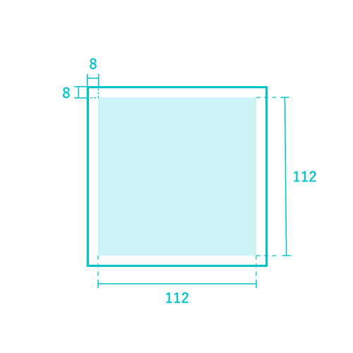

アイコンを作成する際のガイドラインです。

## デザインデータ
- マスターデータ：[master | Googleドライブ](https://drive.google.com/drive/u/1/folders/1GITBH1tHEYVaEFoXdxxnIz-FC5iS8VSW)
- 社内ライブラリ：[アイコン | Figma](https://www.figma.com/file/wTjPGUsrbI0OqSLIEtwvvG/%E3%82%A2%E3%82%A4%E3%82%B3%E3%83%B3%EF%BC%88Communication%EF%BC%89?node-id=610%3A347)

### マスターデータの注意点
- マスターデータは完成したアイコンを管理するものです。新規アイコンを作成する際は、**複製してから**作業をしてください。
- マスターデータの更新はすべて @omame が担当しますので、アイコン作成後にお声かけください。

## 概要
- **アイコンは、基本的にFont Awesome(Freeプラン)から選定します。適したアイコンがない場合は、トンマナを合わせてオリジナルで作成します。**これは、アイコンのデザイントンマナをプロダクトで数多く利用しているFont Awesomeに合わせて統一することで、サービス全体で一環した印象を保つためです。
- 既存アイコンがFont Awesomeか、オリジナルかは[アイコン | Figma](https://www.figma.com/file/wTjPGUsrbI0OqSLIEtwvvG/%E3%82%A2%E3%82%A4%E3%82%B3%E3%83%B3%EF%BC%88Communication%EF%BC%89?node-id=610%3A347)に記載しています。
- アイコンはoutlineとsolidの2種類を用意します。

## 1.Font Awesomeを利用する方法
- outline・solidどちらも、Font Awesome のFreeプランから選定して、利用してください。
- solidがFreeプランに含まれていても、outline（Font Awesome内での表記はRegular）は別プランの場合があります。その場合は以下のルールで作成してください。

| 事例 | 作成方法 |
| --- | --- |
|outline（Regular）がsolidを反転した形状 | outline、solidどちらもオリジナルで作成 |
|outline（Regular）がsolidの反転とは違う形状 | solidはFont Awesomeを利用。outlineはsolidを反転する形でオリジナルで作成 |

※Font Awesome ver 6.0.0 時点

## 2.オリジナルで作成する方法
オリジナルで作成する場合は、Font Awesomeアイコンのトーンに合わせ、並んだときに違和感のないよう作成してください。  
outlineはFont AwesomeのRegular、solidはFont AwesomeのSolidに見た目を合わせます。

### アートボードサイズ
128×128pxで作成してください。

### レイアウト
アイコンの周りには上下左右に各8pxの余白を確保してください

### 基本形状
マスターデータ内に、Font Awesomeのアイコンと並んだときに違和感のないようなKeylineを配置しています。  
できるだけKeylineに合わせることで、サイズ感や形状など見た目を統一できます。

#### 線
基本を10pxとして作成してください。

#### 角丸
基本を半径8pxとして作成してください。

### その他
#### SolidとOutlineのサイズ感を揃える方法
- 先にoutlineのアイコンを作成します。
- solidを作成する際はoutlineの線を残したまま塗りをつけるとサイズ感が変わらずに作成できます。

#### 線のみで構成されているアイコン
outlineアイコンを先に作成し、Font AwesomeのOutlineをベースに線の太さを調整してsolidアイコンを作成してください。  
Font Awesomeの**Regular**と**Solid**の関係を参考にして作成してください。
#### 空白のサイズ
solid作成時、隣接した色ベタの間に空白を入れる場合は6px空けてください。

#### ガイドラインに当てはめられない場合
ガイドラインに沿って作成するのが難しい場合は、ガイドラインを逸脱し作成しても構いません。
認識しやすい形状であり、なおかつ他のアイコンと見た目が統一されていることを優先し作成してください。

## 作成後のガイドライン

アイコンを作成した後の対応については、[アイコンを作成した後のガイドライン | DocBase](https://smarthr-inc.docbase.io/posts/2344856)を参照してください。

## フィードバック先
アイコンの作成方法に関する相談・フィードバック
- 社内Slack: `#design_system_相談`
