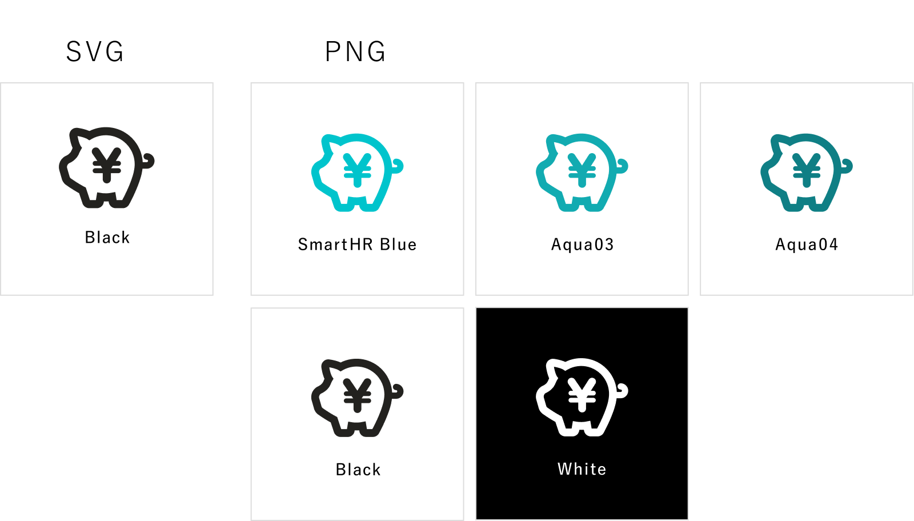

import { SecondaryButtonAnchor } from 'smarthr-ui'

SmartHRサービス全体で利用するアイコンです。

## 利用ガイドライン
SmartHRに関するシーンでどこでも利用できます。
利用の際は各アイコンの利用方法にしたがってください。

## アイコン一覧

### 意味を限定するアイコン

機能や仕様といった、特定の意味に限定するアイコンです。
特定の意味を示すものとして利用してください。

| 分類 | 意味 | アイコン | 補足 |
| --- | --- | :---: | --- |
| SmartHR基本機能 | 従業員データベース |  | 「従業員リスト」「従業員情報」として利用することもあります |
| SmartHR基本機能 | 手続き |  |  |
| SmartHR基本機能 | 申請 |  |  |
| SmartHR基本機能 | 給与明細 |  |  |
| SmartHR基本機能 | お知らせ掲示板 |  |  |
| SmartHR基本機能 | マイナンバー |  |  |
| SmartHR基本機能 | 電子申請 |  |  |
| SmartHR基本機能 | 源泉徴収票 |  |  |
| SmartHR基本機能 | 設定 |  |  |
| SmartHRオプション機能 | カスタム社員名簿 |  |  |
| SmartHRオプション機能 | 組織図 |  |  |
| SmartHRオプション機能 | 年末調整 |  |  |
| SmartHRオプション機能 | 文書配布 |  |  |
| SmartHRオプション機能 | 分析レポート |  |  |
| SmartHRオプション機能 | 従業員サーベイ |  |  |
| SmartHRオプション機能 | 人事評価 |  |  |
| SmartHRオプション機能 | ファイル一括アップロード |  |  |
| SmartHRオプション機能 | 通勤経路検索 |  |  |
| 仕様・サービス | サービス連携 |  |  |
| 仕様・サービス | 多言語化対応 |  | 旧デザインのため、利用は非推奨です。 |
| 仕様・サービス | SAML/SSO認証 |  | 旧デザインのため、利用は非推奨です。 |
| 仕様・サービス | API連携 |  |  |
| 仕様・サービス | 履歴閲覧・編集 |  | 旧デザインのため、利用は非推奨です。 |
| 仕様・サービス | 履歴登録 |  | 旧デザインのため、利用は非推奨です。 |
| 仕様・サービス | 予約管理 |  | 旧デザインのため、利用は非推奨です。 |
| 仕様・サービス | CSVカスタムダウンロード |  | 旧デザインのため、利用は非推奨です。 |

### 意味を限定しないアイコン

特定の意味に限定しないアイコンです。

| アイコン | 補足 |
| --- | --- |
|  | 旧デザインのため、利用は非推奨です。 |
|  | 旧デザインのため、利用は非推奨です。 |
|  | 旧デザインのため、利用は非推奨です。 |
|  | 旧デザインのため、利用は非推奨です。 |
|  | 旧デザインのため、利用は非推奨です。 |
|  |  |
|  |  |
|  |  |

## ダウンロード

svg,png形式のアイコンデータをダウンロードできます。

<SecondaryButtonAnchor href="/downloads/icon.zip" downloads>まとめてダウンロード</SecondaryButtonAnchor>

