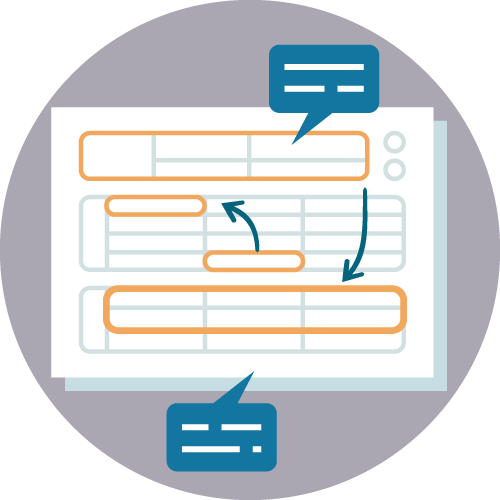
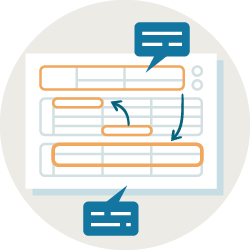
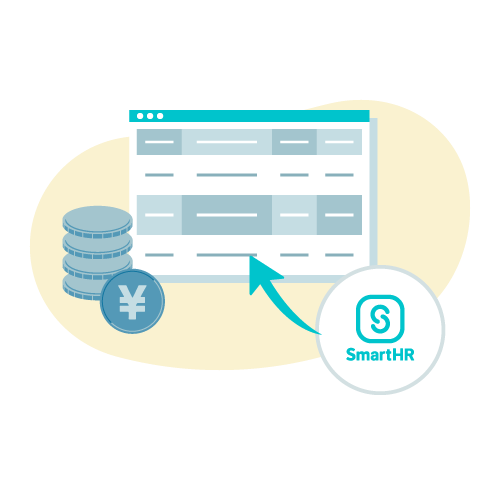
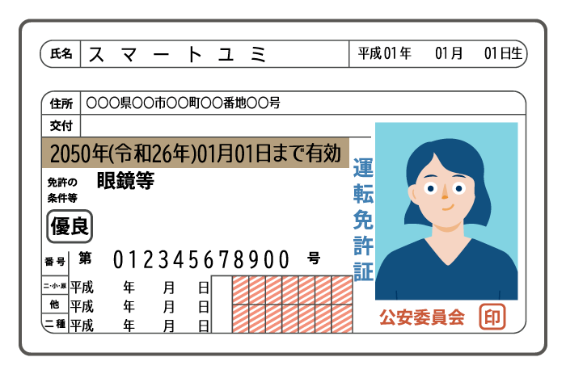
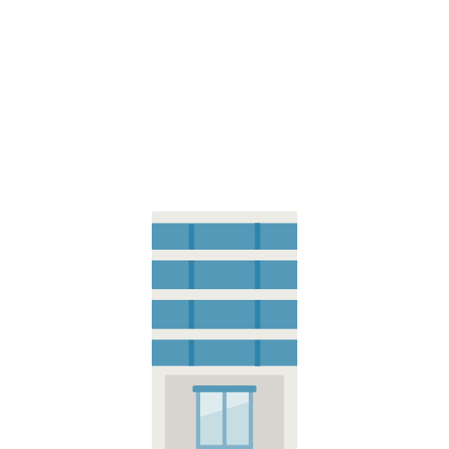

import { Grid } from '@Components/shared/Grid/Grid'
import { ImgWithDesc } from '@Components/article/ImgWithDesc/ImgWithDesc'
import { AnchorButton } from 'smarthr-ui'

SmartHRのアイテムに関連するイラストレーションです。  
SmartHR社、グループ会社、制作パートナーの方々は、イラストレーションをダウンロードできます。  
利用の際は必ず[イラストレーションのガイドライン](/basics/illustration/#h2-0)にしたがってください。

<AnchorButton href="/downloads/item.zip" downloads>まとめてダウンロード</AnchorButton>

## サービス導入効果

### SmartHR導入前の業務

<Private path="/basics/before-smarthr-description.md" />

<Grid autoRepeat="auto-fill" size="100px" gap="28px">

  <ImgWithDesc description="データ入力（労務担当者）">

  

  </ImgWithDesc>

  <ImgWithDesc description="データ入力（人事担当者）">

  

  </ImgWithDesc>

  <ImgWithDesc description="出社（労務担当者）">

  

  </ImgWithDesc>

  <ImgWithDesc description="電話（労務担当者）">

  

  </ImgWithDesc>

  <ImgWithDesc description="電話（人事担当者）">

  

  </ImgWithDesc>

  <ImgWithDesc description="問い合わせ対応（労務担当者）">

  

  </ImgWithDesc>

  <ImgWithDesc description="封入（労務担当者）">

  

  </ImgWithDesc>

  <ImgWithDesc description="封入（人事担当者）">

  

  </ImgWithDesc>

  <ImgWithDesc description="役所手続き（労務担当者）">

  

  </ImgWithDesc>

  <ImgWithDesc description="積み上がった書類と残業">

  

  </ImgWithDesc>

  <ImgWithDesc description="記入（従業員）">

  

  </ImgWithDesc>

  <ImgWithDesc description="記入（従業員）">

  

  </ImgWithDesc>

  <ImgWithDesc description="給与明細手渡し">

  

  </ImgWithDesc>

  <ImgWithDesc description="捺印（個人印）">

  

  </ImgWithDesc>

  <ImgWithDesc description="押印（法人印）">

  

  </ImgWithDesc>

  <ImgWithDesc description="従業員リスト">

  

  </ImgWithDesc>

  <ImgWithDesc description="配送">

  

  </ImgWithDesc>

  <ImgWithDesc description="書類確認">

  

  </ImgWithDesc>

  <ImgWithDesc description="書類差し戻し">

  

  </ImgWithDesc>

  <ImgWithDesc description="書類確認・差し戻し">

  

  </ImgWithDesc>

  <ImgWithDesc description="書類転記・押印">

  

  </ImgWithDesc>

  <ImgWithDesc description="プリンタ">

  

  </ImgWithDesc>

  <ImgWithDesc description="入社書類">

  

  </ImgWithDesc>

  <ImgWithDesc description="年末調整マニュアル">

  

  </ImgWithDesc>

  <ImgWithDesc description="年末調整マニュアル（明るめ）">

  

  </ImgWithDesc>

  <ImgWithDesc description="ファイリング">

  

  </ImgWithDesc>

</Grid>

### SmartHR導入後の業務

<Private path="/basics/after-smarthr-description.md" />

<Grid autoRepeat="auto-fill" size="130px">

  <ImgWithDesc description="送受信：労務担当者（入社情報の提出を依頼）">

  

  </ImgWithDesc>

  <ImgWithDesc description="送受信：労務担当者（入社情報の提出を依頼）">

  

  </ImgWithDesc>

  <ImgWithDesc description="送受信：人事担当者（入社情報の提出を依頼）">

  

  </ImgWithDesc>

  <ImgWithDesc description="送受信：従業員（入社手続き情報入力・年末調整アンケート回答・雇用契約更新の受信）">

  

  </ImgWithDesc>

  <ImgWithDesc description="送受信：従業員（入社手続き情報入力・年末調整アンケート回答・雇用契約更新の受信）">

  

  </ImgWithDesc>

  <ImgWithDesc description="電子申請（手続き書類の自動作成・電子申請）">

  

  </ImgWithDesc>

  <ImgWithDesc description="従業員情報">

  

  </ImgWithDesc>

  <ImgWithDesc description="オンライン署名">

  

  </ImgWithDesc>

  <ImgWithDesc description="給与ソフトからインポート">

  

  </ImgWithDesc>

  <ImgWithDesc description="給与ソフトへ取り込み">

  

  </ImgWithDesc>

  <ImgWithDesc description="年末調整内容確認">

  

  </ImgWithDesc>

  <ImgWithDesc description="年末調整自動催促">

  

  </ImgWithDesc>

  

</Grid>

## 身分証明書

<Grid autoRepeat="auto-fill" size="130px">

  <ImgWithDesc description="運転免許証">

  

  </ImgWithDesc>

  <ImgWithDesc description="マイナンバーカード（表）">

  

  </ImgWithDesc>

  <ImgWithDesc description="マイナンバーカード（裏）">

  

  </ImgWithDesc>

  <ImgWithDesc description="通知カード">

  

  </ImgWithDesc>

  <ImgWithDesc description="社員証">

  

  </ImgWithDesc>

  <ImgWithDesc description="パスポート">

  

  </ImgWithDesc>

  <ImgWithDesc description="年金手帳">

  

  </ImgWithDesc>

  <ImgWithDesc description="印鑑登録証明書">

  

  </ImgWithDesc>

  <ImgWithDesc description="住民票">

  

  </ImgWithDesc>

</Grid>

## 建物

<Grid autoRepeat="auto-fill" size="130px">

  <ImgWithDesc description="ふつうのビル（ブルー）">

  

  </ImgWithDesc>

  <ImgWithDesc description="ふつうのビル（ホワイト）">

  

  </ImgWithDesc>

  <ImgWithDesc description="中規模ビル">

  

  </ImgWithDesc>

  <ImgWithDesc description="高層ビル">

  

  </ImgWithDesc>

  <ImgWithDesc description="店舗">

  

  </ImgWithDesc>

</Grid>

## そのほかのアイテム

<Grid autoRepeat="auto-fill" size="130px">

  <ImgWithDesc description="スマートフォンを操作する手">

  

  </ImgWithDesc>

  <ImgWithDesc description="ラップトップPC">

  

  </ImgWithDesc>

</Grid>

## ライセンス情報
本ページ内のコンテンツについては、[イラストレーションのライセンス情報](/basics/illustration/#h2-1)を参照のうえご利用ください。
