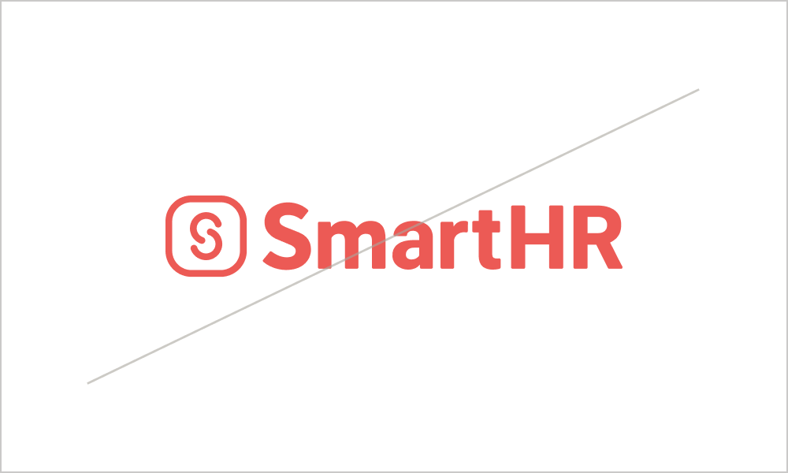

import { Grid } from '@Components/shared/Grid/Grid'
import { ImgWithDesc } from '@Components/article/ImgWithDesc/ImgWithDesc'
import { VideoEmbed } from '@Components/article/VideoEmbed/VideoEmbed'

<VideoEmbed
  poster="/images/motion_logo_thumb.png"
  source="/video/motion_logo.mp4"
  title="SmartHR motion logo"
  youtubeUrl="https://www.youtube.com/watch?v=UxhKEwV9A6Q"
/>

映像領域におけるSmartHRロゴです。  

## 利用者・利用範囲

SmartHR Design Systemはサイトにアクセスするすべての人が、公開されているすべてのコンテンツを参照できます。ただし利用に関しては範囲を定めています。  
ロゴの利用者・利用範囲は以下のとおりです。

| 利用者 | 名義 | 利用可否 |
| :-- | :-- | :-- |
| **SmartHR従業員** | **サービスSmartHR・** **株式会社SmartHR** | **◯ 利用できます** |
| **SmartHR従業員** | **SmartHR Plus β版** | **◯ 利用できます** |
| SmartHR従業員 | SmartHRグループ会社・ 提供サービス | × 利用できません |
| **SmartHR外部パートナー** | **サービスSmartHR・** **株式会社SmartHR** | **◯ 利用できます** |
| SmartHR Plusパートナー | SmartHR Plusパートナーが 提供するアプリ | × 利用できません |
| SmartHRグループ会社従業員 | SmartHRグループ会社・ 提供サービス | × 利用できません |
| **すべてのかた・広報担当者のかた** | **SmartHRの広報活動** | **◯ 利用できます** |

ほかのコンテンツの利用範囲は[利用者のかたへ](/introduction/user/)を参照してください。  
SmartHRモーションロゴを本ガイドラインおよび[利用規約](/terms/)に違反する態様での複製・転用・変更することを禁止します。

## 利用ガイドライン

### 利用方法
- コンテンツの冒頭に挿入してください。冒頭が相応しくない場合は末尾に挿入してください。
- コンテンツの内容に応じ、映像のみ（音声なし）でも使用できます。
- モーションロゴの前後を延長し、クロスフェードやフェードイン／アウトなどの透明度を用いたカットの切り替わり表現を行なうことが可能です。

### 禁止事項

<Grid>
  <ImgWithDesc description="再生速度を変えてはいけない">

  

  </ImgWithDesc>

  <ImgWithDesc description="エフェクトを追加してはいけない">

  

  </ImgWithDesc>

  <ImgWithDesc description="要素の位置を変えてはいけない">

  

  </ImgWithDesc>

  <ImgWithDesc description="指定カラー以外で表記してはいけない">

  

  </ImgWithDesc>

  <ImgWithDesc description="ロゴを傾けてはいけない">

  

  </ImgWithDesc>

  <ImgWithDesc description="変形させてはいけない">

  

  </ImgWithDesc>

  <ImgWithDesc description="他要素やマークをロゴの上に重ねてはいけない">

  

  </ImgWithDesc>

  <ImgWithDesc description="他の音声を重ねてはいけない">

  

  </ImgWithDesc>

  <ImgWithDesc description="音声にエフェクトを追加してはいけない">

  

  </ImgWithDesc>  
</Grid>

## ダウンロード
mov形式のモーションロゴをダウンロードできます。

- 推奨形式（適したデータ形式がわからない場合はこちらを利用してください。）
    - [1920x1080(30fps)](/SmartHR_MotionLogo_1920x1080_30fps.zip)

- そのほかの形式
    - [1920x1080（24fps, 60fps）](/SmartHR_MotionLogo_1920x1080.zip)
    - [3840x2160（24fps, 30fps, 60fps）](/SmartHR_MotionLogo_3840x2160.zip)

## ライセンス情報

SmartHRモーションロゴの、デザインやレイアウト、ロゴマーク、サウンド、商標などに関しては、株式会社SmartHR（以下「当社」といいます）または、当社にその利用を認めた権利者が著作権などの知的財産権、使用権その他の権利を有しています。

## 問い合わせ先
モーションロゴの掲載、使用の可否についての相談・問い合わせ
- 株式会社SmartHR　pr@smarthr.co.jp
- 社内Slack `#pr`

モーションロゴの利用方法に関する相談・問い合わせ

- 株式会社SmartHR　pr@smarthr.co.jp
- 社内Slack `#design_comm_依頼`
