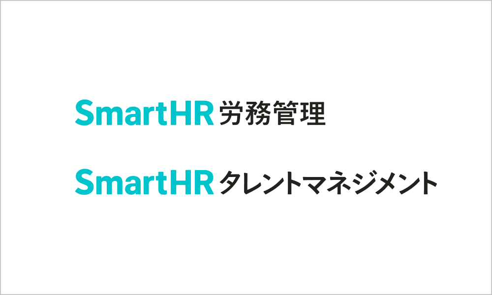
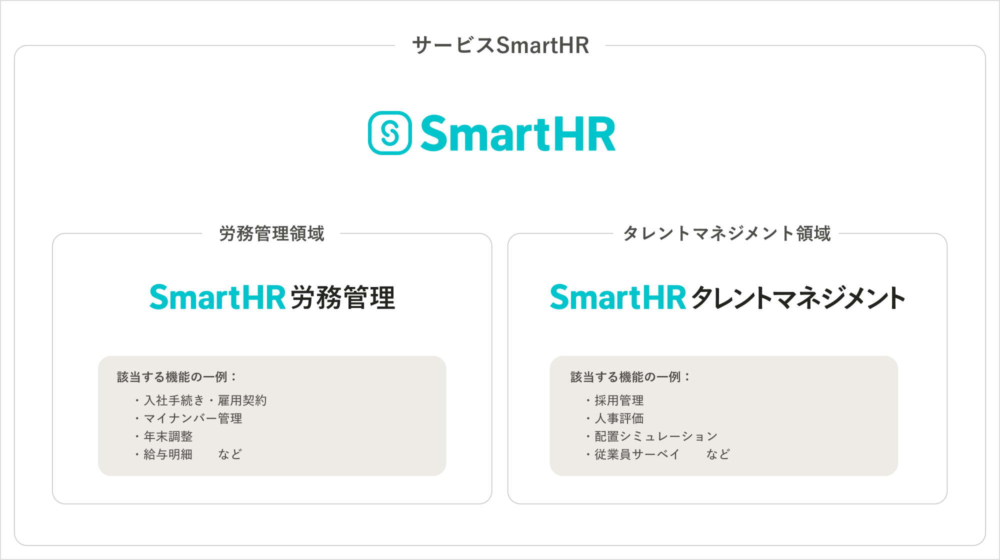
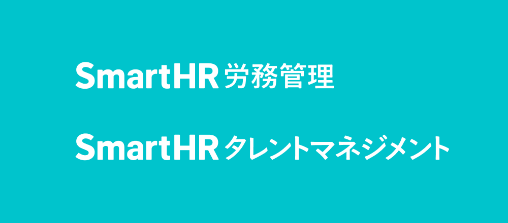
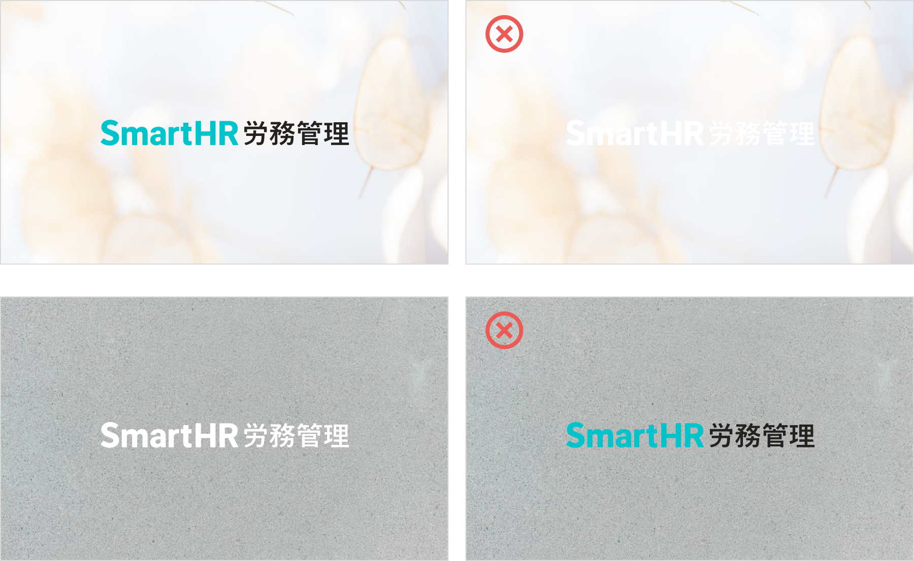
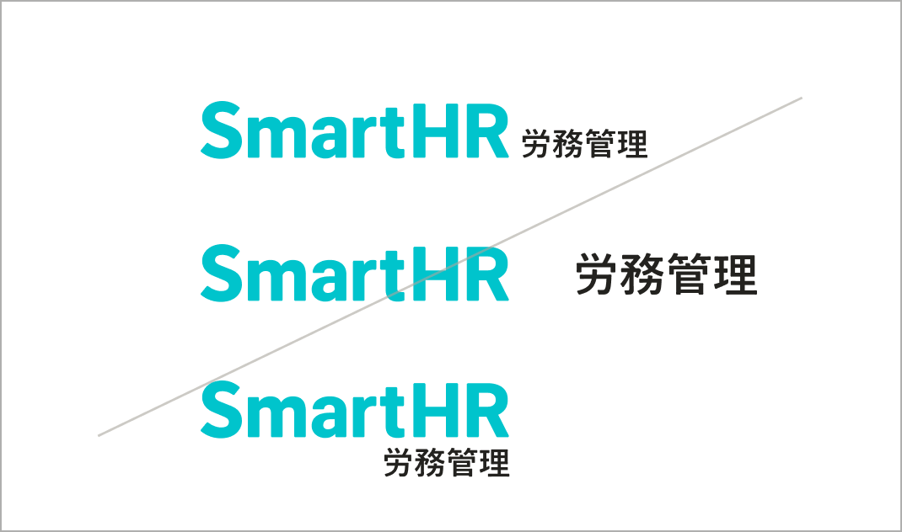

import { Grid } from '@Components/shared/Grid/Grid'
import { ImgWithDesc } from '@Components/article/ImgWithDesc/ImgWithDesc'

サービスカテゴリーロゴは、SmartHRロゴと適切に使い分けて使用することで、ブランド全体を最適な認知につなげることができます。

サイトにアクセスするすべての人が参照できますが、利用に関してはSmartHRロゴと同様に[利用者・利用範囲](#h2-2)を確認してください。

## ブランドの関係性

サービスSmartHRは、サービスブランド「SmartHR」の配下に「SmartHR 労務管理」「SmartHR タレントマネジメント」という領域単位の2つのブランドを保有しています。この領域を示すロゴを「サービスカテゴリーロゴ」と呼称しています。
ブランドの包含関係についてはこちらの図のとおりです。

領域別で言及・発信する場面においては、サービスSmartHR全体で共通して使用する
「SmartHRロゴ」と「サービスカテゴリーロゴ」を適切に使い分けることで、領域単位で効果的に印象づけることができます。

<Grid>
  <ImgWithDesc description="SmartHRロゴ。サービス全体で共通して使用することができます">

  

  </ImgWithDesc>

  <ImgWithDesc description="サービスカテゴリーロゴ。労務管理領域またはタレントマネジメント領域のカテゴリーを示す場面で使用することができます">

  

  </ImgWithDesc>
</Grid>

## 利用ガイドライン

- [利用規約](/terms/)に違反する態様での複製・転用・変更することを禁止します。
- 本ガイドラインに沿って、サービスカテゴリーロゴを利用してください。

### バリエーション
サービスカテゴリーロゴには、それぞれ横組と縦組のバリエーションがあります。
基本的には横組を利用してください。

横組ではレイアウトの都合で最小サイズを割るような場面や、視認性の担保が難しい際に、縦組の利用も検討してください。

<Grid>
  <ImgWithDesc description="それぞれ左が横組、右が縦組のサービスカテゴリーロゴ。基本的には横組の利用を推奨します">

  

  </ImgWithDesc>
</Grid>

### アイソレーション
サービスカテゴリーロゴ周辺には、一定のアイソレーション（保護エリア）を設けます。この領域内には、他の要素・文字などは表示しないでください。

### 最小使用サイズ

サービスカテゴリーロゴは印刷物とデジタルデバイスそれぞれにおいて、下記を最小サイズとして使用してください。

なお、1つの制作物が印刷物とデジタルデバイスで共通して広く使用される場合においては、メインとなるタッチポイントの媒体を基準に調整することを推奨します。

- SmartHR労務管理
  - 横組
    - 印刷物：横幅35mm以上
    - デジタルデバイス：横幅115px（縦幅12px）以上
  - 縦組
    - 印刷物：横幅20mm以上
    - デジタルデバイス：横幅64px（縦幅27px）以上
- SmartHRタレントマネジメント
  - 横組
    - 印刷物：横幅56.5mm以上
    - デジタルデバイス：横幅167px（縦幅12px）以上
  - 縦組
    - 印刷物：横幅31.3mm以上
    - デジタルデバイス：横幅100px（縦幅27px）以上

### 配色

サービスカテゴリーロゴには、以下の配色のバリエーションがあります。基本的にはプライマリーの配色の採用を推奨します。場面に応じて各バリエーションの採用を検討してください。

#### プライマリーの配色（推奨）

サービスカテゴリーロゴの表現の中心となる配色です。カラーの表現においては、基本的にはSmartHR BlueとSecondary Brand ColorのBlackを組み合わせた配色を使用してください。

<Grid>
  <ImgWithDesc description="SmartHR Blue（#00c4cc）とBlack（#23221f）の配色のバリエーション。基本的にはこの配色を使用してください。">

  

  </ImgWithDesc>
</Grid>

#### セカンダリーの配色

SmartHR Blueが背景の表現や、グレースケールの場合、プライマリーでは視認性が担保できない場面においては、次点でSecondary Brand ColorのWhiteを使用した配色を推奨します。

<Grid>
  <ImgWithDesc description="全てホワイト（#ffffff）の配色のバリエーション。特にSmartHR Blueが背景の表現のときに利用を推奨します。">

  

  </ImgWithDesc>
</Grid>

### 背景
サービスカテゴリーロゴは、常に明瞭に見えるよう使用してください。背景に色や画像がある場合は、視認性を考慮しつつ、カラーの表現も担保した調整を行なってください。

サービスカテゴリーロゴは、プライマリーの配色が明瞭に見えるような背景色や画像に配置してください。

プライマリーの配色では視認性が担保できない場合には、まずセカンダリーの使用を検討してください。いずれも意図した表現の実現が難しい場合には、ほかの配色のバリエーションの使用を検討してください。

### 禁止事項

[SmartHR Design System内のロゴの禁止事項](https://smarthr.design/basics/logos/#h3-5)に加えて、サービスカテゴリーロゴの適切な認知を担保するために以下の表現を避けて利用してください。

<Grid>
  <ImgWithDesc description="カテゴリー名のロゴタイプを単体で利用してはいけない">

  

  </ImgWithDesc>

  <ImgWithDesc description="組み合わせのサイズや位置を変更してはいけない">

  

  </ImgWithDesc>
  
  <ImgWithDesc description="定義されたカテゴリー以外を独断で作成してはいけない">

  

  </ImgWithDesc>
    
  <ImgWithDesc description="指定カラー以外で表記してはいけない">

  

  </ImgWithDesc>
    
  <ImgWithDesc description="ロゴマークを追加してはいけない">

  
  
  </ImgWithDesc>
</Grid>

## ダウンロード

PNG・JPG・SVG・AIのファイル形式のロゴを一括ダウンロードできます。
<a href="/downloads/SmartHR_serivice-category-logo.zip">サービスカテゴリーロゴ データ一式</a>

## 利用者・利用範囲

サイトにアクセスするすべての人が参照できますが、利用には一部制限があります。

  <table>
    <thead>
      <tr>
        <th>利用者</th>
        <th>名義</th>
        <th>利用可否</th>
      </tr>
    </thead>
    <tbody>
      <tr>
        <td>SmartHR従業員</td>
        <td>サービスSmartHR 株式会社SmartHR</td>
        <td><strong>◯ 利用できます</strong></td>
      </tr>
      <tr>
        <td>SmartHR従業員</td>
        <td>SmartHR Plus</td>
        <td><strong>◯ 利用できます</strong></td>
      </tr>
      <tr>
        <td>SmartHR従業員</td>
        <td>SmartHRグループ会社と その提供サービス</td>
        <td>× 利用できません</td>
      </tr>
      <tr>
        <td>SmartHR外部パートナー</td>
        <td>サービスSmartHR 株式会社SmartHR</td>
        <td><strong>◯ 利用できます</strong></td>
      </tr>
      <tr>
        <td>SmartHR Plusパートナー</td>
        <td>SmartHR Plusパートナーが 提供するアプリ</td>
        <td>× 利用できません</td>
      </tr>
      <tr>
        <td>SmartHRグループ会社 従業員</td>
        <td>SmartHRグループ会社と その提供サービス</td>
        <td>× 利用できません</td>
      </tr>
      <tr>
        <td>すべてのかた 広報担当者のかた</td>
        <td>SmartHRの広報活動</td>
        <td><strong>◯ 利用できます</strong></td>
      </tr>
    </tbody>
  </table>

## ライセンス情報

サービスカテゴリーロゴの、デザインやレイアウト、ロゴマーク、商標などに関しては、株式会社SmartHR（以下「当社」といいます）または、当社にその利用を認めた権利者が著作権などの知的財産権、使用権その他の権利を有しています。

## 問い合わせ先
掲載、使用の可否についての相談・問い合わせ
- 株式会社SmartHR　pr@smarthr.co.jp
- 社内Slack `#pr`

利用方法やレイアウトに関する相談・問い合わせ
- 社内Slack `#design_comm_依頼`
