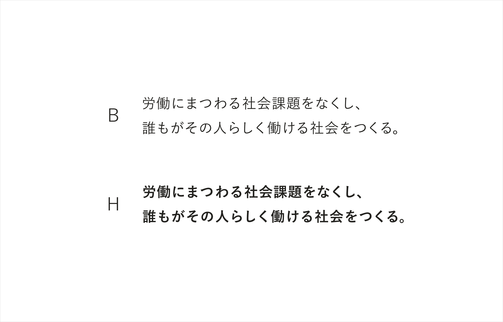

タイポグラフィとは、レイアウトや文字による視覚伝達法です。
文字を適切に扱うことは、ロゴと並ぶ最も重要な振る舞いです。
あらゆる媒体で游ゴシック体を使用することで、ユーザーが日常的・無意識的に受け取るブランドの印象を醸成します。

SmartHRでは、「游ゴシック」を採用しています。
字面が小さめに設計されていて全体的にゆとりがあるため、一文字ごとの識別性に優れている、長文でも読みやすいスタンダードなフォントです。
人事労務の業務や関連する法制度などを説明するコミュニケーションが欠かせないSmartHRにとっては、相性の良いフォントです。
加えて、一般的なゴシック体と比較して文字のエレメントに丸みが施されていることで、やわらかさや親しみやすい印象を与えられます。

游ゴシック体にはLからHの7種類のウェイト展開があります。SmartHRにおける推奨ウェイトは、MとBの2種類です。

## 利用範囲
macOSやWindowsに標準インストールされているシステムフォントなので、すべての人が游ゴシック体を利用できます。

## 利用シーン
ブランドの印象を重要視するシーンでは、游ゴシック体を推奨します。
必ず游ゴシック体を利用する必要はありません。媒体の特性や目的、意図を汲み取ってフォントを選択してください。

例
- バナー・アイキャッチ
    - （PR後に追記）
- プロダクト
    - フォントを使って、タッチポイントの作成に携わるのはデザイナーとは限りません。
    デザイナーなど、一部の限られた人にしか使えないフォントを使うと、それがボトルネックになることがあります。
- ウェブサイト
    - ホームページなどにも推奨フォントを適用しようとした場合に、ウェブフォントが必要になったり、動作が重くなったりするといった懸念があります。
    なので、「ここぞ！」というサイトにのみウェブフォントを使いましょう。

## フィードバック先
フォントの利用方法に関する相談・フィードバック

- 株式会社SmartHR info@smarthr.co.jp
- 社内Slack `#design_comm_依頼`