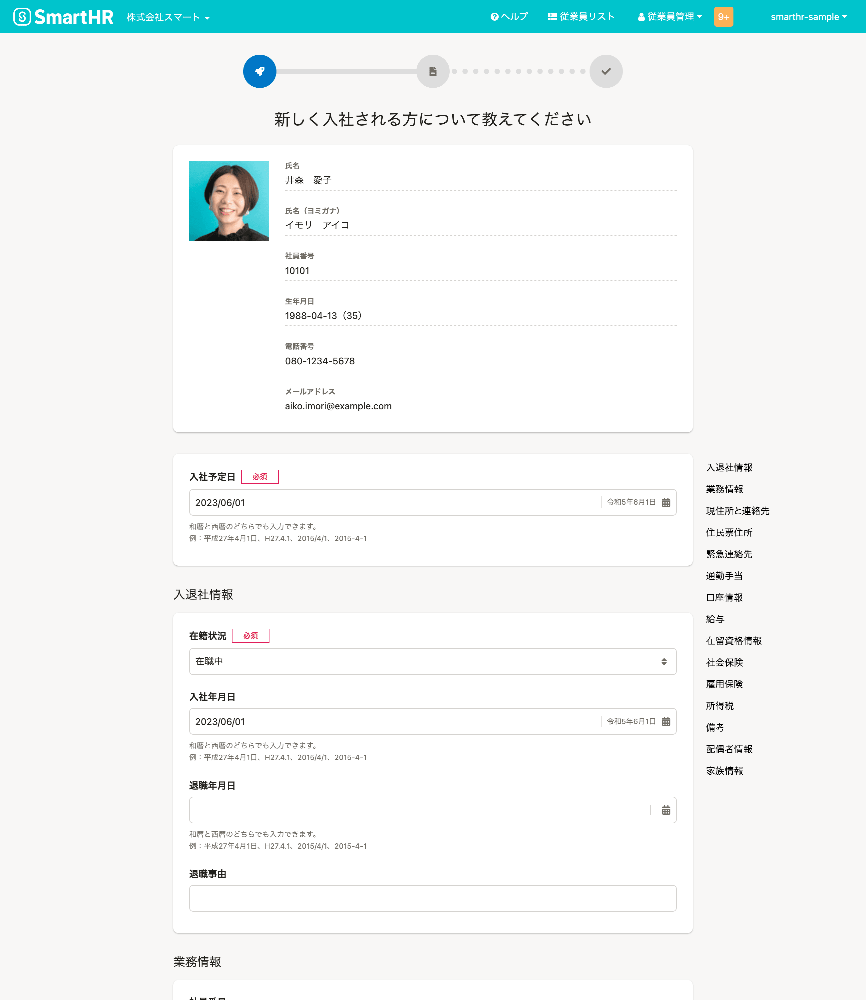
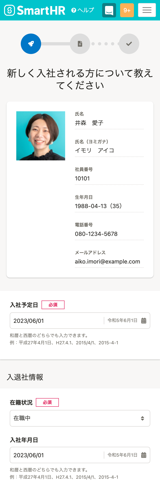

import { Grid } from '@Components/shared/Grid/Grid'
import { CaptureImageWithDesc } from '@Components/contents/ServiceCapture/CaptureImageWithDesc'

利用頻度が高いプロダクトの画面キャプチャを掲載しています。  
未掲載を含むすべての画面キャプチャは<a href="https://drive.google.com/drive/folders/1PT1gK4rrz8DufFkFc2r3Z_xpp03YxHwC" target="_blank">プロダクトキャプチャ | Google ドライブ</a>からアクセスできます。

サイトにアクセスするすべての人が参照できますが、利用に関しては[利用者・利用範囲](#h2-2)を確認してください。

## SmartHR基本機能

### SmartHRのホーム
サービスの顔とも言える、SmartHRのホーム画面です。

#### ノーマル
親しみを演出したいシーンに適しています。

<Grid autoRepeat="auto-fill" size="250px">

  <CaptureImageWithDesc description="パソコンサイズ">

  

  </CaptureImageWithDesc>

  <CaptureImageWithDesc description="スマートフォンサイズ">

  

  </CaptureImageWithDesc>

</Grid>

#### フォーマル
フォーマルな雰囲気を演出したいシーンに適しています。

<Grid autoRepeat="auto-fill" size="250px">

  <CaptureImageWithDesc description="パソコンサイズ">

  

  </CaptureImageWithDesc>

  <CaptureImageWithDesc description="スマートフォンサイズ">

  

  </CaptureImageWithDesc>

</Grid>

### 入社手続き

#### ノーマル

人物写真を含んでいるため、親しみを演出したいシーンに適しています。

<Grid autoRepeat="auto-fill" size="250px">

  <CaptureImageWithDesc description="パソコンサイズ　パターンA">

  

  </CaptureImageWithDesc>

  <CaptureImageWithDesc description="スマートフォンサイズ　パターンA">

  

  </CaptureImageWithDesc>

  <CaptureImageWithDesc description="パソコンサイズ　パターンB">

  

  </CaptureImageWithDesc>

  <CaptureImageWithDesc description="スマートフォンサイズ　パターンB">

  

  </CaptureImageWithDesc>

</Grid>

#### フォーマル

エンタープライズ企業向け資料など、フォーマルな雰囲気を演出したいシーンに適しています。

<Grid autoRepeat="auto-fill" size="250px">

  <CaptureImageWithDesc description="パソコンサイズ　パターンA">

  

  </CaptureImageWithDesc>

  <CaptureImageWithDesc description="スマートフォンサイズ　パターンA">

  

  </CaptureImageWithDesc>

  <CaptureImageWithDesc description="パソコンサイズ　パターンB">

  

  </CaptureImageWithDesc>

  <CaptureImageWithDesc description="スマートフォンサイズ　パターンB">

  

  </CaptureImageWithDesc>

</Grid>

## SmartHRオプション機能

### カスタム社員名簿機能

#### 従業員一覧

SmartHRが従業員データベースであることを示すシーンに適しています。

<Grid autoRepeat="auto-fill" size="250px">

  <CaptureImageWithDesc description="パソコンサイズ">

  

  </CaptureImageWithDesc>

  <CaptureImageWithDesc description="スマートフォンサイズ">

  

  </CaptureImageWithDesc>

</Grid>

### 配置シミュレーション機能

SmartHRのタレントマネジメント領域をあらわすシーンに適しています。

<Grid autoRepeat="auto-fill" size="250px">

  <CaptureImageWithDesc description="プロフィールパネルが閉じている">

  

  </CaptureImageWithDesc>

  <CaptureImageWithDesc description="プロフィールパネルが開いている">

  

  </CaptureImageWithDesc>

</Grid>

## 利用者・利用範囲

サイトにアクセスするすべての人が参照できますが、利用には一部制限があります。
画面キャプチャ（プロダクト）の利用者と利用範囲は以下のとおりです。

  <table>
    <thead>
      <tr>
        <th>利用者</th>
        <th>名義</th>
        <th>利用可否</th>
      </tr>
    </thead>
    <tbody>
      <tr>
        <td>SmartHR従業員</td>
        <td>サービスSmartHR 株式会社SmartHR</td>
        <td><strong>◯ 利用できます</strong></td>
      </tr>
      <tr>
        <td>SmartHR従業員</td>
        <td>SmartHR Plus</td>
        <td><strong>◯ 利用できます</strong></td>
      </tr>
      <tr>
        <td>SmartHR従業員</td>
        <td>SmartHRグループ会社と その提供サービス</td>
        <td>× 利用できません</td>
      </tr>
      <tr>
        <td>SmartHR外部パートナー</td>
        <td>サービスSmartHR 株式会社SmartHR</td>
        <td><strong>◯ 利用できます</strong></td>
      </tr>
      <tr>
        <td>SmartHR Plusパートナー</td>
        <td>SmartHR Plusパートナーが 提供するアプリ</td>
        <td>× 利用できません</td>
      </tr>
      <tr>
        <td>SmartHRグループ会社 従業員</td>
        <td>SmartHRグループ会社と その提供サービス</td>
        <td>× 利用できません</td>
      </tr>
      <tr>
        <td>すべてのかた 広報担当者のかた</td>
        <td>SmartHRの広報活動</td>
        <td><strong>◯ 利用できます</strong></td>
      </tr>
    </tbody>
  </table>

ほかのコンテンツの利用範囲は[利用者のかたへ](/introduction/user/)を参照してください。

## ライセンス情報
本ページ内のコンテンツについては、[画面キャプチャのライセンス情報](/communication/capture/#h2-2)を参照のうえご利用ください。
