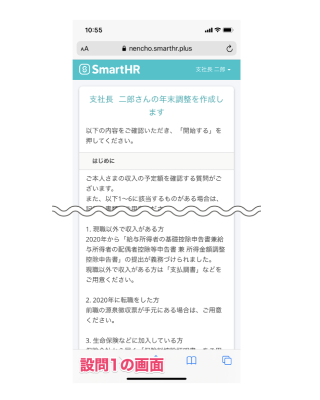
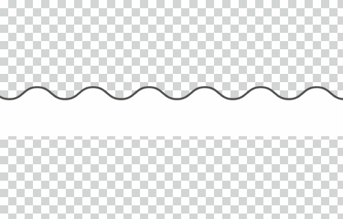
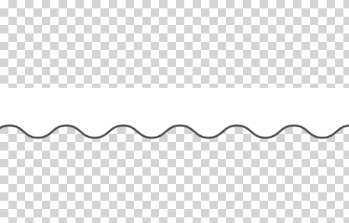
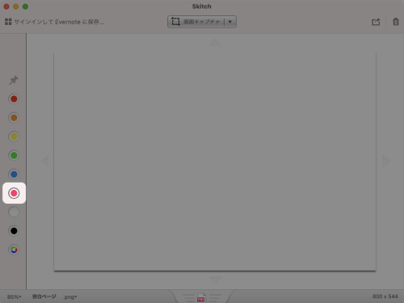

import { ColorPalette, ColorPalettesWrapper } from '@Components/ColorPalette'

import { Grid } from '@Components/shared/Grid/Grid'
import { ImgWithDesc } from '@Components/article/ImgWithDesc/ImgWithDesc'

## キャプチャ用装飾素材

キャプチャ用装飾素材とは、サービス画面キャプチャの一部を加工して表現する際に、装飾として使用する素材のことです。

### 省略線
省略線とは、縦に長いキャプチャ画像などの一部をレイアウトの都合で省略して表示する際に、画像の一部が省略されていることを示すために使用する、波線の形状の素材です。PNG形式で作成されているので、KeynoteやPowerPointなどさまざまなアプリケーションで利用できます。

#### 省略線の一覧

| 用途 | 素材イメージ | 使用イメージ | ダウンロード |
| --- | --- | --- | --- |
| キャプチャ中央部省略用 | |　| <a href="/downloads/省略線_パソコンサイズ_center.png" download>パソコンサイズをダウンロード</a> / <a href="/downloads/省略線_スマートフォンサイズ_center.png" download>スマートフォンサイズをダウンロード</a> |
| キャプチャ下部省略用 | |　| <a href="/downloads/省略線_パソコンサイズ_bottom.png" download>パソコンサイズをダウンロード</a> / <a href="/downloads/省略線_スマートフォンサイズ_bottom.png" download>スマートフォンサイズをダウンロード</a> |
| キャプチャ上部省略用 | |　|<a href="/downloads/省略線_パソコンサイズ_top.png" download>パソコンサイズをダウンロード</a> / <a href="/downloads/省略線_スマートフォンサイズ_top.png" download>スマートフォンサイズをダウンロード</a> |

## 色（注釈）
サービス画面キャプチャなどに、枠線やテキストといった注釈をつける場合に使用します。

<ColorPalettesWrapper>
 <ColorPalette colorValue="#fc0c59" colorName="Annotaion" description="" />
</ColorPalettesWrapper>

キャプチャの機能に特化したアプリケーション<a href="https://apps.apple.com/jp/app/skitch-%E6%92%AE%E3%82%8B-%E6%8F%8F%E3%81%8D%E8%BE%BC%E3%82%80-%E5%85%B1%E6%9C%89%E3%81%99%E3%82%8B/id425955336?mt=12" target="_blank">Skitch</a>の、デフォルトのカラーに合わせています。プロダクトキャプチャを利用した説明画像などを作成する際は、この色を使用して注釈やガイド線などを記入してください。

 

### 使用イメージ
指定色を使用して、注釈を記載したキャプチャのイメージです。
 

## ライセンス情報
本ページ内のコンテンツについては、[画面キャプチャのライセンス情報](/communication/capture/#h2-3)を参照のうえご利用ください。
