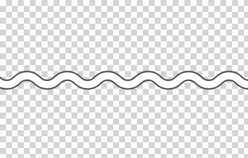

import { ColorPalette, ColorPalettesWrapper } from '@Components/ColorPalette'

import { Grid } from '@Components/shared/Grid/Grid'
import { ImgWithDesc } from '@Components/article/ImgWithDesc/ImgWithDesc'

サービス画面のキャプチャを編集に利用できるアイテム群です。  

## 利用者・利用範囲

SmartHR Design Systemはサイトにアクセスするすべての人が、公開されているすべてのコンテンツを参照できます。ただし利用に関しては範囲を定めています。  
編集キットの利用者と利用範囲は以下のとおりです。

<TableWrapper>
  <table>
    <thead>
      <tr>
        <th>利用者</th>
        <th>名義</th>
        <th>利用可否</th>
      </tr>
    </thead>
    <tbody>
      <tr>
        <td><strong>SmartHR従業員</strong></td>
        <td><strong>サービスSmartHR・ 株式会社SmartHR</strong></td>
        <td><strong>◯ 利用できます</strong></td>
      </tr>
      <tr>
        <td><strong>SmartHR従業員</strong></td>
        <td><strong>SmartHR Plus β版</strong></td>
        <td><strong>◯ 利用できます</strong></td>
      </tr>
      <tr>
        <td>SmartHR従業員</td>
        <td>SmartHRグループ会社・ 提供サービス</td>
        <td>× 利用できません</td>
      </tr>
      <tr>
        <td><strong>SmartHR外部パートナー</strong></td>
        <td><strong>サービスSmartHR・ 株式会社SmartHR</strong></td>
        <td><strong>◯ 利用できます</strong></td>
      </tr>
      <tr>
        <td>SmartHR Plusパートナー</td>
        <td>SmartHR Plusパートナーが 提供するアプリ</td>
        <td>× 利用できません</td>
      </tr>
      <tr>
        <td>SmartHRグループ会社 従業員</td>
        <td>SmartHRグループ会社・ 提供サービス</td>
        <td>× 利用できません</td>
      </tr>
      <tr>
        <td><strong>すべてのかた・ 広報担当者のかた</strong></td>
        <td><strong>SmartHRの広報活動</strong></td>
        <td><strong>◯ 利用できます</strong></td>
      </tr>
    </tbody>
  </table>
</TableWrapper>

ほかのコンテンツの利用範囲は[利用者のかたへ](/introduction/user/)を参照してください。

## 端末モック
[端末モック](../mock)を参照してください。

## 省略線
画面キャプチャを一部省略する際に利用します。  
Keynoteなどで画面キャプチャの上に配置することで簡易合成できます。

| 用途 | 素材イメージ | 使用イメージ | ダウンロード |
| --- | --- | --- | --- |
| キャプチャ中央部省略用 | |　| <a href="/downloads/break-axis_personal-computer-size_center.png" download>パソコンサイズをダウンロード</a> / <a href="/downloads/break-axis_smartphone-size_center.png" download>スマートフォンサイズをダウンロード</a> |
| キャプチャ下部省略用 | |　| <a href="/downloads/break-axis_personal-computer-size_bottom.png" download>パソコンサイズをダウンロード</a> / <a href="/downloads/break-axis_smartphone-size_bottom.png" download>スマートフォンサイズをダウンロード</a> |
| キャプチャ上部省略用 | |　|<a href="/downloads/break-axis_personal-computer-size_top.png" download>パソコンサイズをダウンロード</a> / <a href="/downloads/break-axis_smartphone-size_top.png" download>スマートフォンサイズをダウンロード</a> |

## 注釈の色
画面キャプチャに、枠線やテキストなどの注釈をつける場合に推奨する色です。  
キャプチャの機能に特化したアプリケーション<a href="https://apps.apple.com/jp/app/skitch-%E6%92%AE%E3%82%8B-%E6%8F%8F%E3%81%8D%E8%BE%BC%E3%82%80-%E5%85%B1%E6%9C%89%E3%81%99%E3%82%8B/id425955336?mt=12" target="_blank">Skitch</a>の、デフォルトのカラーを採用しています。
<ColorPalettesWrapper>
 <ColorPalette colorValue="#fc0c59" colorName="Annotaion" description="" />
</ColorPalettesWrapper>

### 使用イメージ

 
