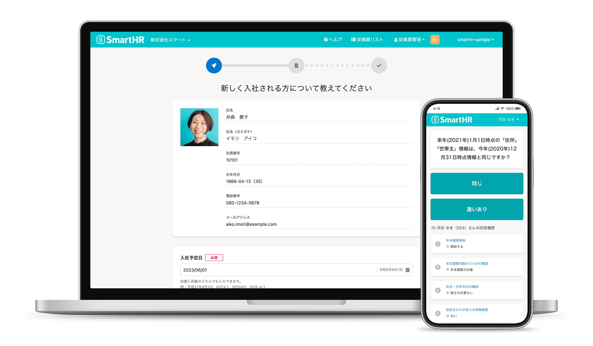

端末モック入りのサービス画面キャプチャは、マーケティング・セールス・広報全般の用途に最適化した画面キャプチャを端末モックに合成したものです。  
これはSmartHRというサービスを端的にあらわしたものであり、「サービスの顔」です。  

## 利用者・利用範囲

SmartHR Design Systemはサイトにアクセスするすべての人が、公開されているすべてのコンテンツを参照できます。ただし利用に関しては範囲を定めています。  
サービス画面キャプチャの利用者と利用範囲は以下のとおりです。

<TableWrapper>
  <table>
    <thead>
      <tr>
        <th>利用者</th>
        <th>名義</th>
        <th>利用可否</th>
      </tr>
    </thead>
    <tbody>
      <tr>
        <td>SmartHR従業員</td>
        <td>・サービスSmartHR ・株式会社SmartHR</td>
        <td><strong>◯ 利用できます</strong></td>
      </tr>
      <tr>
        <td>SmartHR従業員</td>
        <td>・SmartHR Plus β版</td>
        <td><strong>◯ 利用できます</strong></td>
      </tr>
      <tr>
        <td>SmartHR従業員</td>
        <td>・SmartHRグループ会社 ・提供サービス</td>
        <td>× 利用できません</td>
      </tr>
      <tr>
        <td>SmartHR外部パートナー</td>
        <td>・サービスSmartHR ・株式会社SmartHR</td>
        <td><strong>◯ 利用できます</strong></td>
      </tr>
      <tr>
        <td>SmartHR Plusパートナー</td>
        <td>・SmartHR Plusパートナーが 提供するアプリ</td>
        <td>× 利用できません</td>
      </tr>
      <tr>
        <td>SmartHRグループ会社 従業員</td>
        <td>・SmartHRグループ会社 ・提供サービス</td>
        <td>× 利用できません</td>
      </tr>
      <tr>
        <td>・すべてのかた ・広報担当者のかた</td>
        <td>・SmartHRの広報活動</td>
        <td><strong>◯ 利用できます</strong></td>
      </tr>
    </tbody>
  </table>
</TableWrapper>

ほかのコンテンツの利用範囲は[利用者のかたへ](/introduction/user/)を参照してください。

## パターンA：基本的にはこちらを利用します

（使用キャプチャ：<a href="https://drive.google.com/file/d/1RJrO7SD3KuZv9BXDSjziEvAmKaTjN5y9/view?usp=sharing" target="_blank">SmartHR基本機能 従業員情報詳細（管理者）| Google ドライブ</a>・<a href="https://drive.google.com/file/d/1Z79oAzR-A3fKkuo69aCgal-xgzIT3KPE/view?usp=sharing" target="_blank">SmartHR基本機能 ダッシュボード（従業員）| Google ドライブ</a>）

**SmartHRのごく基本的な画面です。基本的にはこのパターンAを利用してください。**

ただし担当デザイナーやコミュニケーションデザイングループの判断によっては、意図に応じたキャプチャに適宜変更してください。

<Private path="/communication/capture-in-mock-formal-a.md"/>

## パターンB：親しみやすさを訴求する場合、入社手続き・年末調整に関する場合

（使用キャプチャ：<a href="https://drive.google.com/file/d/1Z6nOH-UaaI5wcYeBIkEAIFoa7E4vrGnA/view?usp=sharing" target="_blank">SmartHR基本機能 入社手続き| Google ドライブ</a>・<a href="https://drive.google.com/file/d/1WKRDcn3IajGD8lECSFedj27zPDQUaJHY/view?usp=sharing" target="_blank">年末調整機能アンケート| Google ドライブ</a>）

質問形式で、語りかけてくるようなコミュニケーションをとる親しみやすい画面です。

- 推奨利用シーン
    - **より「手軽さ」「親しみやすさ」を感じさせたいシーン**
    - 「入社手続き」「年末調整」に関連するシーン
    - レイアウト上、画像全体が入りづらいシーン（左が見切れるようにレイアウトするときれいに収まります）

<Private path="/communication/capture-in-mock-formal-b.md"/>

堅めな雰囲気・レガシーな雰囲気の方が適している場合は、以下のフォーマルバージョンを利用してください。

## ライセンス情報
本ページ内のコンテンツについては、[画面キャプチャのライセンス情報](/communication/capture/#h2-3)を参照のうえご利用ください。

## 利用ガイドライン
- 画面キャプチャに含まれるパソコン又はスマートフォンの画像部分のみでのご利用はご遠慮ください。
- 画面キャプチャに含まれるパソコン又はスマートフォンに表示されている画像を差し替えて利用することはご遠慮ください。
