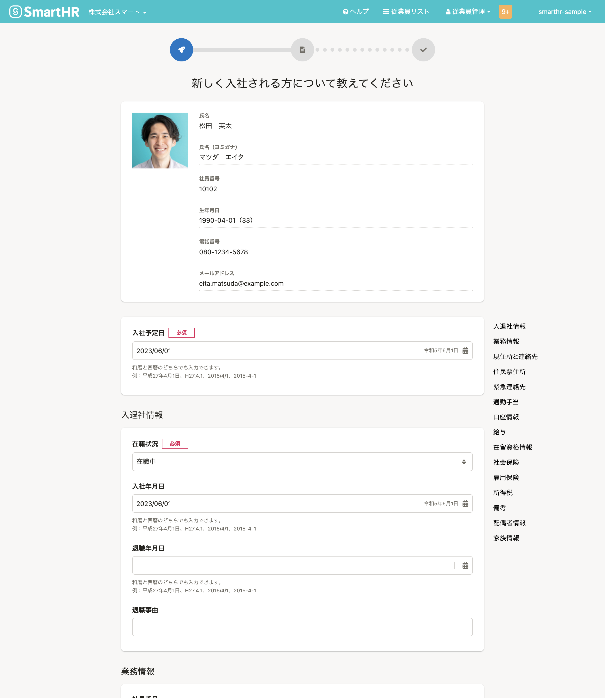
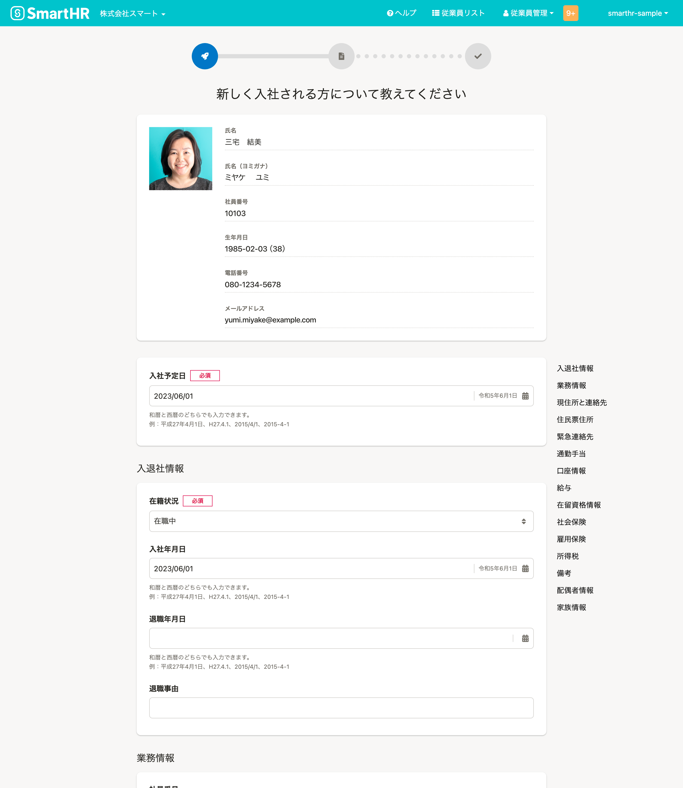
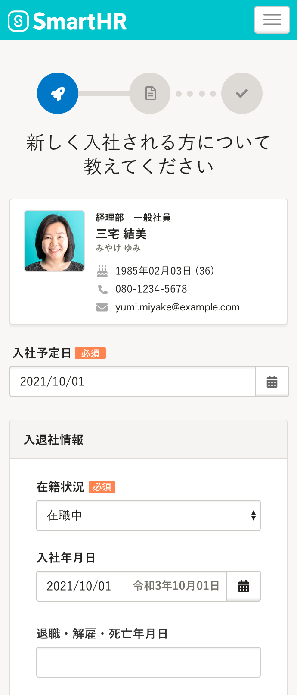

import { Grid } from '@Components/shared/Grid/Grid'
import { CaptureImageWithDesc } from '@Components/contents/ServiceCapture/CaptureImageWithDesc'

サービス画面キャプチャは、マーケティング・セールス・広報全般の用途に最適化したキャプチャです。

このページでは利用頻度の高いキャプチャを選定して掲載しています。

このほかに利用できる画面を一式そろえた<a href="https://drive.google.com/drive/folders/1PT1gK4rrz8DufFkFc2r3Z_xpp03YxHwC" target="_blank">プロダクトキャプチャ | Google ドライブ</a>も利用できます。

利用の際は[利用ガイドライン](/communication/capture/)を確認してください。

## SmartHR基本機能

### ダッシュボード

ホーム画面であり、サービスの顔とも言える画面です。

<Grid autoRepeat="auto-fill" size="250px">

  <CaptureImageWithDesc description="パソコンサイズ">

  

  </CaptureImageWithDesc>

  <CaptureImageWithDesc description="スマートフォンサイズ">

  

  </CaptureImageWithDesc>

</Grid>

### 入社手続き

#### ノーマル

人物写真を含んでいるため、親しみを演出したいシーンに適しています。

<Grid autoRepeat="auto-fill" size="250px">

  <CaptureImageWithDesc description="パソコンサイズ　パターンA">

  

  </CaptureImageWithDesc>

  <CaptureImageWithDesc description="スマートフォンサイズ　パターンA">

  

  </CaptureImageWithDesc>

  <CaptureImageWithDesc description="パソコンサイズ　パターンB">

  

  </CaptureImageWithDesc>

  <CaptureImageWithDesc description="スマートフォンサイズ　パターンB">

  

  </CaptureImageWithDesc>

</Grid>

#### フォーマル

エンタープライズ企業向け資料など、フォーマルな雰囲気を演出したいシーンに適しています。

<Grid autoRepeat="auto-fill" size="250px">

  <CaptureImageWithDesc description="パソコンサイズ　パターンA">

  

  </CaptureImageWithDesc>

  <CaptureImageWithDesc description="スマートフォンサイズ　パターンA">

  

  </CaptureImageWithDesc>

  <CaptureImageWithDesc description="パソコンサイズ　パターンB">

  

  </CaptureImageWithDesc>

  <CaptureImageWithDesc description="スマートフォンサイズ　パターンB">

  

  </CaptureImageWithDesc>

</Grid>

## SmartHRオプション機能

### カスタム社員名簿機能

#### 従業員一覧

SmartHRが従業員データベースであることを示すシーンに適しています。

<Grid autoRepeat="auto-fill" size="250px">

  <CaptureImageWithDesc description="パソコンサイズ">

  

  </CaptureImageWithDesc>

  <CaptureImageWithDesc description="スマートフォンサイズ">

  

  </CaptureImageWithDesc>

</Grid>

### 配置シミュレーション機能

SmartHRのタレントマネジメント領域をあらわすシーンに適しています。

<Grid autoRepeat="auto-fill" size="250px">

  <CaptureImageWithDesc description="プロフィールパネルが閉じている">

  

  </CaptureImageWithDesc>

  <CaptureImageWithDesc description="プロフィールパネルが開いている">

  

  </CaptureImageWithDesc>

</Grid>

## SmartHRスクール

### トップページ

SmartHRスクールを代表する画面です。

<Grid autoRepeat="auto-fill" size="250px">

  <CaptureImageWithDesc>

  

  </CaptureImageWithDesc>

</Grid>

### レッスンページ

SmartHRスクールの受講画面です。

<Grid autoRepeat="auto-fill" size="250px">

  <CaptureImageWithDesc>

  

  </CaptureImageWithDesc>

</Grid>

## PARK online

### トップページ

PARK onlineを代表する画面です。

<Grid autoRepeat="auto-fill" size="250px">

  <CaptureImageWithDesc>

  

  </CaptureImageWithDesc>

</Grid>

### トピックページ

<Grid autoRepeat="auto-fill" size="250px">

  <CaptureImageWithDesc description="年末調整について">

  

  </CaptureImageWithDesc>

  <CaptureImageWithDesc description="産育休の申請方法・フローについて">

  

  </CaptureImageWithDesc>

  <CaptureImageWithDesc description="従業員向けサーベイについて">

  

  </CaptureImageWithDesc>

</Grid>

## SmartHR Mag.

[SmartHR Mag.のキャプチャ | Google ドライブ](https://drive.google.com/drive/u/1/folders/16v9NMGRSYBzPS0mSMYhlo2Wmqv6gA9FF)

## ライセンス情報
本ページ内のコンテンツについては、[画面キャプチャのライセンス情報](/communication/capture/#h2-3)を参照のうえご利用ください。
