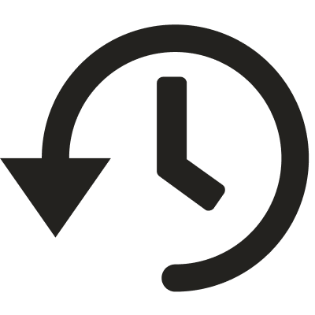

サービス全体で利用しているアイコンの一覧です。
アイコンをダウンロードできます。利用の際は必ず各アイコンの利用方法にしたがってください。

権利の都合上、このページに掲載されていないアイコンは<a href="https://drive.google.com/drive/u/1/folders/1HuxzhO3Dg8lS6wwT7QulUvK2TdN7s8F5" target="_blank">アイコン | Googleドライブ</a>または<a href="https://www.figma.com/file/wTjPGUsrbI0OqSLIEtwvvG/Communication_Icon?node-id=0%3A1" target="_blank">アイコン | Figma</a>からご利用ください。

## 意味を定義しているアイコン

どういった意味の機能で利用するかを定めているアイコンです。

異なる意味では利用しないでください。

| 機能名 | アイコン | 補足 |
| --- | :---: | --- |
| 従業員データベース | - | 権利の都合上<a href="https://drive.google.com/drive/u/0/folders/1HuxzhO3Dg8lS6wwT7QulUvK2TdN7s8F5" target="_blank">Googleドライブ</a>または<a href="https://www.figma.com/file/wTjPGUsrbI0OqSLIEtwvvG/Communication_Icon?node-id=0%3A1" target="_blank">Figma</a>から利用してください。 |
| 手続き | - | 権利の都合上<a href="https://drive.google.com/drive/u/0/folders/1HuxzhO3Dg8lS6wwT7QulUvK2TdN7s8F5" target="_blank">Googleドライブ</a>または<a href="https://www.figma.com/file/wTjPGUsrbI0OqSLIEtwvvG/Communication_Icon?node-id=0%3A1" target="_blank">Figma</a>から利用してください。 |
| 申請 |  |  |
| 給与明細 |  |  |
| お知らせ掲示板 | - | 権利の都合上<a href="https://drive.google.com/drive/u/0/folders/1HuxzhO3Dg8lS6wwT7QulUvK2TdN7s8F5" target="_blank">Googleドライブ</a>または<a href="https://www.figma.com/file/wTjPGUsrbI0OqSLIEtwvvG/Communication_Icon?node-id=0%3A1" target="_blank">Figma</a>から利用してください。 |
| マイナンバー | - | 権利の都合上<a href="https://drive.google.com/drive/u/0/folders/1HuxzhO3Dg8lS6wwT7QulUvK2TdN7s8F5" target="_blank">Googleドライブ</a>または<a href="https://www.figma.com/file/wTjPGUsrbI0OqSLIEtwvvG/Communication_Icon?node-id=0%3A1" target="_blank">Figma</a>から利用してください。 |
| 電子申請 |  |  |
| 設定 |  |  |
| 源泉徴収票 |  |  |
| カスタム社員名簿 | - | 権利の都合上<a href="https://drive.google.com/drive/u/0/folders/1HuxzhO3Dg8lS6wwT7QulUvK2TdN7s8F5" target="_blank">Googleドライブ</a>または<a href="https://www.figma.com/file/wTjPGUsrbI0OqSLIEtwvvG/Communication_Icon?node-id=0%3A1" target="_blank">Figma</a>から利用してください。 |
| 組織図 |  |  |
| 年末調整 | - | 権利の都合上<a href="https://drive.google.com/drive/u/0/folders/1HuxzhO3Dg8lS6wwT7QulUvK2TdN7s8F5" target="_blank">Googleドライブ</a>または<a href="https://www.figma.com/file/wTjPGUsrbI0OqSLIEtwvvG/Communication_Icon?node-id=0%3A1" target="_blank">Figma</a>から利用してください。 |
| 文書配布 | - | 権利の都合上<a href="https://drive.google.com/drive/u/0/folders/1HuxzhO3Dg8lS6wwT7QulUvK2TdN7s8F5" target="_blank">Googleドライブ</a>または<a href="https://www.figma.com/file/wTjPGUsrbI0OqSLIEtwvvG/Communication_Icon?node-id=0%3A1" target="_blank">Figma</a>から利用してください。 |
| 分析レポート | - | 権利の都合上<a href="https://drive.google.com/drive/u/0/folders/1HuxzhO3Dg8lS6wwT7QulUvK2TdN7s8F5" target="_blank">Googleドライブ</a>または<a href="https://www.figma.com/file/wTjPGUsrbI0OqSLIEtwvvG/Communication_Icon?node-id=0%3A1" target="_blank">Figma</a>から利用してください。 |
| 従業員サーベイ |  |  |
| 人事評価 |  |  |
| ファイル一括アップロード |  |  |
| 通勤経路検索 |  |  |
| サービス連携 |  |  |
| 多言語化対応 |  | 旧デザインのため、利用は非推奨です。 |
| SAML/SSO認証 | - | 権利の都合上<a href="https://drive.google.com/drive/u/0/folders/1HuxzhO3Dg8lS6wwT7QulUvK2TdN7s8F5" target="_blank">Googleドライブ</a>または<a href="https://www.figma.com/file/wTjPGUsrbI0OqSLIEtwvvG/Communication_Icon?node-id=0%3A1" target="_blank">Figma</a>から利用してください。 |
| API連携 |  |  |
| 履歴閲覧・編集 |  | 旧デザインのため、利用は非推奨です。 |
| 履歴登録 |  | 旧デザインのため、利用は非推奨です。 |
| 予約管理 |  | 旧デザインのため、利用は非推奨です。 |
| CSVカスタムダウンロード |  | 旧デザインのため、利用は非推奨です。 |

## 意味を定義していないアイコン

どういった意味で利用するかを定めていませんが、各所で利用しているアイコンです。

権利の都合上、以下に掲載されていないアイコンは<a href="https://drive.google.com/drive/u/0/folders/1HuxzhO3Dg8lS6wwT7QulUvK2TdN7s8F5" target="_blank">アイコン | Googleドライブ</a>または<a href="https://www.figma.com/file/wTjPGUsrbI0OqSLIEtwvvG/Communication_Icon?node-id=0%3A1" target="_blank">アイコン | Figma</a>から利用してください。

| アイコン | 補足 |
| --- | --- |
|  | 旧デザインのため、利用は非推奨です。 |
|  | 旧デザインのため、利用は非推奨です。 |
|  |  |
|  |  |
|  |  |