サービス全体で利用しているアイコンの一覧です。  
ただし、一部[プロダクト](/products/)では異なるアイコンを使用している場合があります。将来的にはこの差分の解消に取り組みますが、現状は以下の内容で利用してください。

ベクターデータは<a href="https://drive.google.com/drive/u/0/folders/1IVSdjwsiixwGWplbuzH5kG4yFAytru2t" target="_blank">アイコン | Googleドライブ</a>または<a href="https://www.figma.com/file/wTjPGUsrbI0OqSLIEtwvvG/Communication_Icon?node-id=0%3A1" target="_blank">アイコン | Figma</a>を利用してください。

## 意味を定義しているアイコン

どういった意味で利用するかを定めているアイコンです。  
異なる意味では利用しないでください。

| 機能名 | SmartHR Blue 　　 　　 | Aqua04　  　　 　　 　　| White　　  　　 　　| 補足 |
| --- | --- | --- | --- | --- |
| 入社手続き機能 | - | - | - | 権利の都合上<a href="https://drive.google.com/drive/u/0/folders/1HuxzhO3Dg8lS6wwT7QulUvK2TdN7s8F5" target="_blank">Googleドライブ</a>または<a href="https://www.figma.com/file/wTjPGUsrbI0OqSLIEtwvvG/Communication_Icon?node-id=0%3A1" target="_blank">Figma</a>から利用してください。プロダクトで利用しているアイコンとは異なります。 |
| マイナンバー機能 | 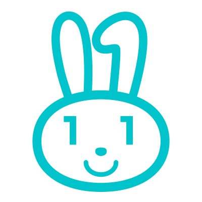 | 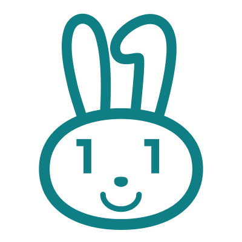 |  |プロダクトで利用しているアイコンとは異なります。 |
| 年末調整機能 | 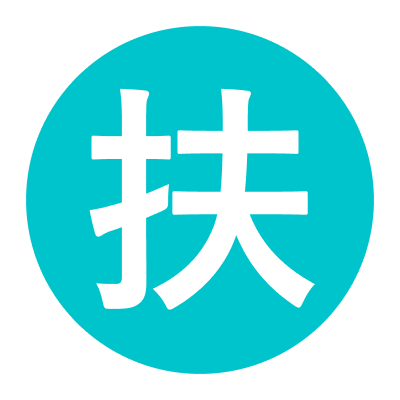 | 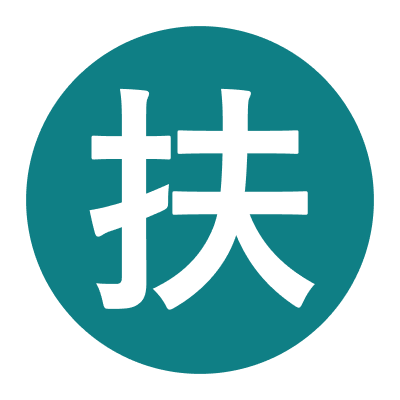 | 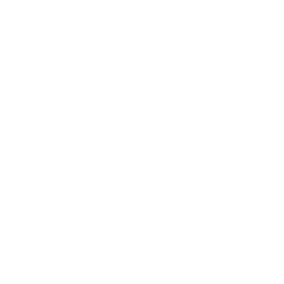 | |
| 申請承認機能 |  |  |  | プロダクトで利用しているアイコンとは異なります。 |
| お知らせ掲示板機能 | - | - | - | 権利の都合上<a href="https://drive.google.com/drive/u/0/folders/1HuxzhO3Dg8lS6wwT7QulUvK2TdN7s8F5" target="_blank">Googleドライブ</a>または<a href="https://www.figma.com/file/wTjPGUsrbI0OqSLIEtwvvG/Communication_Icon?node-id=0%3A1" target="_blank">Figma</a>から利用してください。 |
| 文書配付機能 | - | - | - | 権利の都合上<a href="https://drive.google.com/drive/u/0/folders/1HuxzhO3Dg8lS6wwT7QulUvK2TdN7s8F5" target="_blank">Googleドライブ</a>または<a href="https://www.figma.com/file/wTjPGUsrbI0OqSLIEtwvvG/Communication_Icon?node-id=0%3A1" target="_blank">Figma</a>から利用してください。 |
| 履歴・登録編集機能 |  | 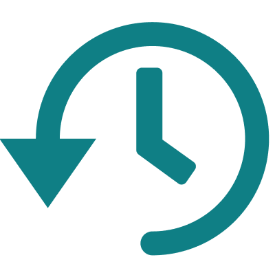 | 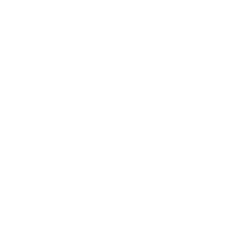 | |
| 履歴・予約機能 | 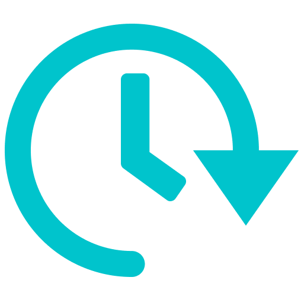 |  |  | |
| 分析レポート機能 | 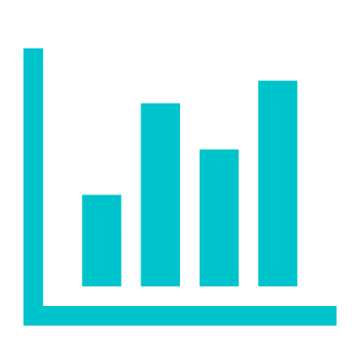 |  | 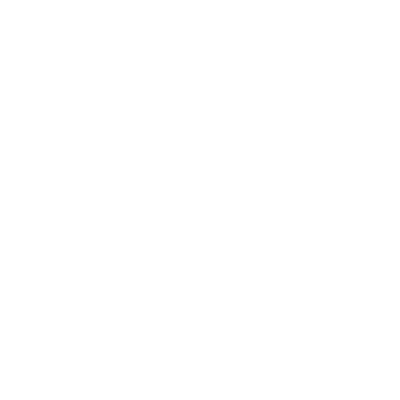 ||プロダクトで利用しているアイコンとは異なります。 |
| 従業員サーベイ機能 |  |  |  | |
| 組織図機能 |  |  |  | |
| 人事評価機能 |  |  |  | |
| カスタム社員名簿機能 |  |  |  | |
| 給与明細機能 |  |  |  ||
| 電子申請機能 | - | - | - | 権利の都合上<a href="https://drive.google.com/drive/u/0/folders/1HuxzhO3Dg8lS6wwT7QulUvK2TdN7s8F5" target="_blank">Googleドライブ</a>または<a href="https://www.figma.com/file/wTjPGUsrbI0OqSLIEtwvvG/Communication_Icon?node-id=0%3A1" target="_blank">Figma</a>から利用してください。 |
| カスタマーサポート | - | - | - | 権利の都合上<a href="https://drive.google.com/drive/u/0/folders/1HuxzhO3Dg8lS6wwT7QulUvK2TdN7s8F5" target="_blank">Googleドライブ</a>または<a href="https://www.figma.com/file/wTjPGUsrbI0OqSLIEtwvvG/Communication_Icon?node-id=0%3A1" target="_blank">Figma</a>から利用してください。 |
| 二段階認証 | - | - | - | 権利の都合上<a href="https://drive.google.com/drive/u/0/folders/1HuxzhO3Dg8lS6wwT7QulUvK2TdN7s8F5" target="_blank">Googleドライブ</a>または<a href="https://www.figma.com/file/wTjPGUsrbI0OqSLIEtwvvG/Communication_Icon?node-id=0%3A1" target="_blank">Figma</a>から利用してください。 |
| 多言語対応　| 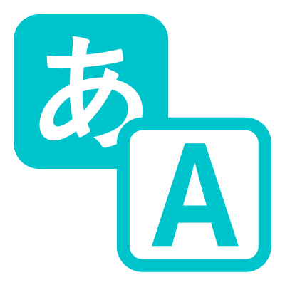 | 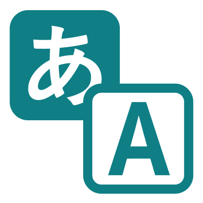 | 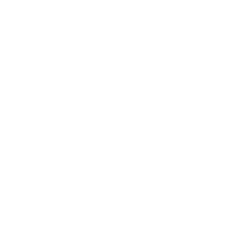 | |
| 源泉徴収票　|  |  |  | |
| API連携　|  |  |  | |
| 通勤経路検索　|  |  |  | |

## 意味を定義していないアイコン

どういった意味で利用するかを定めていませんが、各所で利用しているアイコンです。

権利の都合上、以下に掲載されていないアイコンは<a href="https://drive.google.com/drive/u/0/folders/1HuxzhO3Dg8lS6wwT7QulUvK2TdN7s8F5" target="_blank">アイコン | Googleドライブ</a>または<a href="https://www.figma.com/file/wTjPGUsrbI0OqSLIEtwvvG/Communication_Icon?node-id=0%3A1" target="_blank">アイコン | Figma</a>からご利用ください。

| SmartHR Blue | 　 Aqua04　　 | 　　White　　 | 補足 |
| --- | --- | --- | --- |
|  |  |  |  |
|  |  |  | |
|  | 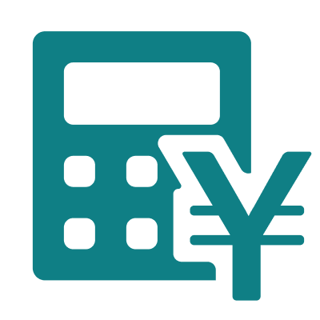 | 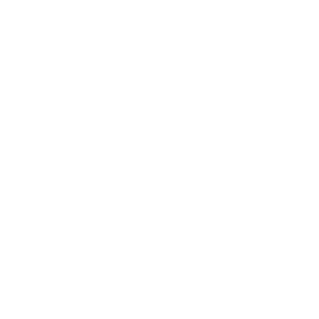 | |
|  |  |  ||
|  |  |  | |
|  |  |  |  |
| 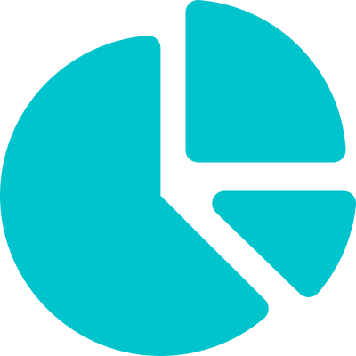 |  |  | プロダクトでは分析レポート機能のアイコンとして利用しています。 |
|  |  |  |  |
