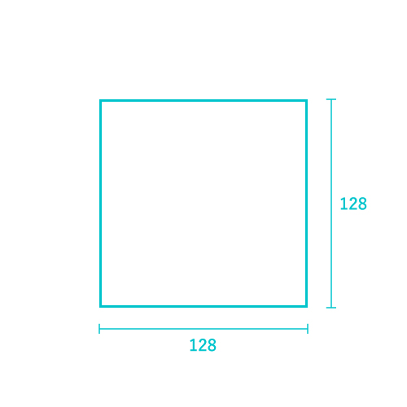
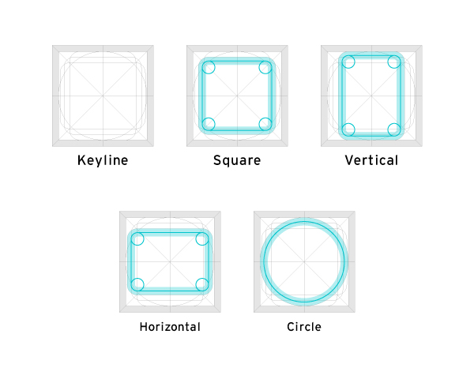

アイコンを作成する際のガイドラインです。

## アイコンデータ
- マスターデータ：[master | Googleドライブ](https://drive.google.com/drive/u/1/folders/1GITBH1tHEYVaEFoXdxxnIz-FC5iS8VSW)
- 社内ライブラリ：[アイコン | Figma](https://www.figma.com/file/wTjPGUsrbI0OqSLIEtwvvG/%E3%82%A2%E3%82%A4%E3%82%B3%E3%83%B3%EF%BC%88Communication%EF%BC%89?node-id=610%3A347)

### マスターデータの注意点
- マスターデータは完成したアイコンを管理するものです。新規アイコンを作成する際は、**複製してから**作業をしてください。
- マスターデータの更新はすべて @omame が担当しますので、アイコン作成後にお声かけください。

## 原則
- Font AwesomeのFreeプランのアイコンを使用し、Font Awesomeにないアイコンのみ独自作成しています。
- 独自に作成するアイコンはFont Awesomeアイコンと並んだときに違和感のないよう作成してください。
- outlineとsolidの2種類を作成してください。
- outlineはFont AwesomeのRegular、solidはFont AwesomeのSolidに見た目を合わせています。
- アイコンは単色で作成してください。
- 既存アイコンがFont Awesomeか、独自作成か知りたい場合は[アイコン | Figma](https://www.figma.com/file/wTjPGUsrbI0OqSLIEtwvvG/%E3%82%A2%E3%82%A4%E3%82%B3%E3%83%B3%EF%BC%88Communication%EF%BC%89?node-id=610%3A347)で確認できます。

## Font Awesomeのアイコン
- Freeプランのアイコンのみを使用してください。
- SmartHR Design Systemで配布しているため、ProやPro Maxプランのアイコンは使用しないでください。
- SolidのみFreeでoutline（Font Awesome内での表記はRegular）はProの場合があります。その場合は以下のルールで作成してください。

| 事例 | 作成方法 |
| --- | --- |
|Regular（Pro）がSolid（Free）を反転した形状 | outline、solidどちらも形を変えて独自作成 |
|Rutline（Pro）がsolid（Free）と違う形状 | solidはそのまま使用、outlineはsolidを反転する形で独自作成 |

※2022年4月時点のFont Awesome最新 ver 6.0.0

## 独自作成をする際のガイドライン
### アートボードサイズ
128 × 128pxで作成してください。

### レイアウト
アイコンの周りには上下左右に各8pxの余白を確保してください

### 基本形状
Font Awesomeのアイコンと並んだときに違和感のないようにKeylineを作成しました。
できるだけKeylineに合わせることで、サイズ感や形状など見た目を統一できます。

#### 線
基本を半径10pxとして作成してください。

#### 角丸
基本を8pxとして作成してください。

## その他
### SolidとOutlineのサイズ感を揃える方法
- 先にoutlineのアイコンを作成します。
- solidを作成する際はoutlineの線を残したまま塗りをつけるとサイズ感が変わらずに作成できます。

### 線のみで構成されているアイコン
- outlineアイコンを先に作成し、Font AwesomeのOutlineをベースに線の太さを調整してsolidアイコンを作成してください。
    - FontAwesomeの**Regular**と**Solid**の関係を参考にして作成してください。
### 空白のサイズ
solid作成時、隣接した色ベタの間に空白を入れる場合は6px空けてください。

## ガイドラインに当てはめられない場合
ガイドラインに沿って作成するのが難しい場合は、ガイドラインを逸脱し作成しても構いません。
認識しやすい形状であり、なおかつ他のアイコンと見た目が統一されていることを優先し作成してください。

## お問い合わせ
アイコンの利用方法に関する相談・お問い合わせ
- 株式会社SmartHR　pr@smarthr.co.jp
- 社内Slack `#design_comm_依頼`