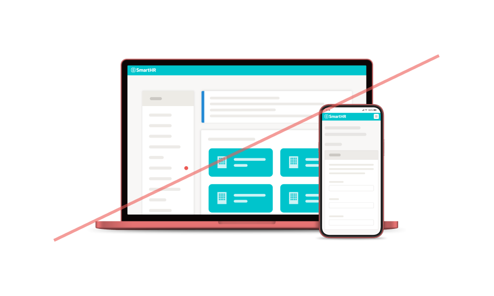
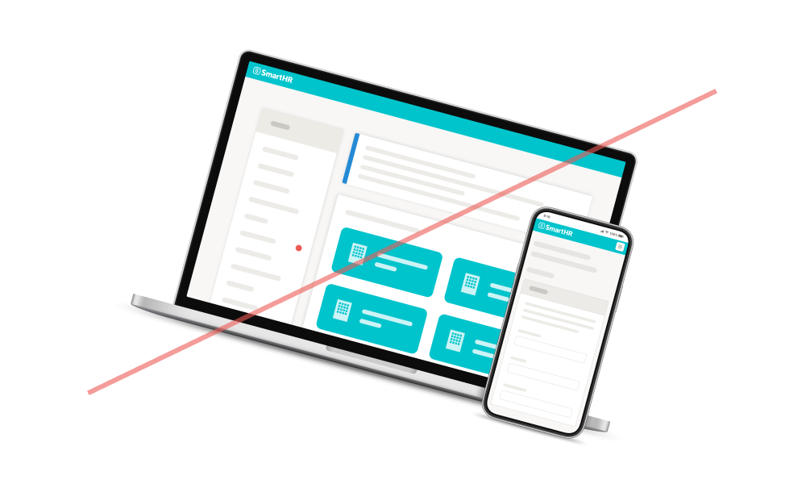
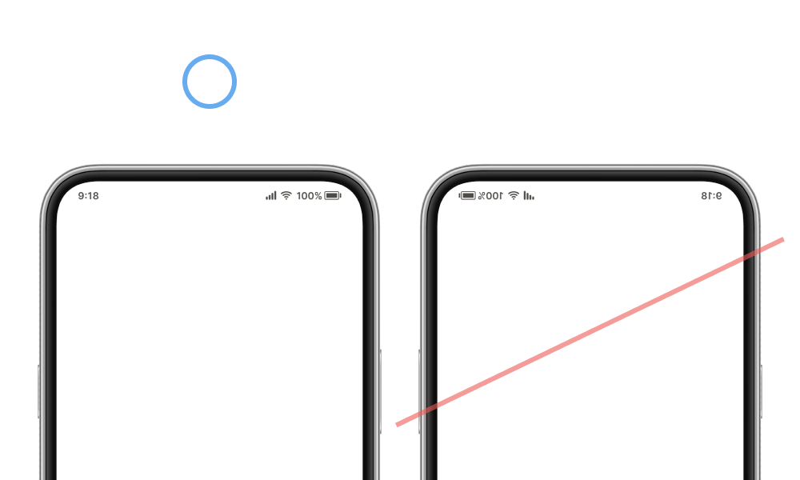
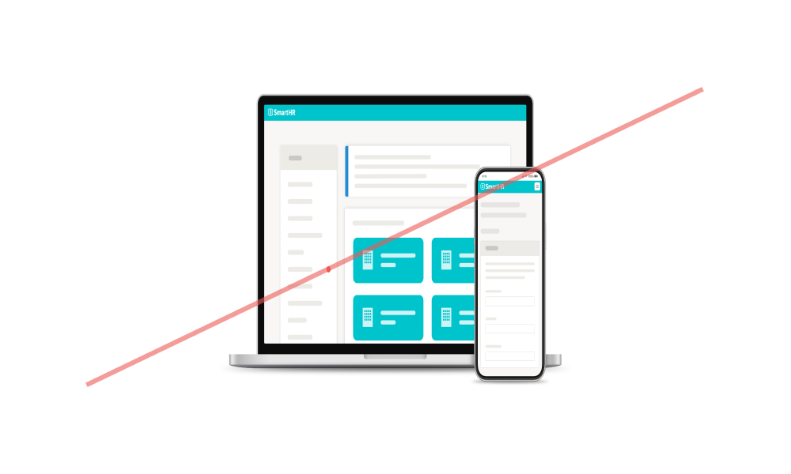
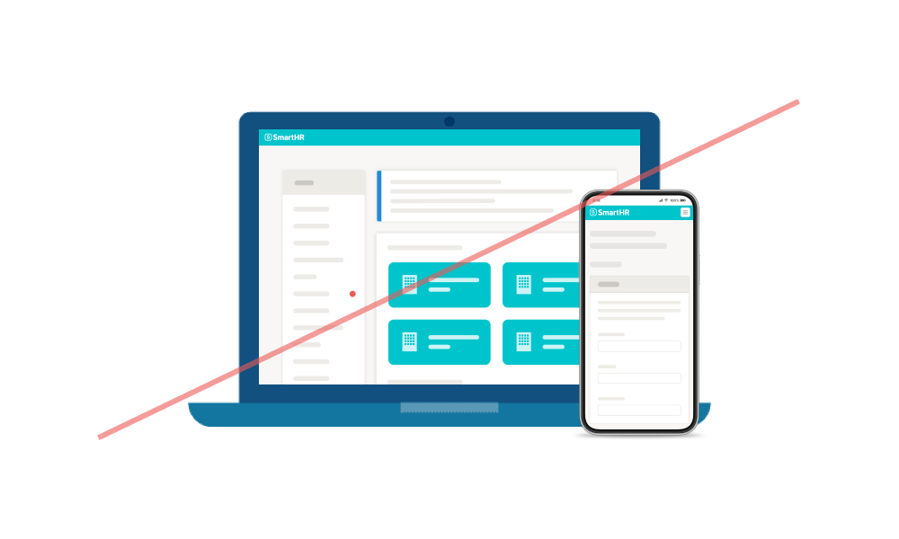
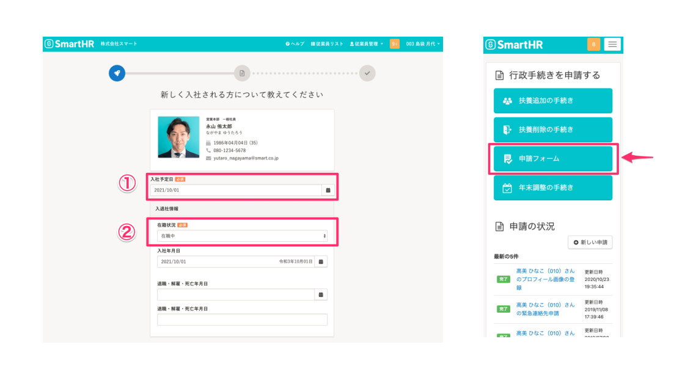

import { ColorPalette, ColorPalettesWrapper } from '@Components/ColorPalette'

import { Grid } from '@Components/shared/Grid/Grid'
import { ImgWithDesc } from '@Components/article/ImgWithDesc/ImgWithDesc'

## 端末モック
SmartHR社、制作パートナー、グループ会社の従業員は、SmartHRの端末モックとサービス画面キャプチャを利用できます。

### 禁止事項
端末モック画像をそのまま使用し、変更を加えないでください。

<Grid>
  <ImgWithDesc description="色味を変更してはいけない">

  

  </ImgWithDesc>

  <ImgWithDesc description="シャドウを付けてはいけない">

  

  </ImgWithDesc>

  <ImgWithDesc description="傾けてはいけない">

  

  </ImgWithDesc>

  <ImgWithDesc description="反転してはいけない">

  

  </ImgWithDesc>

  <ImgWithDesc description="変形してはいけない">

  

  </ImgWithDesc>

  <ImgWithDesc description="同じ画像内で他の端末画像と組み合わせてはいけない">

  

  </ImgWithDesc>
</Grid>

### 端末モックとサービス画面キャプチャを合成する方法

サービス画面キャプチャを端末モック画像に合成するのには3つの方法があります。  
いずれかの方法で、合成・ダウンロードしてください。

#### 1. Figmaを利用する

Fimgaのアカウントをお持ちの方は「<a href="https://www.figma.com/file/ul8bbn8p3aPIXo0DsjjsA6/%E7%AB%AF%E6%9C%AB%E3%83%A2%E3%83%83%E3%82%AF%E5%90%88%E6%88%90?node-id=723%3A121" target="_blank">端末モック合成 | Figma</a>」を利用して合成してください。  
詳細は従業員限定コンテンツとして動画で解説しています。

<Private path="/communication/capture-kit.md"/>

####  2. 端末モック透過画像を利用する

KeynoteやGoogleスライドなどのスライド資料の場合、サービス画面と端末モック透過画像を重ねて配置することで、簡易的な合成ができます。

<Private path="/communication/capture-kit-mockup-transparent.md"/>

####  3. コミュニケーションデザイングループに依頼する

社内Slackより作成を依頼してください。
- 社内Slack `#design_comm_依頼`

## キャプチャ用装飾素材

キャプチャ用装飾素材とは、サービス画面キャプチャの一部を加工して表現する際に、装飾として使用する素材のことです。

### 省略線
省略線とは、縦に長いキャプチャ画像などの一部をレイアウトの都合で省略して表示する際に、画像の一部が省略されていることを示すために使用する、波線の形状の素材です。PNG形式で作成されているので、KeynoteやPowerPointなどさまざまなアプリケーションで利用できます。

#### 省略線の一覧

| 用途 | 素材イメージ | 使用イメージ | ダウンロード |
| --- | --- | --- | --- |
| キャプチャ中央部省略用 | 　|　| <a href="/downloads/省略線_パソコンサイズ_center.png" download>パソコンサイズをダウンロード</a> / <a href="/downloads/省略線_スマートフォンサイズ_center.png" download>スマートフォンサイズをダウンロード</a> |
| キャプチャ下部省略用 | 　|　| <a href="/downloads/省略線_パソコンサイズ_bottom.png" download>パソコンサイズをダウンロード</a> / <a href="/downloads/省略線_スマートフォンサイズ_bottom.png" download>スマートフォンサイズをダウンロード</a> |
| キャプチャ上部省略用 | 　|　|<a href="/downloads/省略線_パソコンサイズ_top.png" download>パソコンサイズをダウンロード</a> / <a href="/downloads/省略線_スマートフォンサイズ_top.png" download>スマートフォンサイズをダウンロード</a> |

## 色（注釈）
サービス画面キャプチャなどに、枠線やテキストといった注釈をつける場合に使用します。

<ColorPalettesWrapper>
 <ColorPalette colorValue="#fc0c59" colorName="Annotaion" description="" />
</ColorPalettesWrapper>

キャプチャの機能に特化したアプリケーション<a href="https://apps.apple.com/jp/app/skitch-%E6%92%AE%E3%82%8B-%E6%8F%8F%E3%81%8D%E8%BE%BC%E3%82%80-%E5%85%B1%E6%9C%89%E3%81%99%E3%82%8B/id425955336?mt=12" target="_blank">Skitch</a>の、デフォルトのカラーに合わせています。プロダクトキャプチャを利用した説明画像などを作成する際は、この色を使用して注釈やガイド線などを記入してください。

 

### 使用イメージ
指定色を使用して、注釈を記載したキャプチャのイメージです。
 

## ライセンス情報
本ページ内のコンテンツについては、[画面キャプチャのライセンス情報](/communication/capture/#h2-3)を参照のうえご利用ください。
