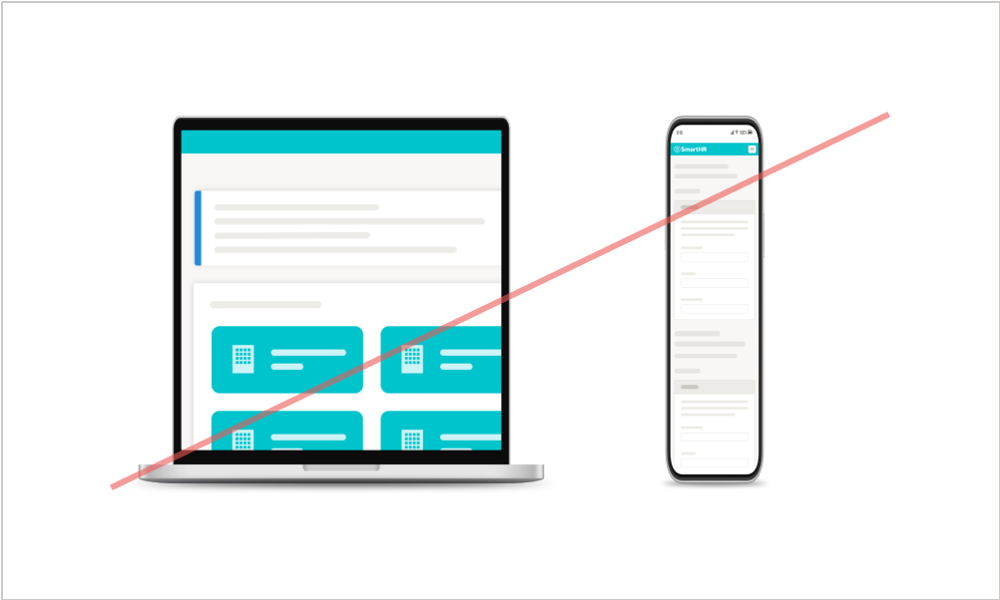

import { ColorPalette, ColorPalettesWrapper } from '@Components/ColorPalette'

import { Grid } from '@Components/shared/Grid/Grid'
import { ImgWithDesc } from '@Components/article/ImgWithDesc/ImgWithDesc'

SmartHRの端末モックです。  
サービス画面キャプチャと合成して利用することで、実際の端末での利用イメージを想起させ、信頼感を与えます。

## 利用者・利用範囲

SmartHR Design Systemはサイトにアクセスするすべての人が、公開されているすべてのコンテンツを参照できます。ただし利用に関しては範囲を定めています。  
端末モックの利用者と利用範囲は以下のとおりです。

| 利用者 | 名義 | 利用可否 |
| :-- | :-- | :-- |
| **SmartHR従業員** | **サービスSmartHR・** **株式会社SmartHR** | **◯ 利用できます** |
| **SmartHR従業員** | **SmartHR Plus β版** | **◯ 利用できます** |
| **SmartHR従業員** | **SmartHRグループ会社・** **提供サービス** | **◯ 利用できます** |
| **SmartHR外部パートナー** | **サービスSmartHR・** **株式会社SmartHR** | **◯ 利用できます** |
| **SmartHR Plusパートナー** | **SmartHR Plusパートナーが** **提供するアプリ** | **◯ 利用できます** |
| **SmartHRグループ会社従業員** | **SmartHRグループ会社・** **提供サービス** | **◯ 利用できます** |
| すべてのかた・広報担当者のかた | すべて | × 利用できません |

ほかのコンテンツの利用範囲は[利用者のかたへ](/introduction/user/)を参照してください。

## 禁止事項
端末モック画像をそのまま使用し、変更を加えないでください。

<Grid>
  <ImgWithDesc description="色味を変更してはいけない">

  

  </ImgWithDesc>

  <ImgWithDesc description="シャドウを加工してはいけない">

  

  </ImgWithDesc>

  <ImgWithDesc description="傾けてはいけない">

  

  </ImgWithDesc>

  <ImgWithDesc description="反転してはいけない">

  

  </ImgWithDesc>

  <ImgWithDesc description="変形してはいけない">

  

  </ImgWithDesc>

  <ImgWithDesc description="同じ画像内で他の端末画像と組み合わせてはいけない">

  

  </ImgWithDesc>
</Grid>

## サービス画面キャプチャと合成する方法

サービス画面キャプチャを端末モック画像に合成するのには3つの方法があります。  

### 1. Figmaを利用する

Fimgaのアカウントをお持ちの方は「<a href="https://www.figma.com/file/ul8bbn8p3aPIXo0DsjjsA6/%E7%AB%AF%E6%9C%AB%E3%83%A2%E3%83%83%E3%82%AF%E5%90%88%E6%88%90?node-id=723%3A121" target="_blank">端末モック合成 | Figma</a>」を利用して合成してください。  
詳細は従業員限定コンテンツとして動画で解説しています。

<Private path="/communication/mock.md"/>

###  2. 端末モック透過画像を利用する

KeynoteやGoogleスライドなどのスライド資料の場合、サービス画面と端末モック透過画像を重ねて配置することで、簡易的な合成ができます。

<Private path="/communication/capture-mock-transparent.md"/>

###  3. コミュニケーションデザイングループに依頼する

社内Slackより作成を依頼してください。
- 社内Slack `#design_comm_依頼`