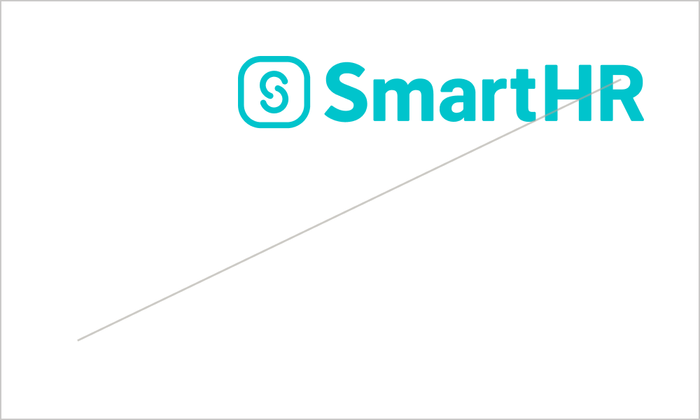

import { Grid } from '../../../../src/components/shared/Grid/Grid'
import { ImgWithDesc } from '../../../../src/components/article/ImgWithDesc/ImgWithDesc'

<video controls style="max-width: 100%; width: 100%;" poster="/images/jingle_movie_thumb.png" >
  <source src="/video/jingle_movie.mp4" type="video/mp4" title="SmartHR jingle movie" ></source>
  
動画を再生できない場合は以下のYouTubeリンクよりご覧ください

</video>

（ <a href="https://www.youtube.com/watch?v=EKpYFkLSIjY" target="_blank">SmartHR ジングルムービー | YouTube</a> ）
イベントやライブストリーミングで利用できるジングルムービーです。
SmartHRジングルムービーを本ガイドラインおよび[利用規約](/terms/)に違反する態様での複製・転用・変更することを禁止します。

## ガイドライン
### 利用方法
- プレゼンテーションの始まりや場面の転換など、コンテンツを印象付ける場面で使用してください。
- ロゴマークとして添えたいときは、[モーションロゴ](/basics/logos/motion/)を使用してください。
- ジングルムービーの前後を延長し、クロスフェードやフェードイン／アウトなどの透明度を用いたカットの切り替わり表現が可能です。

### 禁止事項
<Grid>
  <ImgWithDesc description="再生速度を変えてはいけない">
  
  </ImgWithDesc>
  <ImgWithDesc description="エフェクトを追加してはいけない">
  
  </ImgWithDesc>
  <ImgWithDesc description="要素の位置を変えてはいけない">
  
  </ImgWithDesc>
  <ImgWithDesc description="指定カラー以外で表記してはいけない">
  
  </ImgWithDesc>
  <ImgWithDesc description="ロゴを傾けてはいけない">
  
  </ImgWithDesc>
  <ImgWithDesc description="変形させてはいけない">
  
  </ImgWithDesc>
  <ImgWithDesc description="他要素やマークをロゴの上に重ねてはいけない">
  
  </ImgWithDesc>
  <ImgWithDesc description="他の音声を重ねてはいけない">
  
  </ImgWithDesc>
  <ImgWithDesc description="音声にエフェクトを追加してはいけない">
  
  </ImgWithDesc>
</Grid>

### ダウンロード
mov形式のジングルムービーをダウンロードできます。
- 推奨形式（適したデータ形式がわからない場合はこちらを使用してください。）
    - [1920x1080（30fps）](/SmartHR_JingleMovie_1920x1080_30fps.zip)
- そのほかの形式
    - [1920x1080（24fps, 60fps）](/SmartHR_JingleMovie_1920x1080.zip)
    - [3840x2160（24fps, 30fps, 60fps）](/SmartHR_JingleMovie_3840×2160.zip)

## ライセンス情報
SmartHRジングルムービーのデザインやレイアウト、ロゴマーク、サウンド、商標などに関しては、株式会社SmartHR（以下「当社」といいます）または、当社にその利用を認めた権利者が著作権などの知的財産権、使用権その他の権利を有しています。

## お問い合わせ
ジングルムービーの*掲載、使用の可否*についての相談・お問い合わせ
- 株式会社SmartHR　pr@smarthr.co.jp
- 社内Slack `#pr`
ジングルムービーの*利用方法*に関する相談・お問い合わせ
- 株式会社SmartHR　pr@smarthr.co.jp
- 社内Slack `#design_comm_依頼`
