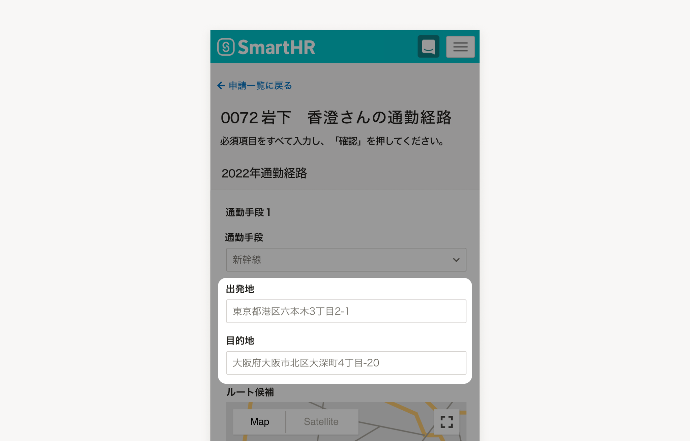

SmartHRのサービス全体で利用できるサンプルテキストです。

## ガイドライン
- SmartHRに関するシーン、例えば営業資料・サービスサイト・ヘルプセンターなどのどこでも、媒体を問わず利用できます。
- 利用シーンに応じて、情報の取捨選択や適切な表記法を選択してください。

## 利用シーン例
- プロダクトの入力例が表示されているプレースホルダー
- 画面キャプチャのユーザー情報

## サンプルテキスト一覧

### 従業員情報

| 項目 | 推奨する表記 | 補足 |
| --- | --- | --- |
| 従業員氏名 | **[ユーザー社の従業員](https://smarthr.design/basics/illustration/user-co-other/)に掲載されている氏名を利用** |  |
| メールアドレス | **{名前.苗字}@example.com** | 例：yamato.makoto@example.com |
| 従業員番号 | **0064など、半端な数字を使用** | 従業員番号一桁台だと役員であるケースも多いため、二桁以上を推奨します。 |

### 企業名

| シーン | 推奨する表記 | 補足 |
| --- | --- | --- |
| 1社記載 | **株式会社＊＊＊＊＊** | 「全角のアスタリスク5つ」を基本とする。 モバイルなど横幅が短い場面ではアスタリスク3つ「株式会社＊＊＊」に短縮OK |
| 複数社記載 | **株式会社＊＊＊＊＊A 株式会社＊＊＊＊＊B 株式会社＊＊＊＊＊C** | 「全角のアスタリスク5つ＋アルファベット」を基本とする 場面に応じて「＊」の個数および「A,B,」の表現は調整はOK |
| 社名を日本語表記にしたい場合 | **株式会社SmartHR** |  |

表記決定の背景や、具体的な表現の調整例については[画面キャプチャ内のダミー社名（DocBase）](https://smarthr-inc.docbase.io/posts/3534932#%E6%B1%BA%E5%AE%9A%E3%81%97%E3%81%9F%E4%BB%A3%E6%9B%BF%E8%A1%A8%E8%A8%98)を参照してください。

### その他

| 項目 | 推奨する表記 | 補足 |
| --- | --- | --- |
| 住所 | **〒106-6217 東京都港区六本木3-2-1 住友不動産六本木グランドタワー** | 2つ以上掲載したい場合は、<a href ="https://smarthr.co.jp/company/" target="_blank">コーポレートサイト</a>を参照し、支社の住所を使用してください。 |
| 固定電話番号 | **03-1234-5678** | 2つ以上掲載したい場合は、先頭を「03」にして、以降は0から9までの整数を順に記載してください（例：03-2345-6789） |
| 携帯電話番号 | **080-1234-5678** | 2つ以上掲載したい場合は、先頭を「080」にして、以降は0から9までの整数を順に記載してください（例：080-2345-6789） |

## フィードバック先
サンプルテキストの利用方法に関する相談・フィードバック
- SmartHR Design System 運営チーム smarthr-design-system@smarthr.co.jp
- 社内Slack　`#design_system_相談`
