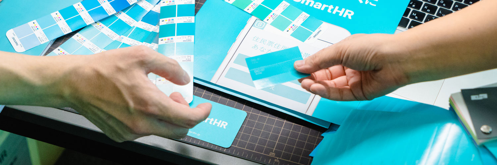

## h2 相当のタイトル

文章が記入できます。文章が記入できます。文章が記入できます。文章が記入できます。文章が記入できます。文章が記入できます。文章が記入できます。文章が記入できます。文章が記入できます。文章が記入できます。文章が記入できます。文章が記入できます。文章が記入できます。

### h3 相当のタイトル

文章が記入できます。文章が記入できます。文章が記入できます。文章が記入できます。文章が記入できます。文章が記入できます。文章が記入できます。文章が記入できます。文章が記入できます。文章が記入できます。文章が記入できます。文章が記入できます。文章が記入できます。

#### h4 相当のタイトル

文章が記入できます。文章が記入できます。文章が記入できます。文章が記入できます。文章が記入できます。文章が記入できます。文章が記入できます。文章が記入できます。文章が記入できます。文章が記入できます。文章が記入できます。文章が記入できます。文章が記入できます。

##### h5 相当のタイトル

文章が記入できます。文章が記入できます。文章が記入できます。文章が記入できます。文章が記入できます。文章が記入できます。文章が記入できます。文章が記入できます。文章が記入できます。文章が記入できます。文章が記入できます。文章が記入できます。文章が記入できます。

## 箇条書き

- 箇条書き1
- 箇条書き2
- 箇条書き3

1. 順番箇条書き
2. 順番箇条書き
3. 順番箇条書き

## プレビュー

import { PrimaryButton, PrimaryButtonAnchor } from 'smarthr-ui'
import { SecondaryButton, SecondaryButtonAnchor } from 'smarthr-ui'
import { DangerButton, DangerButtonAnchor } from 'smarthr-ui'
import { SkeletonButton, SkeletonButtonAnchor } from 'smarthr-ui'
import { TextButton, TextButtonAnchor } from 'smarthr-ui'
import { Cluster, LineUp, Stack } from 'smarthr-ui'
import { Text } from 'smarthr-ui'
import { FaPlusCircleIcon } from 'smarthr-ui'
import { ComponentPreview } from 'Components/ComponentPreview'
import { DoAndDont } from 'Components/DoAndDont'
import { StaticImage } from 'Components/StaticImage'

<ComponentPreview>
  <PrimaryButton>Button</PrimaryButton>
  <SecondaryButton>Button</SecondaryButton>
  <DangerButton>Button</DangerButton>
  <SkeletonButton>Button</SkeletonButton>
  <TextButton>Button</TextButton>
</ComponentPreview>

## コード（ライブコード）

基本的に、1コード1コンポーネントで利用してください。

```tsx live=true
<PrimaryButton>Button</PrimaryButton>
```

## コード

```tsx
<PrimaryButton>Button</PrimaryButton>
<SecondaryButton>Button</SecondaryButton>
<DangerButton>Button</DangerButton>
<SkeletonButton>Button</SkeletonButton>
<TextButton>Button</TextButton>
```

## Markdown テーブル

| thead | thead | thead |
| ----- | ----- | ----- |
| cell  | cell  | cell  |
| cell  | cell  | cell  |
|   | cell  | cell  |

### SmartHR UI テーブル

import { Table, Body, Head, Row, Cell } from 'smarthr-ui'

<Table>
  <Head>
    <Row>
      <Cell>thead</Cell>
      <Cell>thead</Cell>
      <Cell>thead</Cell>
    </Row>
  </Head>
  <Body>
    <Row>
      <Cell>cell</Cell>
      <Cell>cell</Cell>
      <Cell>
        <PrimaryButton>Button</PrimaryButton>
      </Cell>
    </Row>
    <Row>
      <Cell>cell</Cell>
      <Cell>cell</Cell>
      <Cell>
        <PrimaryButton>Button</PrimaryButton>
      </Cell>
    </Row>
  </Body>
</Table>

## レイアウト
SmartHR UI Layoutコンポーネントを使用できます。

### Cluster

* 入れ子にして`align`や`justify`を組み合わせるとメディアクエリを使用せずに柔軟なレイアウトを作れます。
* 幅を狭めて収まり切らなくなると折返します。
* `gap`に使える値は`XXS`,`XS`,`S`,`M`,`L`,`XL`、他`1`,`0.5`などの数値です。詳しくはsmarthr-uiのドキュメントを参照してください。

<Cluster gap="XS">
  {[...Array(10)].map((_, i) => (
    <div key={i} style={{background: 'black', width: `${100}px`, height: '100px'}} />
  ))}
</Cluster>

### LineUp

* `align-items`や`justify-content`など`Flexbox`に準じたプロパティを渡せます。
* `gap`に使える値は`XXS`,`XS`,`S`,`M`,`L`,`XL`、他`1`,`0.5`などの数値です。詳しくはsmarthr-uiのドキュメントを参照してください。

<LineUp gap="XS">
  {[...Array(10)].map((_, i) => (
    <div key={i} style={{background: 'black', width: `${100}px`, height: '100px'}} />
  ))}
</LineUp>

### Stack

* 等間隔に隙間を保ち、積み重ねるレイアウトが作れます。
* 各要素の間隔は`1rem`が標準です。
* `gap`に使える値は`XXS`,`XS`,`S`,`M`,`L`,`XL`、他`1`,`0.5`などの数値です。詳しくはsmarthr-uiのドキュメントを参照してください。

<Stack gap="XS">
  {[...Array(4)].map((_, i) => (
    <div key={i} style={{background: 'black', width: '100px', height: '100px'}} />
  ))}
</Stack>

## Color パレット

import { ColorPalette, ColorPalettesWrapper } from 'Components/ColorPalette'

<ColorPalettesWrapper>
  <ColorPalette hexCode="#0077c7" colorName="MAIN" description="プライマリーカラー（プロダクトの印象を司る箇所に使用）" />
  <ColorPalette hexCode="#ffffff" colorName="WHITE" description="コンポーネントの背景色（Base コンポーネントなど）" />
</ColorPalettesWrapper>

## 画像

画像はcontent配下の指定ディレクトリに格納できます。


### Markdown形式の画像設置

Markdown形式の画像Pathは`相対パス`で読み込めます。また属性値を以下のような指定で設定できます。

```md

```

#### 表示例


### Component内の画像設置

`.mdx`ファイル内で、SmartHR UIなどのコンポーネントと共に画像（imgタグ）を使いたい場合は、利用したい画像を`import`し、`StaticImage`コンポーネントの`src`にその`path`を設定してください。

```tsx
import { StaticImage } from 'Components/StaticImage'
import { Cluster } from 'smarthr-ui'
import imageUrl from './images/sample.jpg';

<Cluster gap="XS">
  <StaticImage src={imageUrl} width="200" alt="Image Sample" />
  <StaticImage src={imageUrl} width="200" alt="Image Sample" />
</Cluster>
```

#### 表示例

import imageUrl from './images/sample.jpg';

<Cluster gap="XS">
  <StaticImage src={imageUrl} width="200" alt="Image Sample" />
  <StaticImage src={imageUrl} width="200" alt="Image Sample" />
</Cluster>

## ファイルのリンク

静的な巨大ファイルは`/static`フォルダから直接リンクできます。

[ダウンロードリンク](/SmartHR_Logo_png.zip)

## 絵文字

### Shortcut codes

:rocket:
:smiling_imp:
:imp:
:skull:
:skull_and_crossbones:
:poop:
:clown_face:
:japanese_ogre:
:japanese_goblin:
:ghost:
:alien:
:space_invader:

### Unicode

👍🥳👏💃🌵🥑🌶️🌮🌯🍸🍻🏜️🎈🎊🎵🎶 🎸🇲🇽🇺🇸

## Do And Don&apos;t

<LineUp gap="XS">
  <DoAndDont
    type="do"
    img={<StaticImage src={imageUrl} alt="Do" width="200" />}
    label={<Text>ほげほげ</Text>}
  />
  <DoAndDont
    type="dont"
    img={<StaticImage src={imageUrl} alt="Dont" width="200" />}
    label={<Text>ほげほげ</Text>}
  />
</LineUp>

