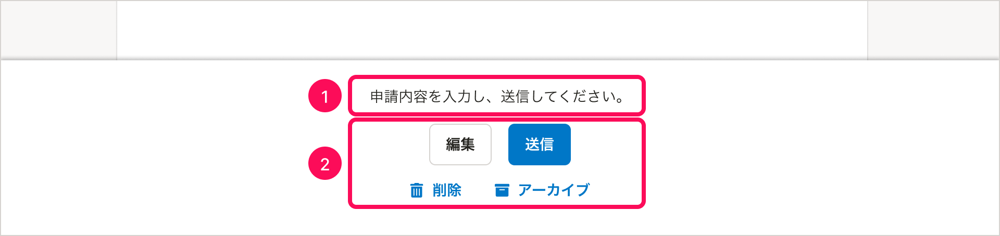

import { ComponentPropsTable } from '@Components/ComponentPropsTable'
import { ComponentStory } from '@Components/ComponentStory'

画面の下部に固定表示する領域のためのコンポーネントです。特定のアクションボタンを、スクロール位置にかかわらず常に画面内に表示するために使います。

<ComponentStory name="BottomFixedArea" />

## 基本的な考え方

ページ全体を対象とした主要なアクションがある場合、BottomFixedAreaを使ってボタンを固定表示できます。代表的な例として以下があります。

- [ページ全体を使ったモード](/products/design-patterns/modal-ui/#h3-2)であるとき
- タスクとしての性質を持つオブジェクトの詳細画面

置かれるアクションボタンの例として、次のようなものがあります。

- 操作した内容をシステムに送信する
- 操作した内容を破棄し、前の状態に戻す
- プレビューする
- タスクを次のステータスに進める、前のステータスに戻す
- オブジェクトを削除する、アーカイブする

## 使用上の注意

### ページ全体に対するアクションボタン以外は置かない

BottomFixedAreaに置くアクションボタンは、ページに表示されている情報全体に対するものに限定します。

以下のようなアクションのボタンは、BottomFixedArea以外の場所に置いてください。

- オブジェクトの名前変更など、「ページの一部」に対するアクション
- 機能全体の設定変更など、「ページよりも広い範囲」に対するアクション

### アクション対象外のカラムがある場合はFloatAreaを使う

固定表示するアクションボタンの対象とならないカラム（サイドバーなど）がページ内にある場合は、[FloatArea](/products/components/float-area/)を使ってください。

## 構成

1. 説明文（任意）
2. アクションボタン

### 1. 説明文（任意）

必要に応じて、アクションに関する説明を書きます。

### 2. アクションボタン

必要に応じて、以下のボタンを配置できます。

- Primaryボタン・Secondaryボタン
  - 最大でそれぞれ1個ずつ置けます。
  - 両方置く場合は、Primaryボタンを右側に置きます。
- Tertiaryボタン
  - Primary・Secondaryボタンを置いたうえで、さらにアクションボタンを置く場合は、下の段にTertiaryボタンを複数個置けます。

## Props

<ComponentPropsTable name="BottomFixedArea" />

