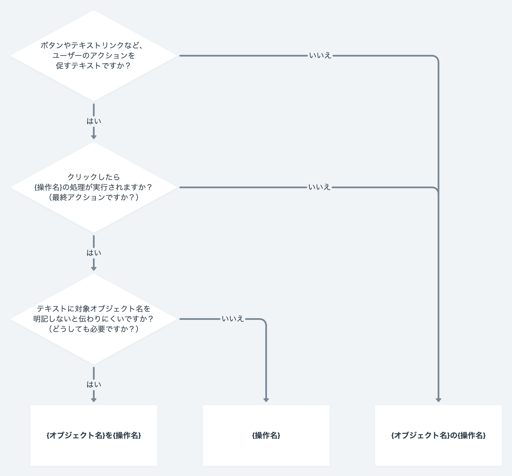

import { Button, Cluster, FaCaretDownIcon, FaCloudDownloadAltIcon, FaFilterIcon, FaPlusCircleIcon } from 'smarthr-ui'
import { ComponentStory } from '@Components/ComponentStory'
import { ComponentPropsTable } from '@Components/ComponentPropsTable'

Buttonコンポーネントは、ユーザーが情報の保存や検索などの操作をできるようにします。

<ComponentStory name="Button" />


## 種類
ボタンの優先度や役割に合わせた4種類のコンポーネントを総称して、Buttonコンポーネントとして定義しています。

```tsx editable codeBlock
<>
  <Button variant="primary">Primary</Button>
  <Button>Secondary</Button>
  <Button variant="danger">Danger</Button>
  <Button variant="text">Text</Button>
</>
```

### Primary
画面の主要なアクションを促すボタンです。

1つの画面に複数のPrimaryボタンを使わないでください。複数のPrimaryボタンがあるとユーザーは何をすればいいかわからなくなります。

```tsx editable codeBlock
<>
  <Button variant="primary">ボタン</Button>
  <Button variant="primary" prefix={<FaPlusCircleIcon />}>ボタン</Button>
  <Button variant="primary" suffix={<FaCaretDownIcon />}>ボタン</Button>
  <Button variant="primary" square>
    <FaPlusCircleIcon visuallyHiddenText="追加" />
  </Button>
</>
```

### Secondary
画面でのアクションを促す、Primaryボタンに対する副次的なボタンとして使います。  
SmartHR UI では特に種類の指定をしない場合はSecondaryになります。

画面内にボタンが多すぎる場合、ユーザーは次に何をすればいいのか戸惑うかもしれません。その場合はボタンを減らしたり、画面を簡略化したり、複数の画面に分けることを検討しましょう。

```tsx editable codeBlock
<>
  <Button>ボタン</Button>
  <Button prefix={<FaPlusCircleIcon />}>ボタン</Button>
  <Button suffix={<FaCaretDownIcon />}>ボタン</Button>
  <Button square>
    <FaPlusCircleIcon visuallyHiddenText="追加" />
  </Button>
</>
```

### Danger
破壊的なアクション（データの永久消去など）の実行前に、ユーザーに一歩立ち止まって考えてもらいたいときに使います。

- Dangerボタンが頻出すると効果がありません。
- ユーザーにこのアクションを実行させる場合は、必ず確認を求めるステップを追加してください。（例：[削除ダイアログ](/products/design-patterns/delete-dialog/)）
- すべてのユーザーが色を見たり、理解できるわけではないため、警告を促す赤色（[`DANGER`](/products/design-tokens/color/#h2-1)）に頼らないでください。ボタン配置のコンテキストやラベルテキストは重要です。

```tsx editable codeBlock
<>
  <Button variant="danger">ボタン</Button>
  <Button variant="danger" prefix={<FaPlusCircleIcon />}>ボタン</Button>
  <Button variant="danger" suffix={<FaCaretDownIcon />}>ボタン</Button>
  <Button variant="danger" square>
    <FaPlusCircleIcon visuallyHiddenText="追加" />
  </Button>
</>
```

### Text
Secondaryボタンよりもさらに優先度が低いアクションのボタンとして使います。

また、[ドロップダウンメニュー](/products/design-patterns/dropdown-button/#h3-1)として使用したり、[アイコンボタン](#h4-1)として使用するなど、ボタンではあるもののボタンの装飾を必要としない場合に使います。

```tsx editable codeBlock
<>
  <Button variant="text">ボタン</Button>
  <Button variant="text" prefix={<FaPlusCircleIcon />}>ボタン</Button>
  <Button variant="text" suffix={<FaCaretDownIcon />}>ボタン</Button>
  <Button variant="text" square>
    <FaPlusCircleIcon visuallyHiddenText="追加" />
  </Button>
</>
```

### AnchorButton
リンク（`a`要素）をボタンのように見せるためのコンポーネントですが、どうしようもないときだけ使います。
アクションボタンとして表現したい場合は、素直に`Button`を使いましょう。

```tsx editable codeBlock
<>
  <AnchorButton variant="primary" href="#h3-4">ボタン</AnchorButton>
  <AnchorButton href="#h3-4">ボタン</AnchorButton>
  <AnchorButton variant="danger" href="#h3-4">ボタン</AnchorButton>
  <AnchorButton variant="text" href="#h3-4">ボタン</AnchorButton>
</>
```


## レイアウト
サイズやアイコンの有無で、コンポーネント内のレイアウトにバリエーションがあります。  
「`サイズ小`かつ`アイコン付き（左）`」のように組み合わせることもできます。

### ボタンサイズ
2種類の大きさのボタンを使用できます。
SmartHR UIでは、サイズ（`size`props）で指定できます。

| 種類 | 表示例 | 説明 |
| :--- | :--- | :--- |
| `通常` | <Button prefix={<FaPlusCircleIcon />} size="default">ボタン</Button> | 通常のサイズです。 |
| `小` | <Button prefix={<FaPlusCircleIcon />} size="s">ボタン</Button> | レイアウトの都合上、どうしようもない場合に使うサイズです。 |

### アイコンの有無

#### アイコン付きボタン
ラベルテキストの左右にアイコンを配置できます。  
SmartHR UIでは、プレフィックス（`prefix`props）およびサフィックス（`suffix`props）に[Iconコンポーネント](/products/components/icon/)を指定することで表現できます。

ただし、左右のアイコンを同時に指定しないでください。`アイコン付き（右）`を優先し、アイコンを右に表示する場合は左のアイコンは設定しないようにしましょう。

| 種類 | 表示例 | アイコンの役割 |
| :--- | :--- | :--- |
| `アイコン付き（左）` | <Cluster><Button prefix={<FaPlusCircleIcon />}>項目を追加</Button><Button prefix={<FaCloudDownloadAltIcon />}>ダウンロード</Button></Cluster> | ボタンのアクション（機能）を表すために使います。<br />同じアクションのボタンには、同じアイコンを採用してください。 |
| `アイコン付き（右）` | <Cluster><Button suffix={<FaCaretDownIcon />}>一括操作</Button><Button suffix={<FaFilterIcon />}>絞り込み</Button></Cluster> | ドロップダウンのように、ボタン押下後に表示するUIを想起させるために使います。<br />（例：[ドロップダウンボタン](/products/design-patterns/dropdown-button/)、[Dropdown](/products/components/dropdown/)、[FilterDropdown](/products/components/filter-dropdown/)） |

#### アイコンボタン
アイコンのみのボタンです。ラベルテキストを表示するレイアウト上の余裕がない場合などに使います。  
ラベルテキストがないため、[アイコンには必ず代替テキストを含めてください。](/products/components/icon/#h3-0)

```tsx editable codeBlock
<>
  <Button square>
    <FaPlusCircleIcon visuallyHiddenText="追加" />
  </Button>
  <Button square size="s">
    <FaPlusCircleIcon visuallyHiddenText="追加" />
  </Button>
</>
```


## 状態

### マウスオーバー
マウスポインタでボタンに触れている状態（hover状態）のスタイルです。
マウスオーバーを認知できるように、標準時の背景色に[`OVERLAY`](/products/design-tokens/color/#h2-3)を重ねて表現します。

### 無効（disabled）
ボタンの操作ができない状態を表現したスタイルです。  
無効状態のボタンはコントラストが低くユーザーを混乱させるため、できるだけ使わないようにしてください。

ユーザーはなぜ無効になっているのかわからないことがあります。「[権限による表示制御](/products/design-patterns/access-control-pattern/)」のデザインパターンを参考にして、無効状態の理由を表示したり、無効ではなくボタン自体を非表示にすることを検討してください。

```tsx editable codeBlock
<>
  <Button variant="primary" prefix={<FaPlusCircleIcon />} disabled>ボタン</Button>
  <Button prefix={<FaPlusCircleIcon />} disabled>ボタン</Button>
</>
```


## ライティング

### ラベルの書き方
ラベルは、そのボタンが担うアクションを体言止めで書きます。

- ユーザーが入力したフォームを「送信」
- タスクやオブジェクトを「追加」
- 次のプロセスに進む「次へ」

「権限を追加」「申請を取り消し」など、対象のオブジェクト名などを明記しないとアクションが伝わりにくい場合は「を」で接続します。
- [ボタンやテキストリンクでは、助詞は「を」を使用する](../../../products/contents/app-writing/#reccSLpBRYw4z7b1m-0)

ラベルの判断基準は以下のとおりです。




## その他

### type="button" について
SmartHR UIのButtonには意図しない`submit`を防ぐために、`type="button"`がついています。
そのため、form submitを使いたい場合は、必ず`type="submit"`を明記してください。


## Props

<ComponentPropsTable name="Button" />


## 参考文献

- [Button – GOV.UK Design System](https://design-system.service.gov.uk/components/button/)
