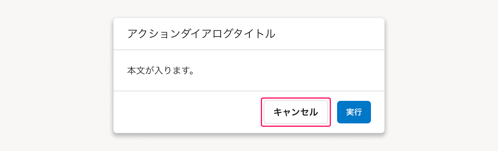
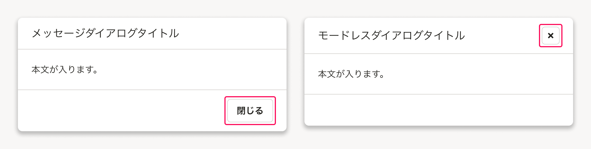

import { useEffect, useState } from 'react'
import {
  ActionDialog,
  Body,
  Button,
  Cell,
  CheckBox,
  Dialog,
  Head,
  MessageDialog,
  ModelessDialog,
  Row,
  Table,
} from 'smarthr-ui'
import { ComponentPreview } from '@Components/ComponentPreview'
import { ComponentStory } from '@Components/ComponentStory'
import { ComponentPropsTable } from '@Components/ComponentPropsTable'

Dialogコンポーネントは、ユーザーに集中してほしい確認や操作を示します。

<ComponentStory name="Dialog" />

## 使いどころ
ダイアログは、ユーザーの能動的なアクションを起点に、主に以下の目的で使います。  

* 別の情報を操作する必要がある場合
* 作業の確認（参照・追加・編集・削除）を促す場合
* メッセージや警告をユーザーに表示する場合

情報設計をしっかり行ない、ダイアログで表示したい内容が上記に挙げた目的に合うものか、メインコンテンツの画面で表示するよりも適切な整理なのかをよく考えましょう。

### ダイアログの乱用は避ける
ダイアログの乱用は避けましょう。  
ダイアログの表示中は、メインコンテンツの情報・状態は保持されますが、ユーザーは（それまでの操作を中断し）ダイアログでの操作に集中させられることになります。
また、以下も推奨されません。

* ダイアログの上にダイアログを表示すること
* 複数のダイアログを同時に表示すること

## 種類
### ActionDialog
SmartHR UIでは`ActionDialog`です。  
ActionDialogは、ユーザーに選択の確認や操作を求める場合に使用するモーダルダイアログです。[Primaryボタン](/products/components/button/#h3-0)を使い強調します。

export const DynamicActionDialog = () => {
  const [isOpen, setIsOpen] = useState(false)
  if (typeof window !== 'undefined') {
    return (
      <>
        <Button variant="primary" onClick={() => setIsOpen(true)}>ActionDialogを開く</Button>
        <ActionDialog
          isOpen={isOpen}
          title="アクションダイアログタイトル"
          closeText="キャンセル"
          actionText="実行"
          actionTheme="primary"
          onClickClose={()=> {setIsOpen(false)}}
          onPressEscape={() => setIsOpen(false)}
          onClickAction={()=> {setIsOpen(false)}}
        >
          

            本文が入ります。
          

        </ActionDialog>
      </>
    )
  } else {
    return null
  }
}

<ComponentPreview>
  <DynamicActionDialog />
</ComponentPreview>

### MessageDialog
SmartHR UIでは`MessageDialog`です。  
MessageDialogは、ユーザーの操作を中断させて、ユーザーへの警告や確認を明示的にしたい場合に使うモーダルダイアログです。

ユーザーの操作を中断させる必要がない場合は、[InformationPanel](/products/components/information-panel/)や[CompactInformationPanel](https://smarthr.design/products/components/compact-information-panel/)の使用を検討してください。

export const DynamicMessageDialog = () => {
  const [isOpen, setIsOpen] = useState(false)
  if (typeof window !== 'undefined') {
    return (
      <>
        <Button variant="primary" onClick={() => setIsOpen(true)}>MessageDialogを開く</Button>
        <MessageDialog
          isOpen={isOpen}
          title="メッセージダイアログタイトル"
          description={
本文が入ります。
}
          closeText="閉じる"
          onClickClose={() => setIsOpen(false)}
          onPressEscape={() => setIsOpen(false)}
          id="dialog-message"
        />
      </>
    )
  } else {
    return null
  }
}

<ComponentPreview>
  <DynamicMessageDialog />
</ComponentPreview>

### ModelessDialog
SmartHR UIでは`ModelessDialog`です。  
ModelessDialogは、ユーザーに任意のタイミングや順序で、情報の確認や操作をさせたい場合に使います。

export const DynamicModelessDialog = () => {
  const [isOpen, setIsOpen] = useState(false)
  if (typeof window !== 'undefined') {
    return (
      <>
        <Button
          variant="primary"
          onClick={() => setIsOpen(!isOpen)}
          data-test="dialog-trigger"
          aria-haspopup="dialog"
          aria-controls="modeless-dialog"
        >
          ModelessDialogを開く
        </Button>
        <ModelessDialog
          isOpen={isOpen}
          header={<ModelessHeading>モードレスダイアログ</ModelessHeading>}
          footer={<ModelessFooter>フッタ</ModelessFooter>}
          onClickClose={() => setIsOpen(false)}
          onPressEscape={() => setIsOpen(false)}
          width="50%"
          height="50%"
          id="modeless-dialog-1"
          data-test="dialog"
        >
          <ModelessContent>
            <Stack gap="S">
              <Table>
                <Head>
                  <Row>
                    <Cell>
                      <CheckBox />
                    </Cell>
                    <Cell>テーブル見出し1</Cell>
                    <Cell>テーブル見出し2</Cell>
                    <Cell>テーブル見出し3</Cell>
                  </Row>
                </Head>
                <Body>
                  {Array.from(Array(10).keys()).map((i) => (
                    <Row key={i}>
                      <Cell>
                        <CheckBox />
                      </Cell>
                      <Cell>データ1-{i}</Cell>
                      <Cell>データ2-{i}</Cell>
                      <Cell>データ3-{i}</Cell>
                    </Row>
                  ))}
                </Body>
              </Table>
            </Stack>
          </ModelessContent>
        </ModelessDialog>
      </>
    )
  } else {
    return null
  }
}

<ComponentPreview>
  <DynamicModelessDialog />
</ComponentPreview>

## レイアウト
### 基準サイズ
ダイアログの横幅サイズの基準値は以下のとおりです。  
サイズに意図がない場合は、下記の値から想定に近い値を選択してください。

#### デスクトップ、タブレット（`TABLET`）

| サイズ | 値 | 補足説明 |
| :--- | :--- | :--- |
| S | 480px | Dialogの最小値として使います。 |
| M | 640px |  |
| L | 768px |  |
| MAX | calc(100% - 32px) | Dialogの最大値として使います。 |

#### スマートフォン（`SP`）
スマートフォンは表示領域が狭いため、サイズの最大値/最小値は同じとします。

| サイズ | 値 | 補足説明 |
| :--- | :--- | :--- |
| 標準 | calc(100% - 32px) | Dialogの最大値/最小値として使います。 |

### 表示位置
意図的な場合をのぞき、ダイアログは画面の天地中央（上下左右中央）に表示します。

モードレスダイアログ（ModelessDialog）では、操作の起点を示すために、ダイアログを開くボタンやリンクテキストの付近から表示することがあります。

## ライティング
### タイトルのつけ方
ダイアログは、コンポーネントの用途がそれぞれ明確にあり、タイトルのつけ方もそれぞれ異なります。  
冗長な表記をなるべく避けてください。複数行になる長いタイトルは見直しましょう。

#### ActionDialog
基本的に、[Headingの見出しの書き方](/products/components/heading/#h3-5)と同様に、画面上のオブジェクトや操作を簡潔に体言止めで書きます。

* アクションに関わる動詞（動名詞）は、基本的に「の」で接続して表記します。
  * 例えば、オブジェクトの追加のための操作を行なう場合、タイトルは、`[オブジェクト名]の追加`となります。
  * [アクションを伴う画面のタイトルは「の」で接続する | ライティングガイド](/products/contents/writing-style/#アクションを伴う画面のタイトルは「の」で接続する)
* データを永久に消去するなど、破壊的なアクションを示す際は、ユーザーに確認を促すために疑問形とします。
  * 例えば、オブジェクトの操作を行なう場合、`[オブジェクト名]の[操作名]をしますか？`とします。（[削除ダイアログ | デザインパターン](https://smarthr.design/products/design-patterns/delete-dialog/)）

#### MessageDialog
メッセージ確認を促す簡潔な文書を入れます。ユーザーに注意喚起を促す、お知らせをしたいなど、目的に合わせたタイトルを設定してください。

#### ModelessDialog

［WIP］

## デザインパターン
### サブタイトルの使い方
原則として、使いません。タイトルだけではオブジェクトや機能を特定できない場合にのみ使ってください。

### ダイアログ外領域への操作
ダイアログ表示中における、ダイアログ外の領域に対する操作の基準は以下のとおりです。

| 操作 | モーダルダイアログ （ActionDialog, MessageDialog） | モードレスダイアログ （MessageDialog） |
| :--- | :--- | :--- |
| ダイアログ外のUIに対するインタラクション | ダイアログ外にスクリム（幕）を表示しているため、受け付けません。 | 受け付けます。 |
| ダイアログ外の領域のクリック | MessageDialogなど、ダイアログ内の情報を保持する必要がない用途では、ダイアログを閉じる動作を許容します。 | モードレスダイアログは閉じす、ダイアログ外のUIに対するインタラクションとして受け付けます。 |

### ダイアログを閉じる操作
ダイアログを閉じるアクションは、ダイアログの種類に応じて異なります。

#### 「キャンセル」ボタン
ユーザーが、ダイアログの操作を明示的に中断するためのアクションボタンです。

主にActionDialogで使用し、ActionDialogのセカンダリアクションとして配置します。

ダイアログ内の情報の保持状態（フォームの入力状態など）を初期化して、ダイアログを閉じる動作をします。  
ダイアログ内の情報を途中保存していたり、自動保存している場合は、再表示時にもっとも近い保存時点まで復帰します。

#### 「閉じる」ボタン
ユーザーが、ダイアログを閉じるためのアクションボタンです。

主にMessageDialogおよびModelessDialogで使用し、ダイアログの（唯一の）アクションとして配置します。  
同じダイアログ内で、閉じる役割が重複する「キャンセル」ボタンと同時に配置されることはありません。

ダイアログ内にフォームなどを含む場合は、閉じる際に入力状態を保存し、再表示時には復帰することを推奨します。

#### `ESC`キー
ダイアログ表示中のキーボード操作として機能し、「キャンセル」および「閉じる」と同じ動作をします。

## Props

<ComponentPropsTable name="ActionDialog" showTitle />

<ComponentPropsTable name="MessageDialog" showTitle />

<ComponentPropsTable name="ModelessDialog" showTitle />
