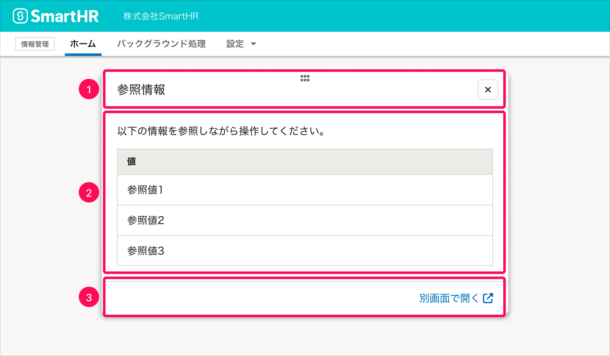
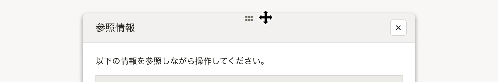

import { ComponentPropsTable } from '@Components/ComponentPropsTable'
import { ComponentStory } from '@Components/ComponentStory'
import CautionAbuse from './common/_caution_abuse.mdx'
import Keyboard from './common/_keyboard.mdx'
import Layout from './common/_layout.mdx'

モードレスなダイアログです。ダイアログを表示したまま、ダイアログの裏側の画面も操作できます。

基本的に、ダイアログと裏側の画面を同時並行で閲覧・操作する場合に使います。

<ComponentStory name="ModelessDialog" />

## 使用上の注意

<CautionAbuse />

## レイアウト

<Layout />

- `ModelessDialog`の場合は、ダイアログを開く操作をした箇所の付近に表示します。
  - モーダルなダイアログと違って、ダイアログの裏側の画面がスクリム（幕）で隠されないため、開く操作をした箇所から遠い位置に表示すると、ユーザーがダイアログを見つけにくいためです。

## アクセシビリティ

<Keyboard />

## 構成

ModelessDialogは以下の要素で構成されます。

1. ヘッダーエリア
2. 本文
3. フッターエリア（任意）

### 1. ヘッダーエリア

ヘッダーエリアの左端にはダイアログのタイトルが、右側にはダイアログを閉じるボタンが配置されます。

ダイアログのタイトルは、表示する情報を簡潔に表現するものをつけます。

また、ヘッダーエリアをドラッグしてダイアログの位置を移動できます。

### 2. 本文

ユーザーに提示したい情報を表示します。

### 3. フッターエリア（任意）

必要に応じてアクションボタンやリンクなどを配置します。

## Props

<ComponentPropsTable name="ModelessDialog" />
