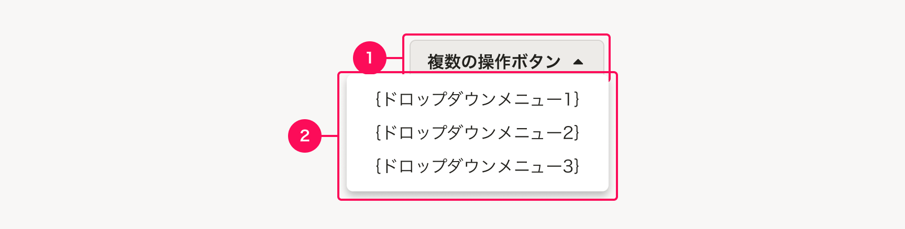
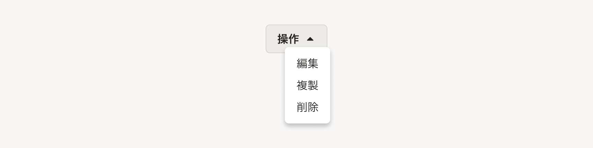
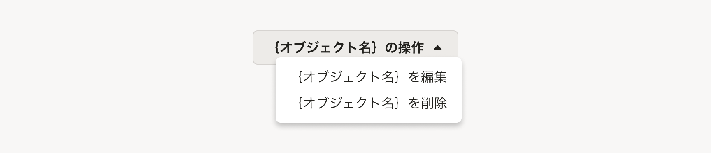
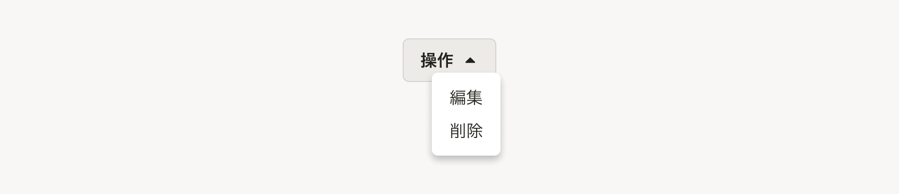
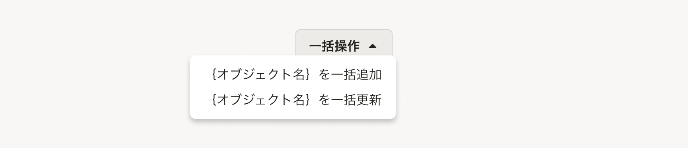
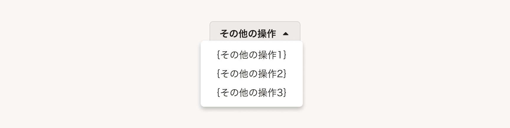
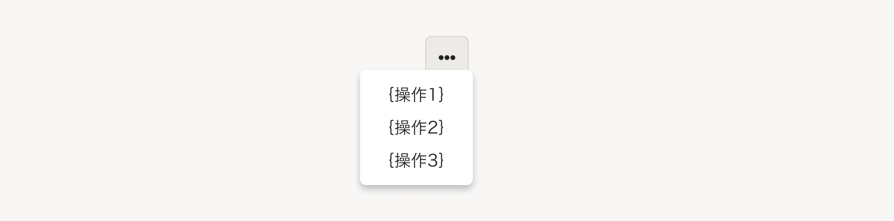

import { ComponentPropsTable } from '@Components/ComponentPropsTable'
import { ComponentStory } from '@Components/ComponentStory'
import { FaCaretDownIcon, FaEllipsisHIcon } from 'smarthr-ui'

DropdownButton は複数の操作をまとめて提供するためのコンポーネントで、パネル内には操作がリスト上に表示されます。

<ComponentStory name="DropdownMenuButton" />

## 構成

ドロップダウンの引き金となるボタン（アクションボタン）とドロップダウンをあわせて、「*ドロップダウンメニューボタン*」と呼びます。

ドロップダウンメニューボタンは、以下の要素で構成されています。

1. アクションボタン
2. ドロップダウン



### 1. アクションボタン
複数の操作がまとまっていることを示唆するために、[Secondaryボタン](/products/components/button/#h3-1)の`アイコン付き（右）`を使い、アイコンには「<FaCaretDownIcon alt="展開" />（`FaCaretDownIcon`）」を使います。

### 2. ドロップダウン

[Dropdown](/products/components/dropdown/)を用いて、操作をリスト形式でまとめて表示します。  
まとめ方は、[種類](#h2-1)から用途にあったものを選択してください。

#### 操作の個数
レイアウトの一貫性やユーザーの利便性に応じて適切な個数を設定してください。ひと目で把握できるように**できるだけ少ない個数が望ましい**です。

ただし以下の場合には操作が1つの場合でも、あえてドロップダウンの中に配置することがあります。

- 操作の優先度に依る視覚的優先度を付けたいとき  
  例： 操作はオブジェクトの削除しかないが、積極的にオブジェクトの削除をさせたくない場合
- 類似する画面とのレイアウトの一貫性を保ちたいとき

#### 操作の順序
**使用頻度が高い順**を推奨しますが、破壊的なアクション（例：オブジェクトの削除）に関しては、順序を下げて配置してください。  
操作の順序の典型的な例は以下のとおりです。  




## 種類
用途によって5つのパターンを定義します。

| # | パターン名 | 用途 |
| :--- | :--- | :--- |
| A | 単一のオブジェクトに対する操作 | オブジェクトに関する複数の操作をまとめるときに使います。   |
| B | 単一のオブジェクトに対する操作（オブジェクト名省略） | 特定のオブジェクトの操作であることがレイアウト上自明なとき（例えば[よくあるテーブル](/products/design-patterns/smarthr-table/)の行の中など）に使います。 |
| C | 同一の操作 | 同じ種類の操作をまとめるときに使います。  |
| D | 異なる複数の操作 | 異なる複数の操作を適切に分割できなかったり、まとめ方が無いときに、異なる複数の操作をまとめるために使います。  |
| E | 異なる複数の操作（ラベル省略） | Dのパターンに該当し、ボタンを配置するスペースを十分確保できないときに使います。   |

### A. 単一のオブジェクトに対する操作


オブジェクトに関する操作をまとめるときに使います。

| 要素 | 説明 |
| :--- | :--- |
| アクションボタン | ラベルは`{オブジェクト名}の操作`とします。 |
| ドロップダウン | オブジェクトに対して行なう操作を入れます。 |

### B. 単一のオブジェクトに対する操作（オブジェクト名省略）


操作の対象になるオブジェクトがレイアウト上、明らかなときに使います。  
例： [よくあるテーブル](/products/design-patterns/smarthr-table/)の行の中など

| 要素 | 説明 |
| :--- | :--- |
| <span style={{ whiteSpace: 'nowrap' }}>アクションボタン</span> | 基本的に「A. 単一のオブジェクトに対する操作」のようにオブジェクト名を表示しますが、狭い場所にレイアウトするときにオブジェクト名を省けます。ラベルは`操作`にします。  |
| ドロップダウン | オブジェクトに対して行なう操作を入れます。アクションボタンのラベルと同様にオブジェクト名を省けます。 |

### C. 同一の操作



同じ種類の操作をまとめるときに使います。

| 要素 | 説明 |
| :--- | :--- |
| アクションボタン | 操作をまとめるラベルにします。 |
| ドロップダウン | 同じ種類の操作を入れます。 |

### D. 異なる複数の操作


他のA~Cのパターンに該当しないときに、異なる複数の操作をまとめるために使います。

| 要素 | 説明 |
| :--- | :--- |
| アクションボタン | ラベルは`その他の操作`とします。 |
| ドロップダウン | 異なる複数の操作を入れます。 |

### E. 異なる複数の操作（ラベル省略）


「D. 異なる複数の操作」に該当し、ボタンを配置するスペースを十分確保できないときに使います。

| 要素 | 説明 |
| :--- | :--- |
| <span style={{ whiteSpace: 'nowrap' }}>アクションボタン</span> | [Secondaryボタン](/products/components/button/#h3-1)の`アイコンのみ`で、アイコンには「<FaEllipsisHIcon alt="その他の操作" />（`FaEllipsisHIcon`）」を使います。ラベルは視覚的に省けますが、**必ず代替テキストを含めて**何のボタンなのかを伝えましょう。 |
| ドロップダウン | 「D. 異なる複数の操作」と同じです。 |

## レイアウト

ドロップダウンメニューボタンのレイアウトは次のとおりです。

```tsx editable withStyled codeBlock noIframe
type Actions = ActionItem | ActionItem[]
// これでコンポーネントを絞れるわけではないが Button[variant=text] を使ってほしいんだよ! という気持ち
type ActionItem =
  | ReactElement<ComponentProps<typeof Button>>
  | ReactElement<ComponentProps<typeof AnchorButton>>
type Props = {
  /** 引き金となるボタンラベル。デフォルトは “その他の操作” */
  label?: string
  /** 操作群 */
  children: Actions
  /** 引き金となるボタンの大きさ */
  triggerSize?: 's'
  /** 引き金となるボタンをアイコンのみとするかどうか */
  onlyIconTrigger?: boolean
}

const DropdownButtons: React.FC<Props> = ({ label = 'その他の操作', children, triggerSize, onlyIconTrigger = false }) => {
  const triggerLabel = useMemo(() => onlyIconTrigger ? <FaEllipsisHIcon alt={label} /> : label, [onlyIconTrigger, label])
  const triggerSuffix = useMemo(() => onlyIconTrigger ? <></> : <FaCaretDownIcon alt="候補を開く" />, [onlyIconTrigger])

  return (
    <Dropdown>
      <DropdownTrigger>
        <Trigger suffix={triggerSuffix} size={triggerSize}>
          {triggerLabel}
        </Trigger>
      </DropdownTrigger>
      <DropdownContent>
        <ActionList>
          {React.Children.map(children, (item, i) => (
            <li key={i}>{actionItem(item)}</li>
          ))}
        </ActionList>
      </DropdownContent>
    </Dropdown>
  )
}

const Trigger = styled(Button)`
  &[aria-expanded='true'] .smarthr-ui-Icon {
    transform: rotate(0.5turn);
  }
`
const ActionList = styled(Stack).attrs({ as: 'ul', gap: 0})`
  ${({ theme: { space } }) => css`
    list-style: none;
    margin-block: 0;
    padding-block: ${space(0.5)};
    padding-inline-start: 0;

    .smarthr-ui-Button,
    .smarthr-ui-AnchorButton {
      justify-content: flex-start;

      padding-block: ${space(0.5)};
      font-weight: normal;
    }
  `}
`
const actionItem = (item: ReactElement) => cloneElement(item, { variant: 'text', wide: true})

render (
  <>
    <DropdownButtons>
      <Button>評価を開始</Button>
      <Button disabled>評価を確定</Button>
      <Button>ヒントメッセージの設定</Button>
      <AnchorButton href="#h2-2">ログアウト</AnchorButton>
    </DropdownButtons>
    <DropdownButtons onlyIconTrigger>
      <Button>評価を開始</Button>
      <Button disabled>評価を確定</Button>
      <Button>ヒントメッセージの設定</Button>
      <AnchorButton href="#h2-2">ログアウト</AnchorButton>
    </DropdownButtons>
    <DropdownButtons triggerSize="s" label="操作">
      <Button>評価を開始</Button>
      <Button disabled>評価を確定</Button>
      <Button>ヒントメッセージの設定</Button>
      <AnchorButton href="#h2-2">ログアウト</AnchorButton>
    </DropdownButtons>
    <DropdownButtons triggerSize="s" onlyIconTrigger>
      <Button>評価を開始</Button>
      <Button disabled>評価を確定</Button>
      <Button>ヒントメッセージの設定</Button>
      <AnchorButton href="#h2-2">ログアウト</AnchorButton>
    </DropdownButtons>
  </>
)
```


## Props

<ComponentPropsTable name="DropdownMenuButton" />
