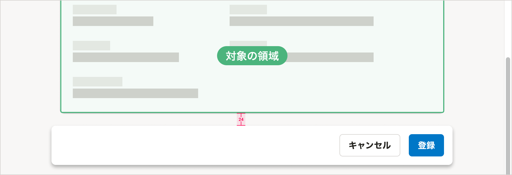

import { ComponentPropsTable } from '@Components/ComponentPropsTable'
import { ComponentStory } from '@Components/ComponentStory'
import { DoAndDont } from '@Components/DoAndDont'
import FloatAreaLayoutDo from './images/float-area-layout-do.png';
import FloatAreaLayoutDont from './images/float-area-layout-dont.png';

スクロール時に固定表示する領域のためのコンポーネントです。特定のアクションボタンやテキストを、スクロール位置にかかわらず画面内の特定の位置に表示できます。

主に[モーダルなUI](/products/design-patterns/modal-ui/)を作るために使います。

<ComponentStory name="FloatArea" />

## レイアウト

### 基本的な考え方

FloatAreaには、ページ全体、もしくはページの一部を対象としたボタンやテキストを置きます。**ページ内のどの部分が対象の領域なのかを視覚的に示す**ことを目指して、FloatAreaの位置や幅、[レイヤー順序](/products/design-tokens/z-index/)を調整してください。

<DoAndDont
  type="do"
  img={<StaticImage src={FloatAreaLayoutDo} alt="2カラムのレイアウトで、FloatAreaが右側のカラムだけに重なっている" />}
  label="FloatAreaが右側のカラムだけに重なっているため、右側のカラムが対象の領域であることがわかる"
/>
<DoAndDont
  type="dont"
  img={<StaticImage src={FloatAreaLayoutDont} alt="2カラムのレイアウトで、FloatAreaが両カラムに重なっている" />}
  label="FloatAreaが2つのカラムに重なっているため、左側のカラムも対象の領域であるように見える"
/>

### レイアウト例

#### スクロール固定中

対象の領域の左右に`0.5（8px）`ずつはみ出し、画面の下辺から`1.5（24px）`の余白をとった位置に置きます。

#### スクロール固定解除後

対象の領域の下辺との間に `1.5（24px）` の余白を取ります。

## デザインパターン

[モーダルなUI](/products/design-patterns/modal-ui/)および[共通設定のアクションビュー](/products/design-patterns-core-features/main-admin/#h2-3)を参照してください。

## Props

<ComponentPropsTable name="FloatArea" />