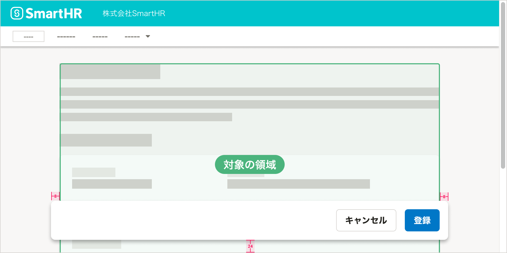
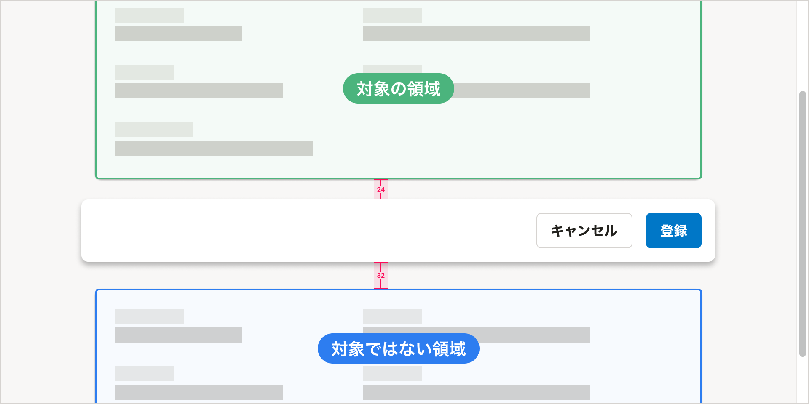

import { ComponentPropsTable } from '@Components/ComponentPropsTable'
import { ComponentStory } from '@Components/ComponentStory'

スクロール時に固定表示する領域のためのコンポーネントです。特定のアクションボタンやテキストを、スクロール位置にかかわらず画面内の特定の位置に表示できます。

主に[モーダルなUI](/products/design-patterns/modal-ui/)を作るために使います。

<ComponentStory name="FloatArea" />

## レイアウト

### 基本的な考え方

FloatAreaには、ページ全体、もしくはページの一部を対象としたボタンやテキストを置きます。**ページ内のどの部分が対象の領域なのかを視覚的に示す**ことを目指して、FloatAreaの幅や周囲の要素との[余白の取り方](/products/design-patterns/spacing-layout-pattern/)、[レイヤー順序](/products/design-tokens/z-index/)を調整してください。

なお、`fixed={true}` を指定しない限り、FloatAreaは `position: sticky` になります。対象の領域が画面内に表示されている間、FloatAreaは固定表示され、スクロールが対象の領域の最下部まで到達すると、FloatAreaの固定は解除され、対象の領域と一緒にスクロールします。

### レイアウト例

#### スクロール固定中

- 対象の領域の左右に`0.5（8px）`ずつはみ出し、画面の下辺から`1.5（24px）`の余白をとった位置に置きます。
- 対象の領域よりも前面に表示されるよう、`zindex`propsを調整します。

#### スクロール固定解除後

- 対象の領域の下辺との間に `1.5（24px）` の余白を取ります。
- FloatAreaの対象ではない領域が続く場合は、関連性が低いことを示せるように、`1.5（24px）` よりも広い余白（例：`2（32px）`）を取ってください。

## デザインパターン

[モーダルなUI](/products/design-patterns/modal-ui/)および[共通設定のアクションビュー](/products/design-patterns-core-features/main-admin/#h2-3)を参照してください。

## Props

<ComponentPropsTable name="FloatArea" />