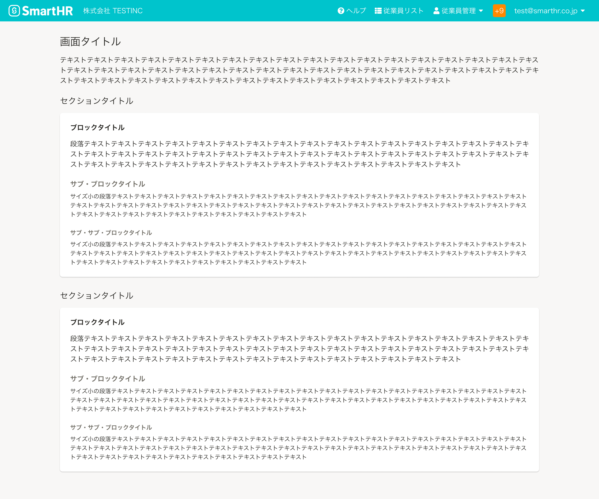

import { Body, Cell, Head, Heading, Row, Stack, Table } from 'smarthr-ui'
import { ComponentStory } from '@Components/ComponentStory'
import { ComponentPropsTable } from '@Components/ComponentPropsTable'

<ComponentStory name="Heading" />

Headingコンポーネントは、直後に続くコンテンツの見出しに使います。

SmartHR UIでは`Heading`です。


## 使いどころ
コンテンツのアウトラインに沿って、順に使用することを想定しています。  
例えば、ブロックタイトルの前にサブ・ブロックタイトルを使わないようにしましょう。


## 種類
見出しレベルに合わせた5種類を定義しています。
SmartHR UIでは、タイプ（`type`props）で種類を指定できます。

```tsx editable
<Stack>
  <Heading type="screenTitle" tag="span">画面タイトル（type: screenTitle, fontSize: XL）</Heading>
  <Heading type="sectionTitle" tag="span">セクションタイトル（type: sectionTitle, fontSize: L）</Heading>
  <Heading type="blockTitle" tag="span">ブロックタイトル（type: blockTitle, fontSize: M）</Heading>
  <Heading type="subBlockTitle" tag="span">サブ・ブロックタイトル（type: subBlockTitle, fontSize: M）</Heading>
  <Heading type="subSubBlockTitle" tag="span">サブ・サブ・ブロックタイトル（type: subSubBlockTitle, fontSize: S）</Heading>
</Stack>
```

### 画面タイトル

画面のタイトルとして、画面ごとに1度しか使えません。

<Table>
  <Head>
    <Row>
      <Cell>タイプ</Cell>
      <Cell>フォントサイズ</Cell>
      <Cell>ウェイト</Cell>
      <Cell>色</Cell>
      <Cell>サンプル</Cell>
    </Row>
  </Head>
  <Body>
    <Row>
      <Cell>screenTitle</Cell>
      <Cell><a href="/products/design-tokens/typography/">XL</a></Cell>
      <Cell>normal</Cell>
      <Cell><a href="/products/design-tokens/color/#h3-2">TEXT_BLACK</a></Cell>
      <Cell><Heading type="screenTitle" tag="span">社会の非合理を、ハックする</Heading></Cell>
    </Row>
  </Body>
</Table>

### セクションタイトル

<Table>
  <Head>
    <Row>
      <Cell>タイプ</Cell>
      <Cell>フォントサイズ</Cell>
      <Cell>ウェイト</Cell>
      <Cell>色</Cell>
      <Cell>サンプル</Cell>
    </Row>
  </Head>
  <Body>
    <Row>
      <Cell>sectionTitle</Cell>
      <Cell><a href="/products/design-tokens/typography/">L</a></Cell>
      <Cell>normal</Cell>
      <Cell><a href="/products/design-tokens/color/#h3-2">TEXT_BLACK</a></Cell>
      <Cell><Heading type="sectionTitle" tag="span">社会の非合理を、ハックする</Heading></Cell>
    </Row>
  </Body>
</Table>

### ブロックタイトル

<Table>
  <Head>
    <Row>
      <Cell>タイプ</Cell>
      <Cell>フォントサイズ</Cell>
      <Cell>ウェイト</Cell>
      <Cell>色</Cell>
      <Cell>サンプル</Cell>
    </Row>
  </Head>
  <Body>
    <Row>
      <Cell>blockTitle</Cell>
      <Cell><a href="/products/design-tokens/typography/">M</a></Cell>
      <Cell>bold</Cell>
      <Cell><a href="/products/design-tokens/color/#h3-2">TEXT_BLACK</a></Cell>
      <Cell><Heading type="blockTitle" tag="span">社会の非合理を、ハックする</Heading></Cell>
    </Row>
  </Body>
</Table>

### サブ・ブロックタイトル

<Table>
  <Head>
    <Row>
      <Cell>タイプ</Cell>
      <Cell>フォントサイズ</Cell>
      <Cell>ウェイト</Cell>
      <Cell>色</Cell>
      <Cell>サンプル</Cell>
    </Row>
  </Head>
  <Body>
    <Row>
      <Cell>subBlockTitle</Cell>
      <Cell><a href="/products/design-tokens/typography/">M</a></Cell>
      <Cell>bold</Cell>
      <Cell><a href="/products/design-tokens/color/#h3-2">TEXT_GREY</a></Cell>
      <Cell><Heading type="subBlockTitle" tag="span">社会の非合理を、ハックする</Heading></Cell>
    </Row>
  </Body>
</Table>

### サブ・サブ・ブロックタイトル

<Table>
  <Head>
    <Row>
      <Cell>タイプ</Cell>
      <Cell>フォントサイズ</Cell>
      <Cell>ウェイト</Cell>
      <Cell>色</Cell>
      <Cell>サンプル</Cell>
    </Row>
  </Head>
  <Body>
    <Row>
      <Cell>subSubBlockTitle</Cell>
      <Cell><a href="/products/design-tokens/typography/">S</a></Cell>
      <Cell>bold</Cell>
      <Cell><a href="/products/design-tokens/color/#h3-2">TEXT_GREY</a></Cell>
      <Cell><Heading type="subSubBlockTitle" tag="span">社会の非合理を、ハックする</Heading></Cell>
    </Row>
  </Body>
</Table>


## レイアウト
アウトラインに合わせた使用例は以下のとおりです。  
余白については、[余白の取り方](/products/design-patterns/spacing-layout-pattern/)を参照してください。




## ライティング

### 見出しの書き方

画面上のオブジェクトや操作を、簡潔に体言止めで書きます。複数行になる長いタイトルは見直しましょう。
- オブジェクトの一覧（コレクション）画面のタイトルでは、「[オブジェクト名]一覧」「[オブジェクト名]の一覧」のような冗長な表記をなるべく避け、「オブジェクト名」とのみ書くようにします。
- [見出しに「一覧」はつけない](../../../products/contents/writing-style/#rec3LamZBSb6ghWPv-0)

アクションを伴う画面（新規作成画面、編集画面）のタイトルや、[ActionDialog](/products/components/dialog/)のタイトルでは、アクションに関わる動詞（動名詞）は、基本的に「の」で接続して表記します。

- 「権限の追加」
- 「申請の取り消し」

見出しが動詞で終わる場合でも、句点は省略します。
- [句点（。）の使い方](../../..//products/contents/writing-style/#recn6q5jT7ewW7pZ3-0)

## Props

<ComponentPropsTable name="Heading" />
