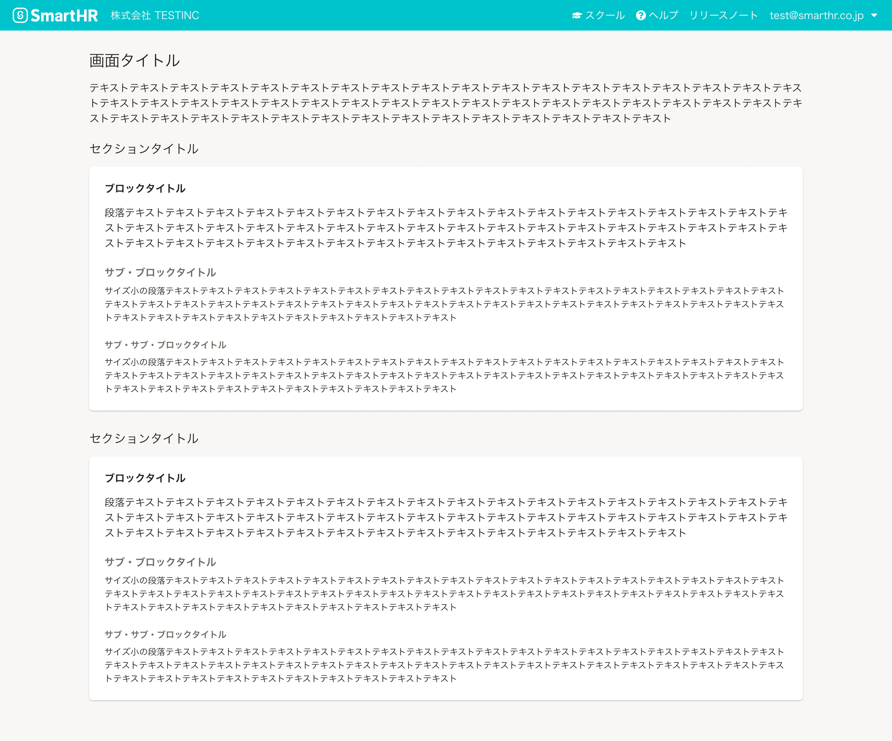

import { ComponentPropsTable } from '@Components/ComponentPropsTable'
import { ComponentStory } from '@Components/ComponentStory'
import { CodeBlock } from '@Components/article/CodeBlock'
import { TableWrapper } from '@Components/contents/shared/TableWrapper'
import { Heading, Stack, Table, Td, Th } from 'smarthr-ui'

Headingコンポーネントは、直後に続くコンテンツの見出しに使います。

<ComponentStory name="Heading" />


## 使用上の注意

コンテンツのアウトラインに沿って、順に使用することを想定しています。  
例えば、ブロックタイトルの前にサブ・ブロックタイトルを使わないようにしましょう。


## 種類
見出しレベルに合わせた5種類を定義しています。
SmartHR UIでは、タイプ（`type`props）で種類を指定できます。

```tsx editable codeBlock
<Stack>
  <PageHeading tag="span">画面タイトル（type: screenTitle, fontSize: XL）</PageHeading>
  <Heading tag="span">セクションタイトル（type: sectionTitle, fontSize: L）</Heading>
  <Heading type="blockTitle" tag="span">ブロックタイトル（type: blockTitle, fontSize: M）</Heading>
  <Heading type="subBlockTitle" tag="span">サブ・ブロックタイトル（type: subBlockTitle, fontSize: M）</Heading>
  <Heading type="subSubBlockTitle" tag="span">サブ・サブ・ブロックタイトル（type: subSubBlockTitle, fontSize: S）</Heading>
</Stack>
```

### 画面タイトル

画面のタイトルとして、画面ごとに1度しか使えません。

<TableWrapper>
  <Table>
    <thead>
      <tr>
        <Th>タイプ</Th>
        <Th>フォントサイズ</Th>
        <Th>ウェイト</Th>
        <Th>色</Th>
        <Th>サンプル</Th>
      </tr>
    </thead>
    <tbody>
      <tr>
        <Td>screenTitle</Td>
        <Td><a href="/products/design-tokens/typography/"><code>XL</code></a></Td>
        <Td>normal</Td>
        <Td><a href="/products/design-tokens/color/#h3-2"><code>TEXT_BLACK</code></a></Td>
        <Td><Heading type="screenTitle" tag="span">well-working 労働にまつわる社会課題をなくし、誰もがその人らしく働ける社会をつくる。</Heading></Td>
      </tr>
    </tbody>
  </Table>
</TableWrapper>

### セクションタイトル

<TableWrapper>
  <Table>
    <thead>
      <tr>
        <Th>タイプ</Th>
        <Th>フォントサイズ</Th>
        <Th>ウェイト</Th>
        <Th>色</Th>
        <Th>サンプル</Th>
      </tr>
    </thead>
    <tbody>
      <tr>
        <Td>sectionTitle</Td>
        <Td><a href="/products/design-tokens/typography/"><code>L</code></a></Td>
        <Td>normal</Td>
        <Td><a href="/products/design-tokens/color/#h3-2"><code>TEXT_BLACK</code></a></Td>
        <Td><Heading tag="span">well-working 労働にまつわる社会課題をなくし、誰もがその人らしく働ける社会をつくる。</Heading></Td>
      </tr>
    </tbody>
  </Table>
</TableWrapper>

### ブロックタイトル

<TableWrapper>
  <Table>
    <thead>
      <tr>
        <Th>タイプ</Th>
        <Th>フォントサイズ</Th>
        <Th>ウェイト</Th>
        <Th>色</Th>
        <Th>サンプル</Th>
      </tr>
    </thead>
    <tbody>
      <tr>
        <Td>blockTitle</Td>
        <Td><a href="/products/design-tokens/typography/"><code>M</code></a></Td>
        <Td>bold</Td>
        <Td><a href="/products/design-tokens/color/#h3-2"><code>TEXT_BLACK</code></a></Td>
        <Td><Heading type="blockTitle" tag="span">well-working 労働にまつわる社会課題をなくし、誰もがその人らしく働ける社会をつくる。</Heading></Td>
      </tr>
    </tbody>
  </Table>
</TableWrapper>

### サブ・ブロックタイトル

<TableWrapper>
  <Table>
    <thead>
      <tr>
        <Th>タイプ</Th>
        <Th>フォントサイズ</Th>
        <Th>ウェイト</Th>
        <Th>色</Th>
        <Th>サンプル</Th>
      </tr>
    </thead>
    <tbody>
      <tr>
        <Td>subBlockTitle</Td>
        <Td><a href="/products/design-tokens/typography/"><code>M</code></a></Td>
        <Td>bold</Td>
        <Td><a href="/products/design-tokens/color/#h3-2"><code>TEXT_GREY</code></a></Td>
        <Td><Heading type="subBlockTitle" tag="span">well-working 労働にまつわる社会課題をなくし、誰もがその人らしく働ける社会をつくる。</Heading></Td>
      </tr>
    </tbody>
  </Table>
</TableWrapper>

### サブ・サブ・ブロックタイトル

<TableWrapper>
  <Table>
    <thead>
      <tr>
        <Th>タイプ</Th>
        <Th>フォントサイズ</Th>
        <Th>ウェイト</Th>
        <Th>色</Th>
        <Th>サンプル</Th>
      </tr>
    </thead>
    <tbody>
      <tr>
        <Td>subSubBlockTitle</Td>
        <Td><a href="/products/design-tokens/typography/"><code>S</code></a></Td>
        <Td>bold</Td>
        <Td><a href="/products/design-tokens/color/#h3-2"><code>TEXT_GREY</code></a></Td>
        <Td><Heading type="subSubBlockTitle" tag="span">well-working 労働にまつわる社会課題をなくし、誰もがその人らしく働ける社会をつくる。</Heading></Td>
      </tr>
    </tbody>
  </Table>
</TableWrapper>


## レイアウト
アウトラインに合わせた使用例は以下のとおりです。  
余白については、[余白の取り方](/products/design-patterns/spacing-layout-pattern/)を参照してください。




## ライティング
関連するライティングガイドラインを参照してください。
- [見出しの書き方](products/contents/ui-text/app-writing/#h2-11)

## Props

<ComponentPropsTable name="Heading" />
