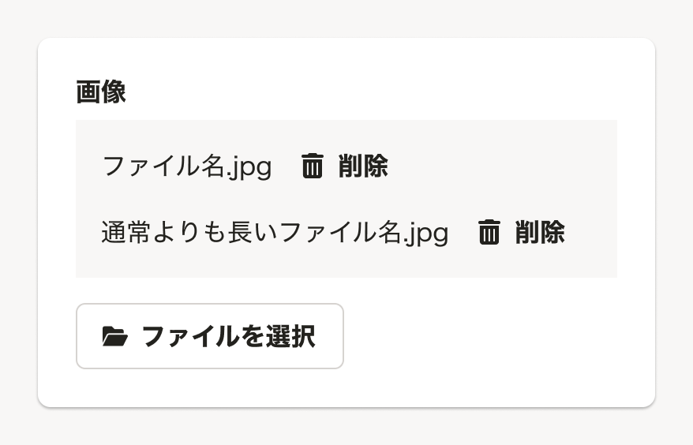

import { ComponentPropsTable } from '@Components/ComponentPropsTable'
import { ComponentStory } from '@Components/ComponentStory'
import { DoAndDont } from '@Components/DoAndDont'
import { StaticImage } from '@Components/StaticImage'
import InputFileDo from './images/input-file-do.png'
import InputFileDont from './images/input-file-dont.png'
import { Cluster } from 'smarthr-ui'

`input[type="file"]`の代わりに使用するコンポーネントです。選択したファイル名の一覧を表示する領域を持っています。

[DropZone](/products/components/drop-zone/)の内部でも使用されています。

<ComponentStory name="InputFile" />

## 状態
### ファイルリストの表示
`hasFileList`propsで`true`を指定すると、ファイルリストを表示できます。

## 使用上の注意
### ドラッグアンドドロップでのファイル選択
ドラッグアンドドロップでのファイル選択をユーザーに提供したい場合は、[DropZone](/products/components/drop-zone/)を使用してください。

- ファイルの探索方法はユーザーの普段の行動に依存するため、レイアウト上の不都合や特別な理由がなければ、ファイル選択UIとしてより多くの選択肢を提供できる[DropZone](/products/components/drop-zone/)の使用を推奨します。
- ただし[DropZone](/products/components/drop-zone/)は操作しやすさを担保するため一定以上の大きさでレイアウトする必要があり、視線を強く誘導する効果を持ちます。  
１つの画面で複数の[DropZone](/products/components/drop-zone/)を乱雑に配置すると、過剰なメリハリによって他の入力項目の閲覧性が低下します。
複数使用する場合は、全体の閲覧性を維持できるようにレイアウトを検討するか、InputFileを使用してください。

<Cluster gap={{ row: 0, column: 1 }}>
  <DoAndDont
    type="do"
    img={<StaticImage src={InputFileDo} alt="Do" />}
    label={<Text>入力項目の大きさが揃っており、閲覧性が高い</Text>}
    width="calc(50% - 8px)"
  />
  <DoAndDont
    type="dont"
    img={<StaticImage src={InputFileDont} alt="Dont" />}
    label={<Text>入力項目の大きさに差があり、項目を見落とす恐れがある</Text>}
    width="calc(50% - 8px)"
  />
</Cluster>

## Props

<ComponentPropsTable name="InputFile" />

