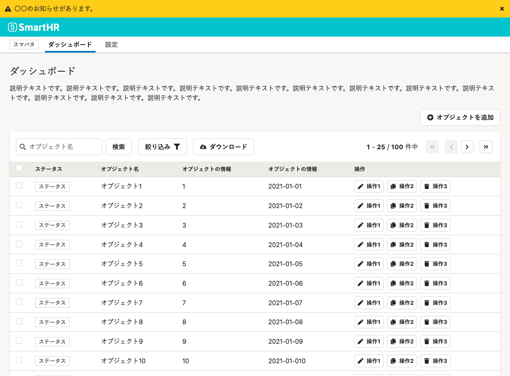
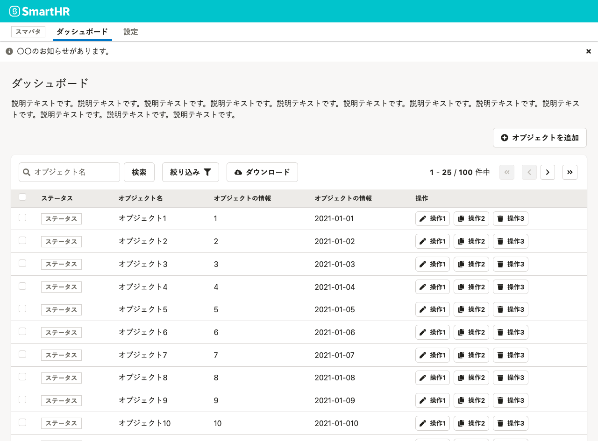

import { useEffect, useState } from 'react'
import { ComponentPreview } from '@Components/ComponentPreview'
import { ComponentStory } from '@Components/ComponentStory'
import { ComponentPropsTable } from '@Components/ComponentPropsTable'
import { NotificationBar, Button, Stack} from 'smarthr-ui'

<ComponentStory name="NotificationBar" />


## 使いどころ
NotificationBarは、フィードバックやメッセージを伝えるために使います。

* 操作後に、ダイアログ内や画面全体が切り替わるとき
* ダイアログで操作し、元の画面に戻るとき
* 特別で重要な情報やお知らせを表示するとき

## 種類

4種類が用意されています。メッセージで伝えたいこと、メッセージの重要度に合わせて指定してください。

```tsx editable codeBlock
<Stack style={{width: '100%', background: '#f8f7f6', padding: '8px'}}>
  <NotificationBar type="info" message="バックグラウンド処理中です。" />
  <NotificationBar type="success" message="タスクの削除に成功しました。" />
  <NotificationBar type="warning" message="情報の整合性が取れなくなる可能性があります。" />
  <NotificationBar type="error" message="タスクの削除に失敗しました。" />
</Stack>
```

## 状態

### 強調

ユーザーへのアテンションを高めたい場合は、`bold={true}`にすることを検討します。

```tsx editable codeBlock
<Stack style={{width: '100%', background: '#f8f7f6', padding: '8px'}}>
  <NotificationBar type="success" bold={true} message="タスクの削除に成功しました。" onClose={()=>{}} />
  <NotificationBar type="warning" bold={true} message="情報の整合性が取れなくなる可能性があります。" onClose={()=>{}} />
  <NotificationBar type="error" bold={true} message="タスクの削除に失敗しました。" onClose={()=>{}} />
</Stack>
```

### アニメーション

ユーザーにメッセージが表示されたことを強調するために使います。

<!-- textlint-disable -->
export const AnimateNotificationBar = () => {
  const [visible, setVisible] = useState(false)
  if (typeof window !== 'undefined') {
    return (
      <Stack style={{ width: '100%', background: '#f8f7f6', padding: '8px', }}>
        {visible && (
          <NotificationBar
            type="success"
            bold={true}
            message="タスクの登録に成功しました。"
            animate={true}
            onClose={() => setVisible(!visible)}
          />
        )}
        <Button onClick={() => setVisible(!visible)}>NotificationBarを{visible ? '隠す' : '表示'}</Button>
      </Stack>
    )
  } else {
    return null
  }
}

<!-- textlint-enable -->

<ComponentPreview>
  <AnimateNotificationBar />
</ComponentPreview>

### その他

ボタンやリンクを渡せたり、常時表示したいときは「閉じる」ボタンを消せます。
また、非推奨ですが[LineClamp](/products/components/line-clamp)コンポーネントも使えます。

```tsx editable codeBlock
<Stack style={{width: '100%', background: '#f8f7f6', padding: '8px'}}>
  <NotificationBar type="info" message="ボタンやリンクを渡せます。" onClose={()=>{}}>
    <Button size="s">編集</Button>
    <TextLink href="#">
      <Text size="S">ヘルプ</Text>
    </TextLink>
  </NotificationBar>
  <NotificationBar type="success" message="onClose を省略すると、閉じるボタンが消えます。" />
  <NotificationBar type="warning" message={<LineClamp maxLines={1} withTooltip>非推奨ですが、LineClampを使用して省略もできます。そのでっかい領域によるヘッダー（のナビゲーション）へのアクセス性の低下をフォローするために多くのウェブサイトはヘッダーを固定していますが、それでは同時にコンテンツの閲覧性に影響を与えてしまいます。</LineClamp>} onClose={()=>{}} />
</Stack>
```


## 使い方

### 操作のフィードバック

主に「操作後に、ダイアログ内や画面全体が切り替わるとき」や「ダイアログで操作し、元の画面に戻るとき」などに使います。  

- ユーザーにメッセージが表示されたことを強調するために、`animate={true}`にします。
- ユーザーの明示的な操作で非表示にします。時間の経過で閉じることは非推奨されません（[※1](#h2-5)）。

#### ダイアログからコレクションにオブジェクトを新規追加した後のメッセージ

コレクションにオブジェクトを追加した際に、フィードバックを表示する典型的な例です。  
以下の例では操作が成功したため`type="success"`にしていますが、エラーの場合は`error`を指定してメッセージを返します。


#### スクロール追従するNotificationBar

操作するボタンなどと、NotificationBarによるメッセージの距離が離れている場合は、`positon: sticky`でスクロールに追従させ、メッセージに気づきやすくすることを推奨します。
以下の例では、スクロールに関わらずNotificationBarを画面上部に固定表示しています。


### 特別な情報やお知らせ

主に「特別で重要な情報やお知らせを出したいとき」に使うケースです。  

- 基本的に、`bold={false}`で使うことを推奨します。破壊的な変更や必ず見てほしい重要情報など必要に応じて強調してください。
- 特別な情報やお知らせで設置するコンポーネントと表示位置は、情報構造に合わせて設計します。NotificationBarでの代表的な使い方は以下を参照してください。
  - 同様の役割は、[InformationPanel](/products/components/information-panel/)や[CompactInformationPanel](/products/components/compact-information-panel/)が担うこともあります。

#### アプリケーション全体にメッセージを表示する

アプリケーション全体にメッセージを表示している例です。  
アプリケーション内で画面を切り替えてもメッセージが表示され続けることを表すため、[Header](/products/components/header)よりも上に配置します。また、必ず見てもらいたいメッセージなので`bold={true}`にしています。



#### ページにメッセージを表示する

ページ内にメッセージを表示している例です。  
「ダッシュボード」の配下のみに関わる情報であることを表すために、[AppNavi](/products/components/app-navi)の下にNotificationBarを配置します。



## Props

<ComponentPropsTable name="NotificationBar" />

## 参考文献

※1. [Web Content Accessibility Guidelines - 2.2.1 タイミング調整可能を理解する](https://waic.jp/docs/UNDERSTANDING-WCAG20/time-limits-required-behaviors.html)
