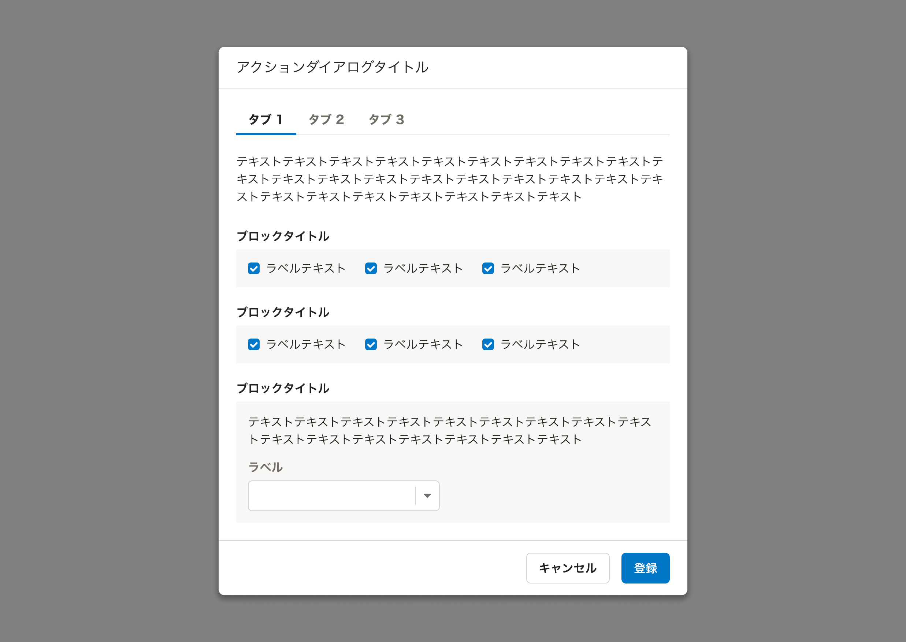
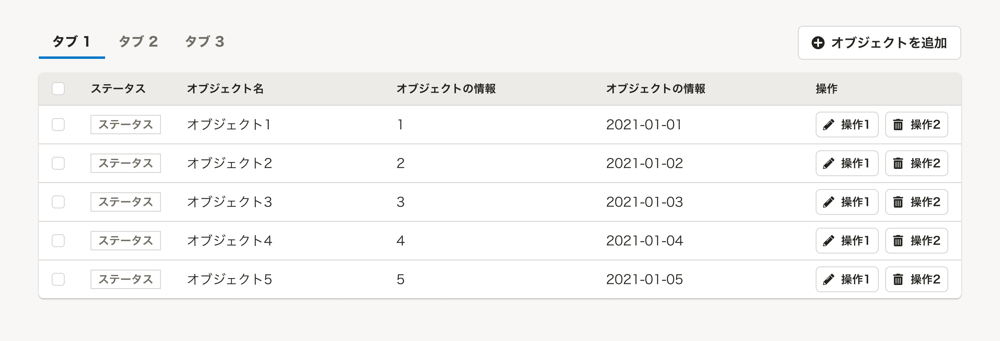

import { ComponentPropsTable } from '@Components/ComponentPropsTable'
import { ComponentStory } from '@Components/ComponentStory'

ユーザーの関心が近いものを並列化し、ビューを切り替えるためのコンポーネントです。

<ComponentStory name="TabBar" />

## 使用上の注意

### 同じオブジェクトの異なる状態を切り替えて表示する目的に使用しない
TabBarは異なるオブジェクトやビューを切り替えるために使用してください。同じオブジェクトについて異なる状態を切り替えたい場合は[SegmentedControl](/products/components/segmented-control/)の使用を検討してください。

## レイアウト

### 標準と下線なしの使い分け
標準のTabBarは、影響するビューの範囲を明示したいときに使用してください。ダイアログ内での使用にて適していることが多いです。

下線なしのTabBarは、Baseとともに用いられてTabBarが影響するビューの範囲が明確なときや、ボタンと一緒にレイアウトしたいときに使用してください。


### IconやBadgeの有無
TabBarItem内にIconやBadgeを追加することでタブそのものやタブ内のビューに関する情報を補足できます。具体例は以下の通りです。

* タブ内のビューで選択しているオブジェクトの数をBadgeで示す
* タブ内のビューでエラーが発生していることをIconで示す

```tsx editable codeBlock noIframe
<TabBar>
    <TabItem id="tabitem1" onClick={() => null} selected>
        <Cluster align="center">
            基本情報
            <Badge count={4} />
        </Cluster>
    </TabItem>
    <TabItem id="tabitem2" onClick={() => null}>
        <Cluster align="center">
            家族情報
            <FaCircleExclamationIcon color="DANGER" alt="エラーあり"/>
        </Cluster>
    </TabItem>
</TabBar>
```

## Props

<ComponentPropsTable name="TabBar" />


