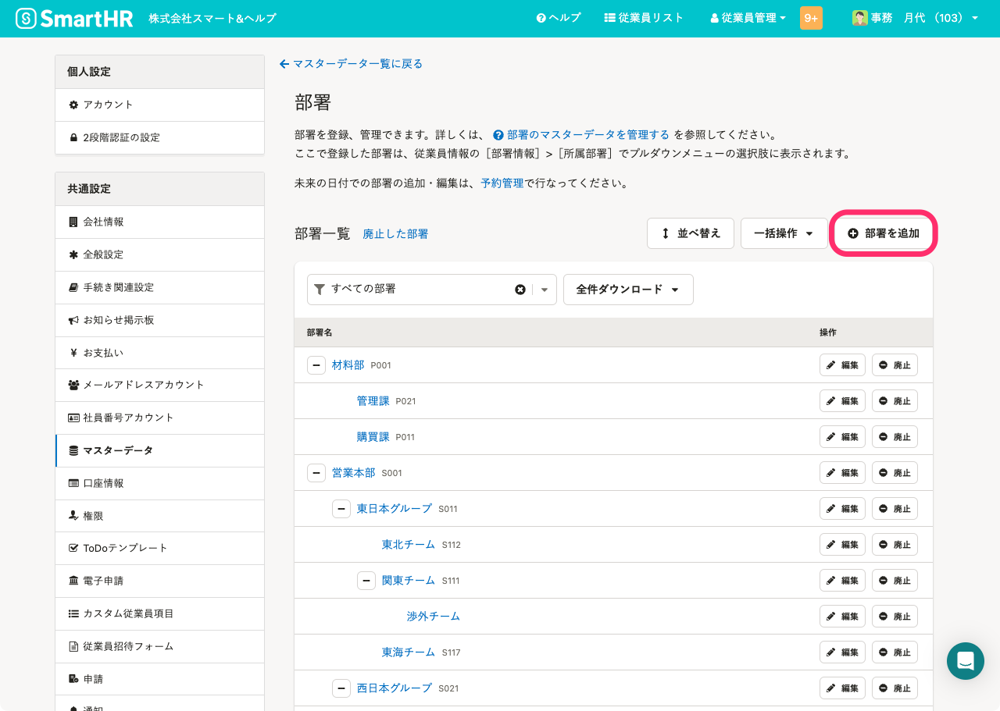
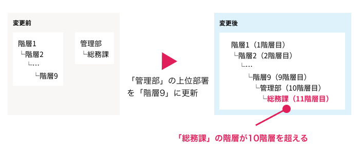
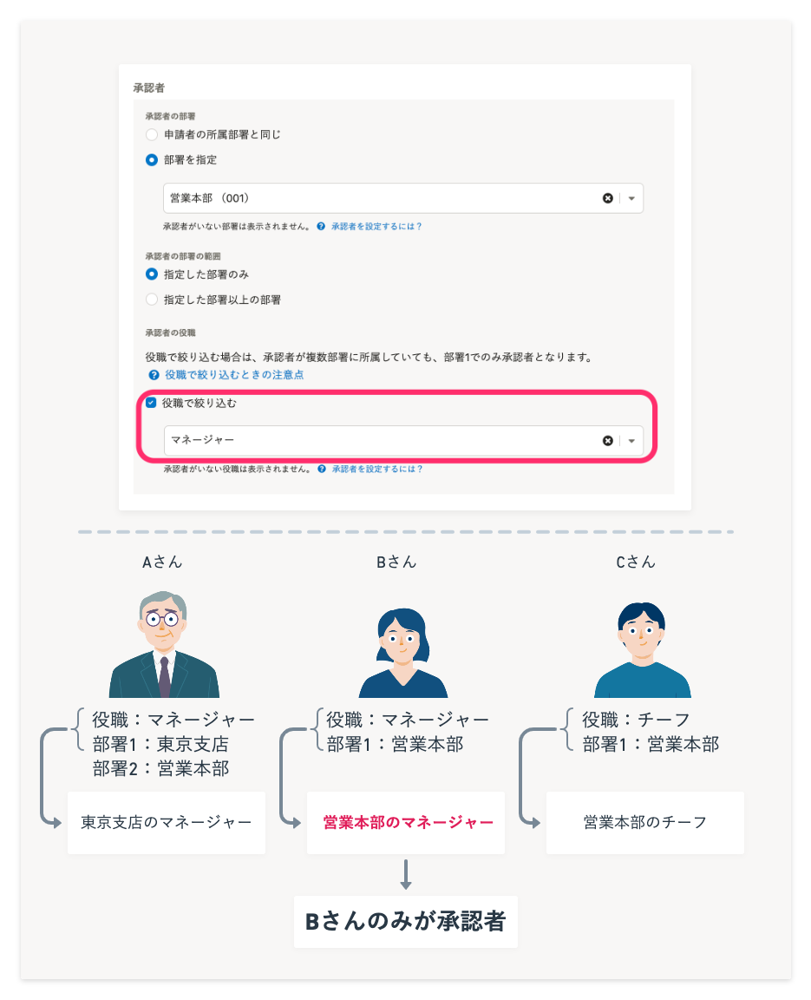
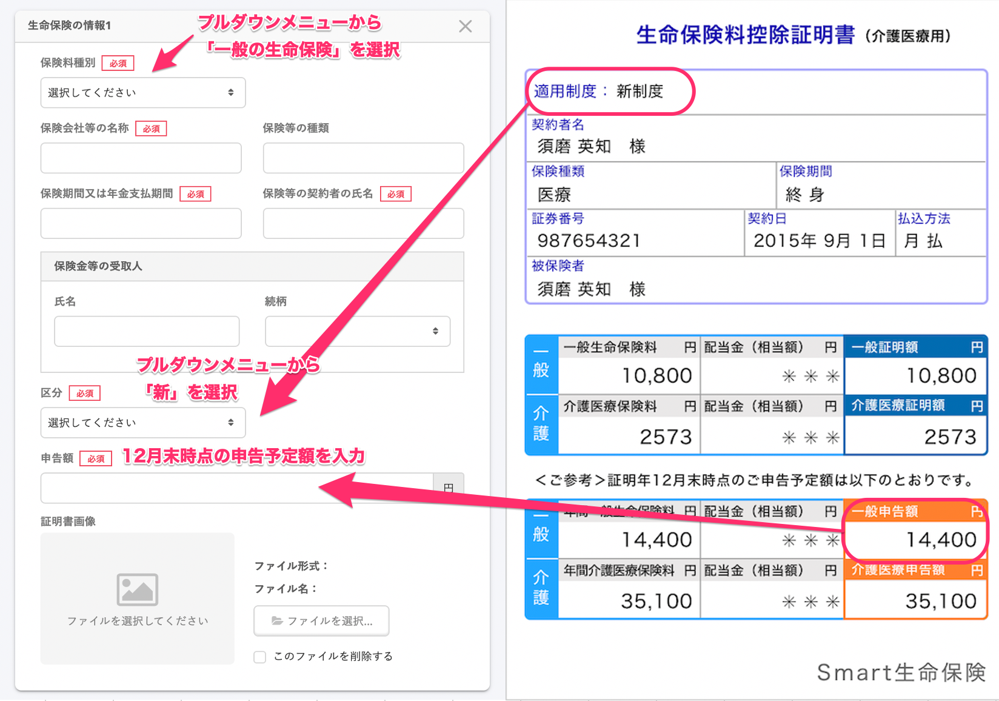

文章での説明が困難な場合には、概念図を作成したり、注釈を加えたスクリーンショットを併用します。

## スクリーンショットの使用ルール

### アクセシビリティの観点から、スクリーンショットはできるだけ使わず、テキストで説明する
アクセシビリティの観点、および情報量が増えて検索性が下がることを防ぐ観点から、スクリーンショットの使用は最小限にします。
まずはテキストのみで説明できないか検討してください。

画面上にボタンが表示されておらず、ドロップダウンリストを開いて操作する場合など、テキストでの説明が難しい場合のみ、スクリーンショットを使います。

### スクリーンショットを使う場合は、ユーザーに注目させたい部分を囲みや矢印をつけて強調する

スクリーンショットを使う場合は、ユーザーに注目させたい部分を囲みまたは矢印で強調します。ボタンや画面内のエリアを強調する場合は、囲みで強調します。囲みを使うと見てほしい部分が読み取りづらくなる場合は、矢印で強調します。ただし、必要以上の強調はユーザーにとってノイズになってしまうため、囲みと矢印は同時に使わないようにしましょう。

強調する箇所は、1つのスクリーンショットにつき、1部分を基本とします。複数の部分を流れで説明したい場合は、丸数字（①②③）で番号を振って、ユーザーに見てほしい順番をわかりやすくします。
アクセシビリティやメンテナンスの観点から、画像内にテキストを載せないようにしましょう。

また、「[関連する情報同士を近くに配置する](../basic-rule/#h4-4)」にしたがって、スクリーンショットと対応する説明文を近くに配置すると、意図が伝わりやすくなります。

### スクリーンショットを使う場合は、ユーザーの操作に必要ない部分を取り除く

スクリーンショットに写っているのがどの画面なのかを、ユーザーが判断しやすいようにしましょう。また、ユーザーの操作に必要ない部分は除いた範囲でスクリーンショットを撮ってください。

操作の起点となる画面は、SmartHRのどの画面から操作するのかをユーザーが把握できるように、ヘッダーも含めたスクリーンショットを使いましょう。
以降の画面は、ヘッダーを除いてトリミングすることを推奨します。どの画面から操作するのかは操作の起点で明示できているため、伝えなくても済む部分を取り除いて、ユーザーが次の操作に集中できるようにします。

## 本文と代替テキストのルール

基本的な考え方は、アクセシビリティガイドラインの[画像の代替テキスト](https://smarthr.design/accessibility/alternative-text/)と同様です。

画像を使用する際も、必要なことは本文テキストに記載し、画像はなくても伝わるようにします。
本文テキストとの重複を避けるため、代替テキストには「何のスクリーンショットなのか」「何を説明する図なのか」を端的に記載します。

以下に、画像の種類ごとの例を示します。

### SmartHRの画面

SmartHRの画面のスクリーンショットで操作の位置を示す場合は下記のように書きます。
画像内で囲みをつけている箇所は本文中に記載しているため、代替テキストには含めません。

本文：［部署］画面で［部署を追加］を押します。

代替テキスト：［部署］画面のスクリーンショット

画像：

### 概念図

機能の概念を説明する際などに使う図の代替テキストは、図で何を説明しているのかを代替テキストに書きます。
図で説明している内容は、基本的に本文にも記載します。

本文：履歴を追加すると、部署の階層が最大値の10階層を超える場合に発生するエラーです。
例えば、下記のイメージのようなケースがあります。「階層1」は「部署9」まで、8つの下位部署を持っています。「管理部」は「総務課」を下位部署に持っています。
「管理部」の履歴を更新し、「階層9」を上位部署に設定した場合、「管理部」の下位部署である「総務課」の履歴も更新されます。
その結果、総務課の階層が11階層目となり、10階層を超えてしまうため、エラーとなります。

代替テキスト：エラーが発生する状況を説明する図

画像：

#### 図の内容を文字で表すのが難しい場合

図で伝えたい内容の要約を代替テキストに書きます。

本文：
例えば、下記のように設定した場合は、部署1が［営業本部］かつ役職が［マネージャー］のBさんのみが承認者となります。

* ［承認者の部署］：［部署を指定］>［営業本部］
* ［承認者の役職］：［役職で絞り込む］>［マネージャー］

代替テキスト：経路の設定画面で承認者を部署と役職で指定した画面のスクリーンショット。その下には3人の登場人物を例に、本文の内容を説明するイラストがある。

画像：

### 書類

SmartHRの画面と同じく、画像で表している内容を本文中に記載します。

本文：
一般の生命保険
証明書の内容を確認して、適用制度や申告額などを入力します。
- ［保険料種別］で［一般の生命保険］を選択
- 証明書の「適用制度」を確認し、画面で［区分］を選択
- 証明書の「一般申告額」を確認し、画面の［申告額］に金額を入力

代替テキスト：SmartHRの画面と保険料控除証明書の対応を表す図

画像：

