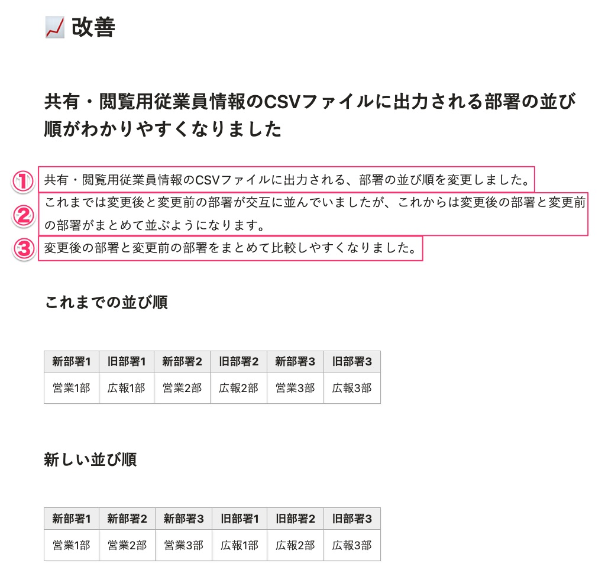

ユーザー向けリリースノートを書くうえでの基本的な考え方とライティングパターンをまとめました。  
このページで記載していない表記ルールは、プロダクトデザインにおける[ライティングスタイル](../../writing-style/)、[用字用語](../../idiomatic-usage/data/)、[UIテキスト](../../app-writing/)に準拠します。

## ユーザーの立場で、できるようになったこと、できなくなったことを伝える

ユーザーにアップデート内容が伝わりやすくするために、「リリースノートはユーザー目線で書く」という考え方を基本にして書きます。  
ユーザー目線とは、コード追加・修正によって生じるアプリケーションの挙動ではなく、ユーザーにとって、何が実現されたか/何ができなくなったかです。  
アプリケーション上の変更点や、リリースに至った背景とともに伝えることで、ユーザーが開発者の意図を理解しやすくなるようにします。  
リリースノートでは「※」の注釈は使いません。専門的な言葉は使わず、平易な言葉でわかりやすく書くことを意識しましょう。

## カテゴリーごとの基本的な書き方

### 新機能
新しく追加した機能について記載します。  
開発の背景、想定しているユースケースや、これまで抱えていた課題をできるだけ具体的に説明します。そのうえで、「できるようになったこと」を伝えます。  
サービスサイトにプレスリリースやアップデートに関する記事を掲載している場合や、ヘルプページがある場合は、記事へのリンクを設置します。

### 改善
使い勝手の向上を目的としたアップデートについて記載します。  
変更点だけでなく、これまで使用時にどのような不便があったかなどの背景とともに伝えます。  
変更点については、どの画面のことなのか、どの操作に関係するのかを具体的に書きます。  
  
また、アップデートに伴って必要な操作がある場合や、アプリケーションの挙動に影響を与える場合には必ず明記します。   
  
SmartHR Design Systemのガイドラインに準拠するための変更の場合は、ガイドラインへのリンクもあるとわかりやすいでしょう。

### アクセシビリティ向上
アクセシビリティ向上につながる対応について記載します。  
どの画面、どのユーザーインターフェースで、どのようなアクセシビリティ対応が追加されたかを具体的に書きます。  

### 不具合修正
不具合の修正について記載します。
どの画面、どのユーザーインターフェースでどのような不具合が修正されたかを具体的に書きます。  
不具合修正のリリースが複数あるときは、箇条書きで記載しましょう。  
不具合修正のカテゴリのみ、見出しは不要です。重要度が高い内容を強調して伝えたい場合は、見出しを立てても構いません。  

### 廃止した機能
使えなくなった機能について記載します。  
事前に機能の廃止をお知らせしていた、サービスサイトの[アップデート](https://smarthr.jp/update)の記事へのリンクを設置します。  

### その他の変更
新機能・改善・アクセシビリティ向上・不具合修正・廃止した機能、これらのどのカテゴリにも当てはまらない内容について記載します。  
どの画面、どのユーザーインターフェースで、どのような変更をしたかを具体的に書きます。  

## 要素別の具体的な書き方
リリースノートを構成する要素別の書き方を説明します。  

### タイトル
リリース日と、変更点の概要、その日のリリース件数を伝えます。  
変更点が複数ある場合は、ユーザーへの影響が一番大きい見出しをリリースノートのタイトルにします。

例：
<!-- textlint-disable -->
2024/02/08 不具合2件を修正しました  
2024/03/12 メールのエラーを一括で解除できるようにしました 他2件
<!-- textlint-enable -->

### リード
リリース日と、変更があった機能、カテゴリ別のリリース件数を伝えます。  
リードは定型文です。テンプレートに沿って作成しましょう。

### カテゴリ
その日のリリースに含まれる、アップデート内容のカテゴリを示します。

### 見出し
変更点の概要を伝えます。見出しは、ユーザーが内容を読むべきかどうかの判断材料になります。  
変更点をそのまま書くのではなく、ユーザーの業務や操作時の認知から想起しやすい言葉を使って書きます。  
見出しは、後述する本文（③ユーザーにとって変わったこと）の内容を要約すると考えやすいです。

見出しの文字数は20文字ちょっとを目安とし、ひと目で読み切れる文字数に収めます。文字数が少なすぎると正確性を損なうため、文字数を減らすよりも、誤解を生まないことを優先します。  
1つのカテゴリに複数のリリース内容が含まれる場合は、ユーザーへの影響が大きいものから順に記載しましょう。

#### よく使う表現
- 〇〇で△△できるようになりました
- 〇〇がわかりやすくなりました
- 〇〇が△△されるようになりました

#### 実例
- Before
  - ［アカウント情報を更新］ボタンを依頼一覧画面に追加しました
- After
  - 依頼一覧画面から最新の従業員情報を再取得できるようになりました
- 解説
  - 依頼一覧画面に［アカウント情報を更新］ボタンを追加したことで、ユーザーができるようになったこと、ユーザーが得られる価値を伝えます。
  - 画面上の変更内容を見出しに書こうとすると、見出しが簡潔にならない場合があります。詳しい内容は本文中に書くと良いです。

### 本文
変更点の詳細を伝えます。  
本文に含まれる要素は3つあり、それぞれに役割が異なります。

| 要素 | 役割 |
| --- | --- |
| ①アプリケーション上の変更点 | 結論・ファクト情報を伝える |
| ②リリースの背景説明 | コンテキストを共有する |
| ③ユーザーにとって変わったこと | 情報をユーザー向けに"翻訳"して伝える |

要素ごとの詳しい書き方は以下のとおりです。

#### ①アプリケーション上の変更点
ファクトとして、変更箇所と変更内容をフラットに書きます。
- 変更箇所
  - 画面名、ボタン名、テーブルの列名など、プロダクトを見たユーザーがテキスト情報から変更箇所を特定できるように書きます。
- 変更内容
  - 変更前の状態と変更後の状態を明記します。

##### よく使う表現
- 〜を変更しました。（記載場所、レイアウト、ラベル名など）
- 〜を、SmartHR全体の表記にあわせて変更しました。
- 〜の表示速度を速めました。
- 〜を追加しました。
- これまでは、〜できませんでした。今回の変更により、〜ができるようになりました。

##### 非推奨の表現
- 「改善しました」
  - 具体的に何が変わったのかが曖昧なため、非推奨です。
  - 「修正しました」、「追加しました」、「変更しました」など、具体的な変更点が伝わるように書き分けましょう。
- 「禁止」
  - 仕様上、制御している操作は、「禁止」ではなく「制御」や「制限」、「できません」と表現しましょう。 
  - 「禁止」にはエラーを引き起こす原因となる操作という意味が強く、その操作自体が許可されているかどうかは意図されていません。「できないように制御している状態」とは異なります。

##### 実例
- Before
  - 評価シート一覧ページの表示項目を改善しました。
- After
  - 従業員モードで表示する、評価シート一覧の列のラベル名を［進行中タスク］から［進行中タスク（期限）］に変更しました。また、［タスク担当者］の列を追加しました。

#### ②リリースの背景説明
リリースにより解決したかった課題、ユーザーの業務課題を書きます。  
軽微な修正の場合には、改善の背景がわかるように書きます。  
例：「使い勝手がどんな風に悪かったか」や「ガイドラインに合わせるため」等

##### よく使う表現
- 〇〇の操作をするときに、△△しづらいという課題がありました。
- 〇〇のバックグラウンド処理／表示に時間がかかっていました。

#### ③ユーザーにとって変わったこと
変更点を受けて、ユーザーの視点で「できるようになったこと」を書きます。  
見出しと本文はいずれもユーザーの視点で書きますが、見出しは文字数が限られているため、詳細な内容は本文で伝えます。  
ユーザーの関心事の場合、「できなくなること」や「変更点がないこと」も明記します。  
例：UIのみの変更であり、検索結果や付与する権限については変更ありません。 
