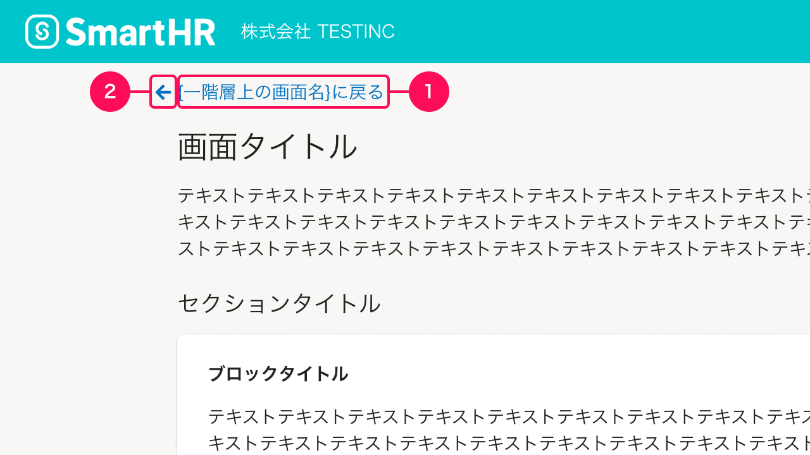
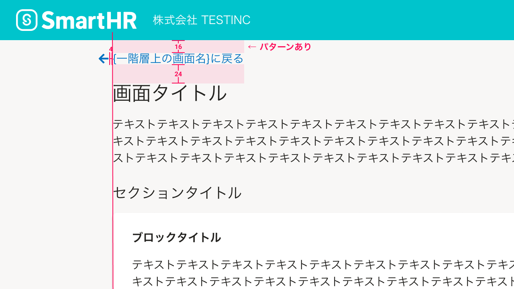
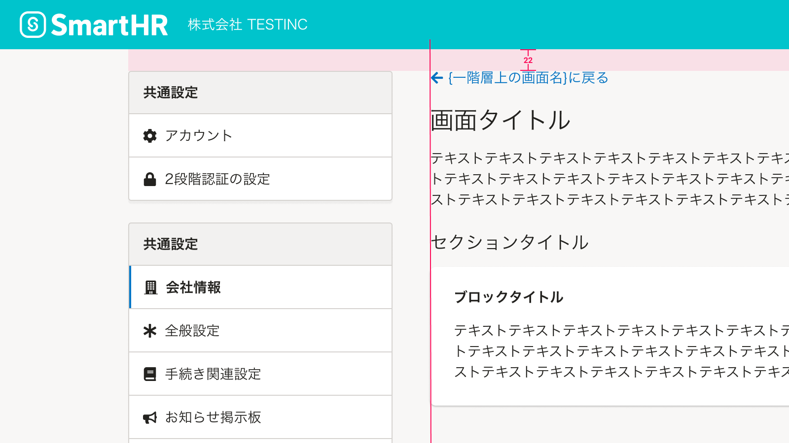

import { FaArrowLeftIcon } from 'smarthr-ui'

一階層上のコンテンツに誘導する役割を持ち、メインコンテンツ間の階層構造を認知させるためのナビゲーションを定義します。

## 構成
「上階層に戻る」リンクは、次の要素で構成されています。

1. リンクテキスト
2. アイコンで伝える。

### 1. リンクテキスト
基本的に「`{一階層上の画面名}に戻る`」と表記し、[リンクのテキストスタイル](/products/design-tokens/typography/#h3-7)を用います。

パーマリンクなどで該当画面に直接遷移した際に、一階層上のコンテンツの類推が難しい場合には、下記のように「`{一階層上の画面名}{一階層上のコンテンツの種類}に戻る`」と表記することを検討します。

| 一階層上のコンテンツ | リンクテキスト | 例 |
| :--- | :--- | :--- |
| コレクション （[よくあるテーブル](/products/design-guide/smarthr-table/)） | `{一階層上の画面名}一覧に戻る` | *「権限一覧に戻る」* （「権限に戻る」だけでは、上の階層に権限に関するどのコンテンツかを類推しにくいため） |

### 2. アイコン
一階層上があることを認知させるために、リンクテキストの左側に「<FaArrowLeftIcon visuallyHiddenText="左矢印" color="TEXT_LINK" size={16} />」アイコン（`fa-arrow-left`）を配置します。

アイコンの色は、リンクテキストの色に準拠して[`TEXT_LINK`](/products/design-tokens/color/#h2-2)とします。

## レイアウト
「上階層に戻る」リンクの余白やインデントは以下のとおりです。

### 余白
[画面タイトル](/products/components/heading/#h3-0)とは`24px`の余白をとります。
ヘッダーとの余白は、周囲のナビゲーションを考慮して以下から選択します。

| 画面パターン | ヘッダーとの余白 | 画面例 | 備考 |
| :--- | :--- | :--- | :--- |
| A. ヘッダーのみ | `16px` | 申請、給与明細 |  |
| B. ヘッダー＋[AppNavi](/products/components/app-navi/) | `24px` | プラスアプリ  | ヘッダーと[AppNavi](/products/components/app-navi/)とは異なるグループであることを強調するため |
| C. SmartHR基本機能の共通設定 | `22px` | SmartHR基本機能の共通設定 | SmartHR基本機能のサイドナビゲーションとヘッダーの余白と揃えるため（[画面例](#h4-0)） |

### インデント
基本的に、リンクテキストとメインコンテンツの左端を揃えます。

<FaArrowLeftIcon visuallyHiddenText="左矢印" color="TEXT_LINK" size={16} /> アイコンとリンクテキストとの余白（4px）分だけ、メインコンテンツより左に飛び出して配置します。
これは「一階層上に遷移するリンクである」ことをユーザーに示し、認知を促すための装飾です。

ただし、以下の例外のように、<FaArrowLeftIcon visuallyHiddenText="左矢印" color="TEXT_LINK" size={16} /> アイコンのインデント分の余白を十分に確保できない場合は、この限りではありません。

#### 例外1. メインコンテンツにサイドナビゲーションが隣接する場合
[SmartHR基本機能の共通設定](/products/design-guide/main-admin/)のように、メインコンテンツにサイドナビゲーションが隣接する場合は、<FaArrowLeftIcon visuallyHiddenText="左矢印" color="TEXT_LINK" size={16} /> アイコンをメインコンテンツの左端に合わせて配置します。

#### 例外2. モバイルでの表示
モバイル（スマートフォン、あるいはタブレットの縦表示）での表示については、<FaArrowLeftIcon visuallyHiddenText="左矢印" color="TEXT_LINK" size={16} /> アイコンをメインコンテンツの左端に合わせて配置します。
（参考：[メディアクエリ](/products/design-tokens/media-query/)）

