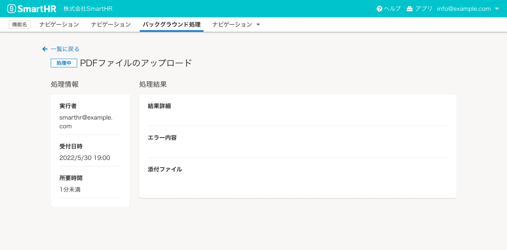
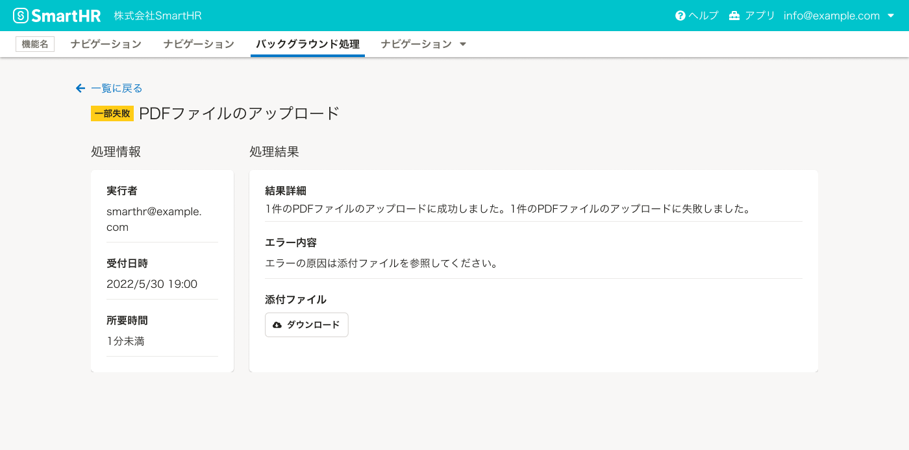
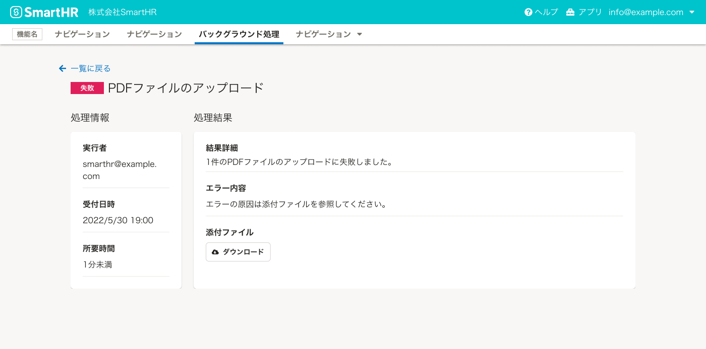

バックグラウンドで実行される操作に対するフィードバックを表すデザインパターンを定義します。

## 基本的な考え方

処理に時間がかかり、操作が完了した状態をすぐに表示できない場合、バックグラウンド（非同期）処理として扱います。

## 画面の種類

バックグラウンド処理で実行される操作に対するフィードバックとして、以下の画面を用意します。

- バックグラウンド処理結果への案内
- バックグラウンド処理結果の一覧画面
- バックグラウンド処理結果の詳細画面

構成やレイアウトはそれぞれの項目を参照してください。

### バックグラウンド処理結果への案内

ユーザーには、バックグラウンド処理であるかどうかはわからないため、操作後に伝える必要があります。

バックグラウンド処理が進行していることと結果をどこで確認すればよいかが伝わるようにしましょう。

案内に使用するコンポーネントは以下の基準をもとに使い分けます。

- バックグラウンド処理中にユーザーの操作を制限したいか
- どれくらいの情報量を記載する必要があるか
- 操作した画面と案内が表示される画面が同じかどうか

は以下の表を参考に、使用するコンポーネントを選んでください。

|　|[Dialog](/products/components/dialog/)|[InformationPanel](/products/components/information-panel/)|[NofiticationBar](/products/components/notification-bar/)|
| --- | --- | --- | --- |
|バックグラウンド処理中にユーザーの操作を制限したいか|制限したい場合に使用|制限したい、したくない場合どちらにも使用可能|制限したくない場合に使用|
|どれくらいの情報量を記載する必要があるか|情報量の制限なし|情報量の制限なし|1行に収まる情報量。2行以上になる場合はInformationPanelを使用|
|操作した画面と案内が表示される画面が同じかどうか|ダイアログで操作したあと処理が完了するまでダイアログを閉じない場合に使用する|ダイアログで操作し画面に戻る場合や操作した画面から別の画面に切り替わる場合に使用する|操作した画面に案内を表示したい場合に使用する|

<!-- ※uさんに実装例を入れていただく -->

### バックグラウンド処理結果の一覧画面

バックグラウンド処理として受け付けた処理を一覧で表示する画面です。

#### 画面内の要素

バックグラウンド処理結果の一覧画面は、以下の情報を含む[よくあるテーブル](/products/design-patterns/smarthr-table/)で構成されます。

- ステータス
- 処理名
- 受付日時
- 結果概要

その他の要素については必要に応じて判断してください。

一覧画面内の情報の詳細については[詳細画面の画面内の要素]()を参照してください。

#### レイアウト

### バックグラウンド処理結果の詳細画面

バックグラウンド処理結果の詳細を伝える画面です。

#### 画面内の要素

バックグラウンド処理結果詳細画面は以下の要素で構成されます。

1. ステータス
2. タイトル（処理名）
3. 処理情報
    - 実行者
    - 受付日時
    - 所要時間
4. 処理結果
    - 結果詳細
    - エラー内容
    - 添付ファイル

##### 1. ステータス

処理のステータスを表示します。
ステータスについての詳細な説明は[種類]()を参照してください。

##### 2. タイトル（処理名）

操作したあとに実行された処理の内容が想像できるように、 `｛オブジェクト｝の｛操作｝`で記載します。

例：
- 評価の削除
- 従業員の一括招待
- 従業員情報のダウンロード

##### 3. 処理情報

以下のような情報をまとめて「処理情報」と呼びます。

- 実行者
    - 従業員名もしくはメールアドレスで記載します。
- 受付日時
    - `2023/3/9 00:00:00`といった形式で記載します。
- 所要時間
    - `hoge分`、`hoge時間`といった形式で記載します。

##### 4. 処理結果

以下のような情報をまとめて「処理結果」と呼びます。

- 結果詳細
- エラー内容
- 添付ファイル
    - CSVの書き出し操作やエラーの詳細をファイルで伝える場合は、CSVファイルをダウンロードできるボタンを配置します。
    - 添付ファイルがない場合にはボタンを非表示にします。

ライティングの詳細は「[種類]()」で説明します。

#### レイアウト

前提となる処理情報を左に配置します。ただし、ユーザーの関心がもっとも高い情報は結果詳細のため、右側に大きく表示します。

どちらの情報もファーストビューに表示されるよう、上下でなく左右に配置しています。

## 種類

バックグラウンド処理には4つの状態が存在します。

- 処理中
- 成功
- 一部失敗
- 失敗

それぞれによって、次の表示パターンが変化します。

- 一覧画面
    - [StatusLabel](/products/components/status-label/)の色と文言が変わります。
    - 結果概要の文言が変わります。
- 詳細画面
    - [StatusLabel](/products/components/status-label/)の色と文言が変わります。
    - 処理結果の結果詳細とエラー内容の文言が変わります。

### 処理中

- StatusLabel
    - `type="blue"`を使用します。
- 結果概要
    - 処理中の場合は何も表示しません。
- 処理結果
    - 処理中の場合は何も表示しません。

### 成功

- StatusLabel
    - `type="grey"`を使用します。
- 結果概要
    - 以下のようなメッセージを表示します。
        - `｛ファイル名｝を｛操作｝しました。`
        - `◯件の｛オブジェクト｝を｛操作｝しました。`
- 処理結果
    - 結果詳細に結果概要と同様の内容もしくは、次に促したい操作を表示します。
    - エラー内容には`エラーはありません。`と表示します。

### 一部失敗

- StatusLabel
    - `type="warning"`を使用します。
- 結果概要
    - 以下のようなメッセージを表示します。
        - `◯件の｛オブジェクト｝の｛操作｝に成功しました。◯件の{オブジェクト}の{操作}に失敗しました。`
- 処理結果
   - 結果詳細に結果概要と同様の内容を表示します。
   - エラー内容にはエラーの原因を表示します。

### 失敗

- StatusLabel
  - `type="error"`を使用します。
- 結果概要
    - 以下のようなメッセージを表示します。
        - `◯件の{オブジェクト}の{操作}に失敗しました。`
- 処理結果
    - 結果詳細に結果概要と同様の内容を表示します。
    - エラー内容にはエラーの原因を表示します。

エラー内容の詳しい書き方については[エラーメッセージ](/products/contents/error-messages/#h4-0)を参照してください。
