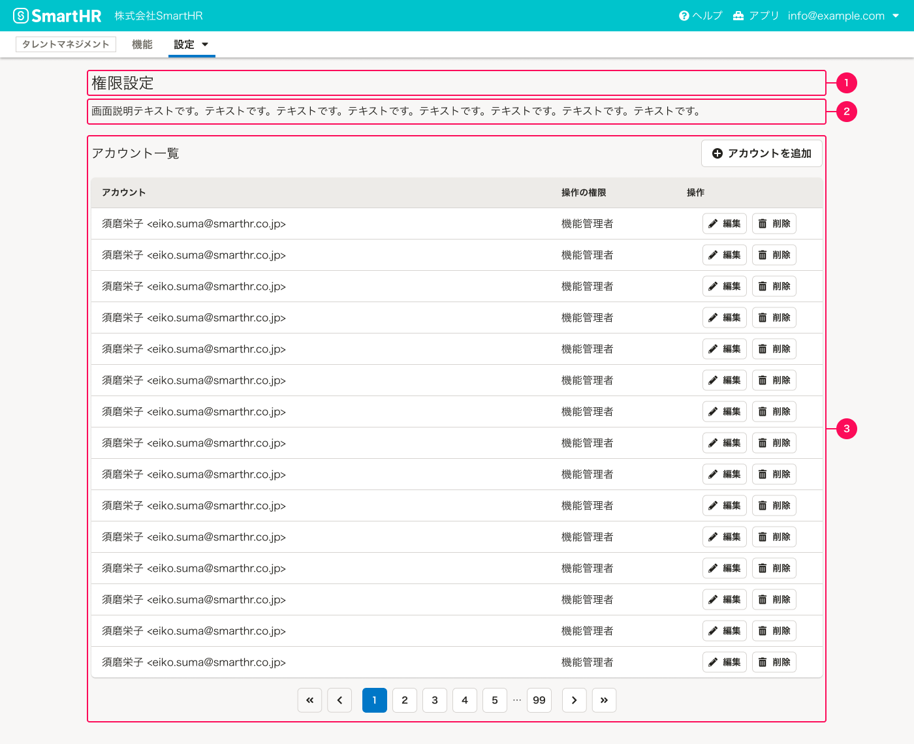
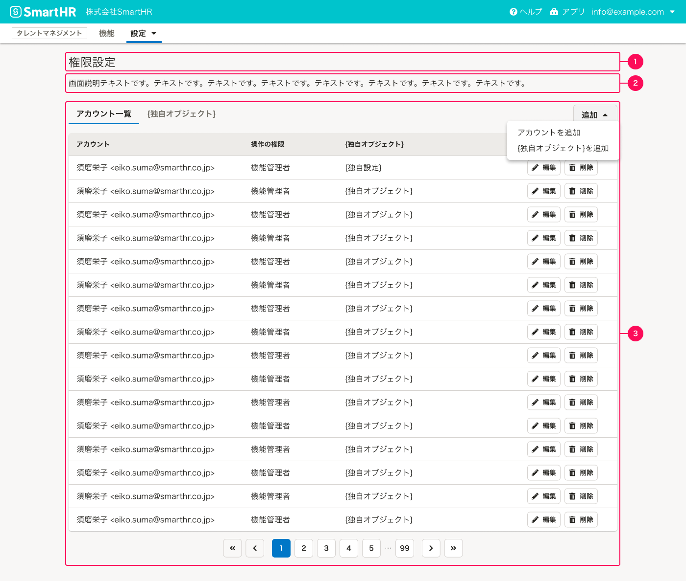
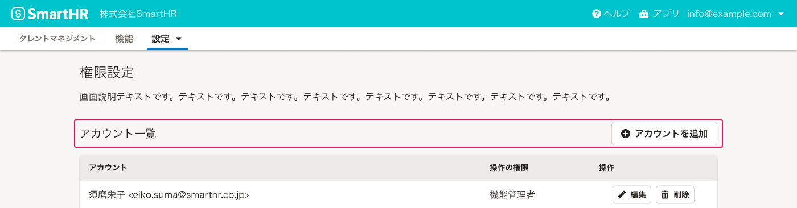
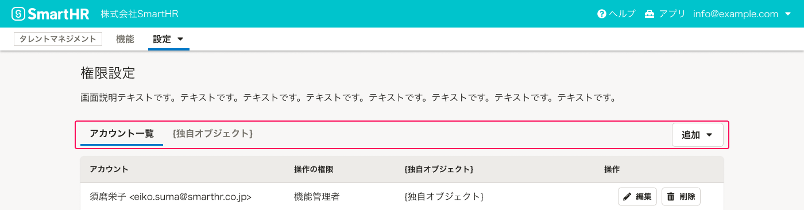
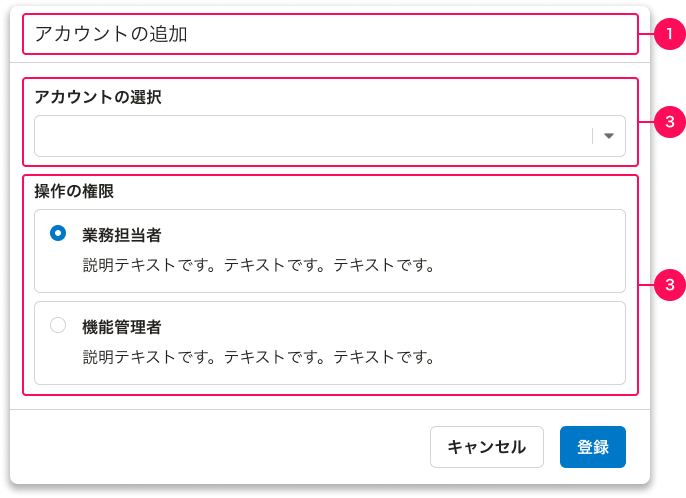
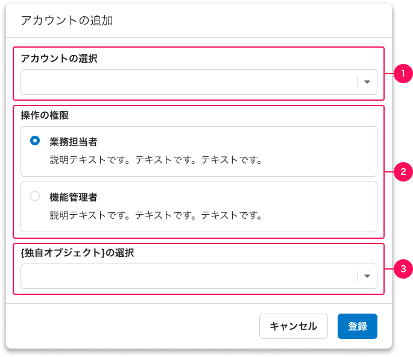
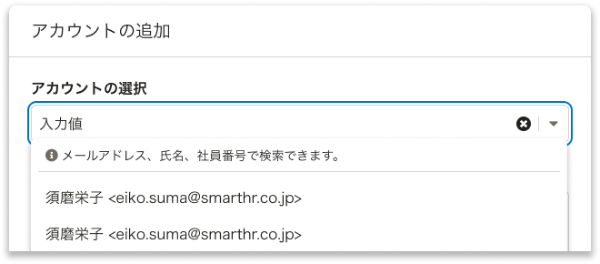

SmartHRにおける「権限設定」のパターンをまとめています。

## 基本的な考え方

プロダクトごとにアカウントの権限を管理するための画面です。画面パターンは以下のとおりです。  
基本機能についてはこの限りではありません。

- [A. 一覧ビュー](#h2-2)
- [B. アカウントの詳細ダイアログ](#h2-3)

## 権限の分類
SmartHRにおける権限は、基本機能を除くと大きく分けて2つの分類に分けられます。権限の分類によって、権限オブジェクトの考え方、画面設計が異なります。
新しくプロダクトと権限を作る場合は、どちらの分類になるかを理解したうえで画面設計を進めてください。

- [RBAC(Role-Based Access Control)パターン](#h3-0)
- [ABAC(Attribute-Based Access Control)パターン](#h3-1)

### RBAC(Role-Based Access Control)パターン

RBACは、ユーザーに役割（例：業務担当者、機能管理者）を割り当て、その役割に応じた特定の行動許可を設定するパターンです。

例えば、SmartHRにおいて対象となるプロダクトは以下のとおりです。

* [配置シミュレーション](https://smarthr.jp/function/simulation/)
* [スキル管理](https://smarthr.jp/function/skill/)
* [組織図](https://smarthr.jp/function/organization/)
* [人事評価](https://smarthr.jp/function/evaluation/)

### ABAC(Attribute-Based Access Control)パターン

ABACは、対象の属性（操作範囲）に基づいて、特定の行動（例：依頼と確認、書類のダウンロード）の許可を選択するパターンです。

例えば、SmartHRにおいて対象となるプロダクトは以下のとおりです。

* [文書配布](https://smarthr.jp/function/distribution/)
* [年末調整](https://smarthr.jp/function/nc/)

## A. 一覧ビュー

一覧ビューでは`アカウント`オブジェクトを一覧で表示します。
OOUIではコレクションのビューと呼ばれる画面で、[よくあるテーブル](/products/design-patterns/smarthr-table/)を使います。

### 構成（RBAC）

構成要素は次のとおりです。

- [A-1. 画面タイトル](#h4-0)
- [A-2. 画面説明テキスト](#h4-1)
- [A-3. よくあるテーブル](#h4-2)

** スクリーンショット：一覧ビュー（アカウントのみ）**

** スクリーンショット：一覧ビュー（アカウントのみ）**

#### A-1. 画面タイトル

一覧ビューの画面タイトルです。通常は「権限設定」とします。

#### A-2. 画面説明テキスト

機能の説明や操作に関する補足テキスト、ヘルプセンターへのリンクなどを配置します。
特別な補足がない場合は以下のメッセージを使ってください。

`{機能名}を利用する権限を設定します。詳しくは、{ヘルプへのリンク}を参照してください。`

#### A-3. よくあるテーブル

[よくあるテーブル](/products/design-patterns/smarthr-table/)の詳細はレイアウトパターンを参照してください。

[よくあるテーブル](/products/design-patterns/smarthr-table/)に必ず表示する情報は以下のとおりです。ただし、プロダクトによっては追加情報が必要な場合があるため、それ以外の情報を入れることを許容します。

* **1. アカウント名**
  * [B-2. アカウントの選択](#h4-4)で設定したアカウント名を表示します。
  * 表示は通常`{姓} {名}<{メールアドレス}>`となりますが、メールアドレスの登録がない場合は`{姓} {名}`、姓名の登録がない場合は`{メールアドレス}`とします。
* **2. 操作の権限**
  * [B-3. 操作の権限](#h4-5)で設定した権限名を表示します。
* **3. 操作**
  * アカウントを操作するアクションボタンを設置します。通常、[編集]と[削除]のアクションボタンが置かれます。
  * コンポーネントは[SecondaryButton](/products/components/button/)を使います。

これらの情報は左から列で並べてください。

##### アカウントのみの場合

権限設定において、アカウントのみを扱う場合はセクションタイトルを`アカウント一覧`、オブジェクトを追加するボタンラベルは`アカウントを追加`としてください。

##### アカウントと独自の権限設定（オブジェクト）を扱う場合

権限設定においてアカウントに紐づけが必要な、独自の権限設定（オブジェクト）を扱う場合、[TabBar](/products/components/tab-bar/)を使ってコンテンツを並列に表示します。

TabBarのタイトルは左から`アカウント一覧`、`{独自オブジェクト}`とします。

タブで並列に表示する場合、それぞれのオブジェクトを追加するアクションボタンは[DropdownMenuButton](/products/components/dropdown/dropdown-menu-button/)で、ラベルは`追加`とします。
をクリックすると、それぞれのコンテンツにオブジェクトを追加するメニューが表示されます。  
アカウントを追加するアクションのラベルは`アカウントを追加`、独自の権限設定を追加するアクションのラベルは`{独自オブジェクト}を追加`とします。

### 構成（ABAC）

［WIP］

## B.アカウントの詳細

アカウントの詳細では`アカウント`オブジェクトの情報を表示します。  
一覧ビューのよくあるテーブルの[アカウントを追加]、または[(アカウントを)編集]ボタンをクリックすると表示されるダイアログを想定しています。ダイアログには[ActionDialog](/products/components/dialog/#h3-1)を使います。

### 構成（RBAC）

構成要素は次のとおりです。

- [B-1. ダイアログタイトル](#h4-3)
- [B-2. アカウントの選択](#h4-4)
- [B-3. 操作の権限](#h4-5)
- [B-4. 独自のオブジェクト設定](#h4-6)

**スクリーンショット: 詳細ダイアログ（アカウントのみ）**

**スクリーンショット: 詳細ダイアログ（アカウント以外の独自の権限設定がある）**

#### B-1. ダイアログタイトル

ダイアログの画面タイトルです。通常は[アカウントの追加]とします。

#### B-2. アカウントの選択

SmartHRのアカウントを選択します。[SingleComboBox](/products/components/combo-box/)を使ってください。

[SingleComboBox](/products/components/combo-box/)の`dropdownHelpMessage`は検索できる項目次第ですが、通常は`{検索対象名1}、{検索対象名2}で検索できます。`とします。

#### B-3. 操作の権限

アカウントに対して操作の権限（役割）を設定します。以下に代表的な役割として**「機能管理者」「業務担当者」**の2つを定義します。必要に応じて見直してください。

- 「機能管理者」：すべての操作の権限を持つ
- 「業務担当者」：業務に必要な操作の権限のみを持つ

操作の権限が上記の2つのみの場合は、[RadioButtonPanel](/products/components/radio-button-panel/)を使ってください。

**「カスタム権限」**として、操作の権限をユーザーが増やせるプロダクトもあります。この場合は[SingleComboBox](/products/components/combo-box/)や[Select](/products/components/select/)を使ってください。

#### B-4.  独自のオブジェクト設定

独自の権限設定がある場合に表示します。用途に依って設定が異なるため、ルールやパターンは定めません。

### 構成（ABAC）

［WIP］

## 関連リンク

- [アプリケーションにおける権限設計の課題 - kenfdev’s blog](https://kenfdev.hateblo.jp/entry/2020/01/13/115032)
