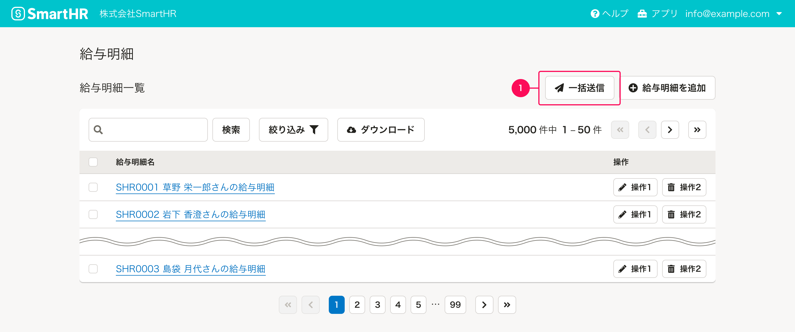
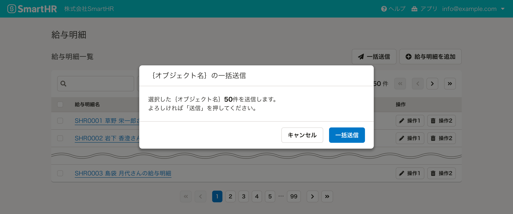
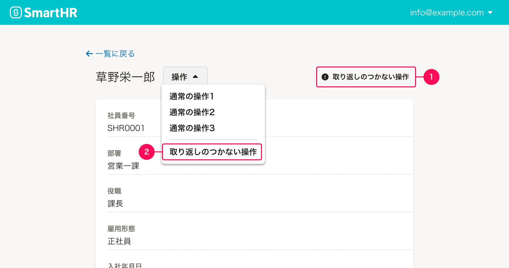
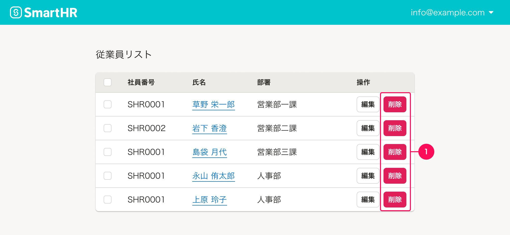
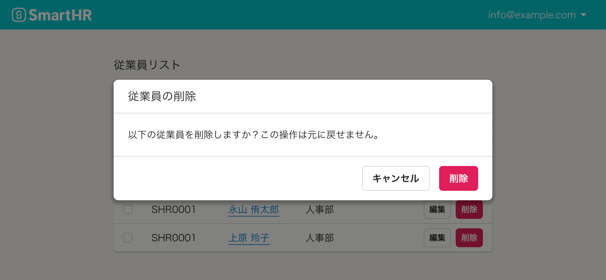

ユーザーにとって注意が必要な操作を提供する際の基準を定義しています。

影響を受けるユーザーが多い操作や、一度実行するとやり直しや巻き戻しが効かない操作のことを「注意が必要な操作」としています。

## 基本的な考え方

サービス内でのデータ損失の原因の多くは人的ミスによるものです。
ユーザーの誤操作によって「注意が必要な操作」が即実行されないように、操作が実行されるタイミングをユーザーに意識できるように配慮しましょう。

## 種類

注意が必要な操作の種類として以下があります。

- 影響を受けるユーザーが多い操作
- 取り返しのつかない操作

### 影響を受けるユーザーが多い操作

影響を受けるユーザーが多い操作の代表的なものとして以下のような操作があります。

- 従業員情報の一括更新
- 情報や書類の依頼・配付

### 取り返しのつかない操作

取り返しのつかない操作の代表的なものとして以下のような操作があります。

- 登録されたデータを削除する操作
- 設定をリセットする操作
- 復元方法がない、または復元に複雑な手順を要するステータスの変更操作

## 注意が必要な操作の配慮方法

### 影響を受けるユーザーが多い操作

影響を受けるユーザーが多い操作を提供する場合には、メインの操作として画面に配置するので明瞭なボタンラベルと、操作の範囲がわかるボタンのレイアウトを心がけてください。  
また、誤操作を防ぐために即時実行されないトリガーボタン（1）にしてください。

#### 操作が実行されるタイミング

影響を受けるユーザーが多い操作をユーザーが実行した際は、その操作によって何が起こるのか、操作が実行されるタイミングが明確にわかるように確認ダイアログなどを表示するのが良いでしょう。

### 取り返しのつかない操作

取り返しのつかない操作をボタンなどのコンポーネントで提供する際は、ユーザーの誤操作を防ぐために可能な限りメイン操作領域の遠くに置く（1）、または領域を変更して置くこと（2）を推奨します。

上記例のようにレイアウトの差をどうしてもつけられない場合は[Dangerボタン](/products/components/button/#h3-3)などのユーザーへ警告を伝えるボタンを設置しましょう。

ただし、一覧の操作セルなど、ファーストビューですぐに触れる領域への「取り返しのつかない操作ボタン」の設置や、Dangerボタンを連続して設置することは通常**推奨しません。**

#### 操作が実行されるタイミング

取り返しのつかない操作をユーザーが実行した際は、その操作によって何が起こるのかをフィードバックで伝えましょう。
フィードバック方法としては、[削除ダイアログ](/products/design-patterns/delete-dialog/)をはじめとした確認ダイアログなどを表示するのが良いでしょう。

