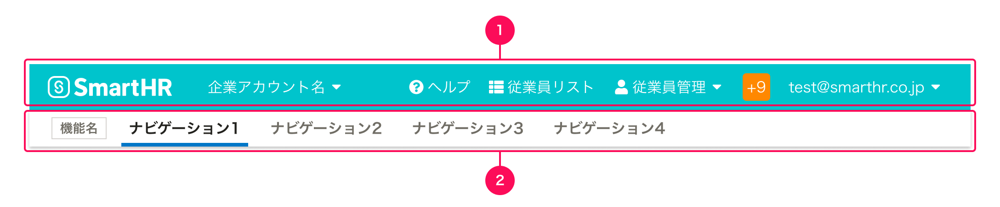

import { FaQuestionCircleIcon } from 'smarthr-ui'

ヘッダー内に配置するコンテンツを定義します。

## 構成

ヘッダーの構造は、大きく2つの領域によって構成されています。

1. グローバルヘッダー（上）
2. ［WIP］アプリナビゲーション（下）

### 1. グローバルヘッダー

グローバルヘッダーは、システム設定・通知・機能間の移動などのシステム全体の機能への横断的なアクセスを提供します。
この領域を構成する主な要素は次の通りです。

- [SmartHRロゴ](#h4-0)
- [ヘルプボタン](#h4-1)
- ［WIP］企業アカウント切替ボタン
- ［WIP］ユーザーアカウントボタン

#### SmartHRロゴ

SmartHRの基本機能のトップページへ遷移するためのボタンです。
すべてのグローバルヘッダーに必ず配置します。
遷移先は、SmartHR基本機能のトップページです。

- ロゴの表示には、[SmartHRLogo](/products/components/smarthr-logo/)を使います。
- ロゴを使用する際は、[基本要素](/basics/logos/)のガイドラインに準拠します。

#### ヘルプボタン

SmartHRの基本機能と各プラスアプリに対応した[ヘルプセンター](https://knowledge.smarthr.jp/hc/ja)のページへ遷移するためのボタンです。
すべてのグローバルヘッダーに必ず配置します。

- テキストリンクの左に <FaQuestionCircleIcon alt="ヘルプ" /> アイコン（`FaQuestionCircleIcon`）を配置します。
- アイコンの色は、テキストの色に準拠して[`WHITE`](/products/design-tokens/color/#h2-0)とします。

遷移先は機能によって異なります。

| 機能 | 遷移先 | 備考 |
| :--- | :--- | :--- |
| 基本機能 | ヘルプセンターのトップページ |  |
| プラスアプリ | ヘルプセンターのアプリごとに対応したセクションページ | 例：年末調整のグローバルヘッダーのヘルプボタンをクリックすると、年末調整のヘルプページへ遷移します。 |
