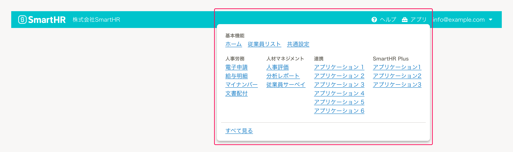
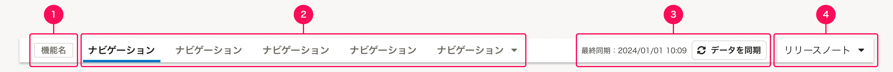
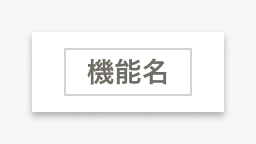

import { FaQuestionCircleIcon } from 'smarthr-ui'

ヘッダー内に配置するコンテンツを定義します。

## 構成

ヘッダーの構造は、大きく2つの領域によって構成されています。

- A. [グローバルヘッダー（上）](#h2-0)
- B. [アプリナビゲーション（下）](#h2-1)

## A. グローバルヘッダー

グローバルヘッダーは、システム設定・通知・機能間の移動などのシステム全体の機能への横断的なアクセスを提供します。

### 構成

構成要素は次のとおりです。  
構成要素の必須項目以外は任意の要素です。機能によって使用有無を判断してください。

1. [SmartHRロゴ](#h4-0)（必須）
2. [企業アカウント切替ボタン](#h4-1)
3. [ヘルプボタン](#h4-2)（必須）
4. [アプリランチャー](#h4-3)
5. [ユーザーアカウントボタン](#h4-4)

#### A-1. SmartHRロゴ

SmartHRの基本機能のトップページへ移動するためのボタンです。  
すべてのグローバルヘッダーに必ず配置します。  
移動先は、SmartHR基本機能のトップページです。

- ロゴの表示には、[SmartHRLogo](/products/components/smarthr-logo/)を使います。
- ロゴを使用する際は、[基本要素](/basics/logos/)のガイドラインに準拠します。

#### A-2. 企業アカウント切替ボタン

［WIP］

#### A-3. ヘルプボタン

SmartHRの[ヘルプセンター](https://support.smarthr.jp/ja/)のページへ移動するためのボタンです。  
すべてのグローバルヘッダーに必ず配置します。

- テキストリンクの左に <FaQuestionCircleIcon alt="ヘルプ" /> アイコン（`FaQuestionCircleIcon`）を配置します。
- アイコンの色は、テキストの色に準拠して[`WHITE`](/products/design-tokens/color/#h2-0)とします。

移動先は、基本的に https://support.smarthr.jp/ja/ で統一します。  
ただし、ユーザーがプロダクト上で日本語以外を表示設定している場合は、対応する言語のヘルプセンターへ移動するようにします。

| 言語の例 | 移動先 |
| :--- | :--- |
| 日本語 | https://support.smarthr.jp/ja/ |
| 英語 | https://support.smarthr.jp/en-us/ |
| 韓国語 | https://support.smarthr.jp/ko/ |
| ベトナム語 | https://support.smarthr.jp/vi/ |
| 中国語（簡体） | https://support.smarthr.jp/zh-cn/ |
| 中国語（繁体） | https://support.smarthr.jp/zh-tw/ |
| ポルトガル語 | https://support.smarthr.jp/pt/ |

#### A-4. アプリランチャー

#### A-5. ユーザーアカウントボタン

［WIP］

### レイアウト

［WIP］

## B. アプリナビゲーション

アプリナビゲーションは、アクセスしている機能に応じたアプリケーション内のページや設定などへの横断的なアクセスを提供します。

### 構成

構成要素は次のとおりです。  
構成要素の必須項目以外は任意の要素です。機能によって使用有無を判断してください。

1. [機能名](#h4-5)（必須）
2. [アプリナビゲーションボタン](#h4-6)（必須）
3. [データ同期ボタン](#h4-7)
4. [リリースノートボタン](#h4-8)

#### B-1. 機能名

現在アクセスしている機能名を表示します。  
すべてのアプリナビゲーションに必ず配置します。

#### B-2. アプリナビゲーションボタン

現在アクセスしている機能内のページへ移動するためのボタンです。  
ページの構成が階層構造になっている場合は、ドロップダウンメニューで階層内のページを一覧表示します。
すべてのアプリナビゲーションに必ず配置します。

#### B-3. データ同期ボタン

#### B-4. リリースノートボタン

### レイアウト

要素間の余白は以下のとおりです。詳細は[余白の取り方](/products/design-patterns/spacing-layout-pattern/)を参照してください。

