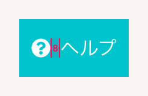
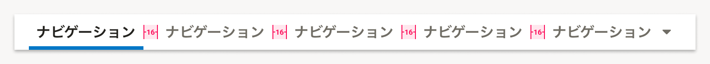

import { FaQuestionCircleIcon } from 'smarthr-ui'

ヘッダー内に配置するコンテンツを定義します。

## 構成

ヘッダーの構造は、大きく2つの領域によって構成されています。

- A. [グローバルヘッダー（上）](#h2-0)
- B. [アプリナビゲーション（下）](#h2-1)

## A. グローバルヘッダー

グローバルヘッダーは、アカウントやシステムの設定、およびSmartHR内の他のアプリケーションへの横断的なアクセスを提供します。
対応するコンポーネントは[Header](/products/components/header/)です。

### 構成

1. [SmartHRロゴ](#h4-0)
2. [企業アカウント切替ボタン](#h4-1)（任意）
3. [ヘルプボタン](#h4-2)
4. [アプリランチャー](#h4-3)（任意）
5. [ユーザーアカウントボタン](#h4-4)（任意）

#### A-1. SmartHRロゴ

SmartHRのホーム（`/`）へ移動するためのボタンです。  
すべてのグローバルヘッダーに必ず配置します。  

- ロゴの表示には、[SmartHRLogo](/products/components/smarthr-logo/)を使います。
- ロゴを使用する際は、[基本要素](/basics/logos/)のガイドラインに準拠します。

#### A-2. 企業アカウント切替ボタン（任意）

［WIP］

#### A-3. ヘルプボタン

SmartHRの[ヘルプセンター](https://support.smarthr.jp/ja/)のページへ移動するためのボタンです。  
すべてのグローバルヘッダーに必ず配置します。

- テキストリンクの左に <FaQuestionCircleIcon alt="ヘルプ" /> アイコン（`FaQuestionCircleIcon`）を配置します。
- アイコンの色は、テキストの色に準拠して[`WHITE`](/products/design-tokens/color/#h2-0)とします。

#### A-4. アプリランチャー（任意）

ユーザーが利用できるSmartHR内の他のアプリケーションへ移動するためのボタンです。  

原則として、他のアプリケーションとあわせて横断的に利用するユースケースが想定される場合に配置します。

アプリランチャーを押すと、アプリケーションのリンクがカテゴリ別にグルーピングされたドロップダウンが表示されます。

#### A-5. ユーザーアカウントボタン（任意）

［WIP］

## B. アプリナビゲーション

アプリナビゲーションは、アクセスしているアプリケーション内のページや設定など、アプリケーションに閉じた横断的なアクセスを提供します。
対応するコンポーネントは[AppNavi](/products/components/app-navi/)です。

### 構成

1. [機能名](#h4-5)
2. [アプリナビゲーションボタン](#h4-6)
3. [データ同期ボタン](#h4-7)（任意）
4. [リリースノートボタン](#h4-8)（任意）

#### B-1. 機能名

現在アクセスしている機能名を表示します。  
すべてのアプリナビゲーションに必ず配置します。

#### B-2. アプリナビゲーションボタン

現在アクセスしている機能内のページへ移動するためのボタンです。  

ページの構成が階層構造になっている場合は、ドロップダウンメニューで階層内のページを一覧表示します。
すべてのアプリナビゲーションに必ず配置します。

#### B-3. データ同期ボタン（任意）

現在アクセスしている機能で必要なSmartHR基本機能や他機能に登録されているデータを、現在アクセスしている機能のデータベースへ能動的に同期するためのボタンです。  

原則として、ユーザーが現在の同期が最新状態かを判断できるようにするため、前回同期した日時を`最終同期：yyyy/MM/dd H:mm`の形式で併記しますが、スペースに余裕がない場合は省略できます。

#### B-4. リリースノートボタン（任意）

現在アクセスしているアプリケーションのリリースノートを確認するためのボタンです。  

原則として、リリースノートはホーム画面などユーザーの利用開始の起点となる画面のコンテンツとして配置します。
ただし、ホーム画面がない機能や、どの画面からもリリースノートにアクセスする可能性がある場合に限り、例外的に配置を検討します。

リリースノートボタンを押すと、最新5件分の日付を含むリリースノートへのリンクと、対応するアプリケーションのリリースノートの一覧画面へ移動するリンクが表示されます。  

