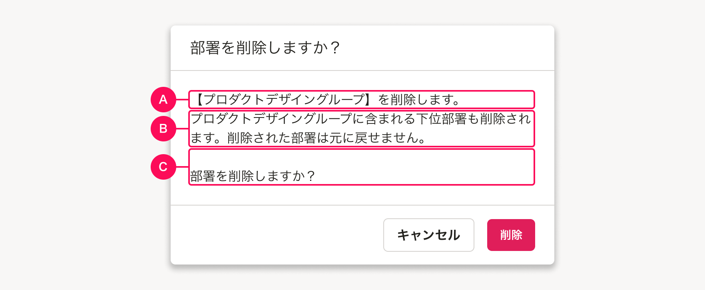

import { useEffect, useState } from 'react'
import {
  ActionDialog,
  BaseColumn,
  Button,
  Checkbox,
  Cluster,
  DefinitionList,
  Dialog,
  MessageDialog,
  ResponseMessage,
  Stack,
  Text,
} from 'smarthr-ui'
import { ComponentPreview } from '@Components/ComponentPreview'

import { AirtableEmbed } from '@Components/article/AirtableEmbed/AirtableEmbed'

削除操作をするときに表示する確認メッセージを定義します。

## 基本的な考え方
削除などの破壊的で不可逆な操作をする際は、システムが処理を実行する前に、ユーザーに確認を求めます。これは、ユーザーが誤って操作をした場合に、ユーザーの意図に反する処理が実行されてしまうのを防ぐためです。

破壊的な操作であっても、操作後に元に戻せる場合は、処理前の確認は必要ありません。

### ライティング
削除の対象となるオブジェクトを提示し、他のオブジェクトと取り違えていた場合に気づけるようにします。

また、この操作が不可逆である旨を伝えます。

削除に伴い、削除されるオブジェクト以外にも影響が生じる場合には、ユーザーがその影響を理解したうえで処理を実行するか判断できるような情報も必ず伝えます。

## 構成

確認メッセージは、[ActionDialog](../../components/dialog#h3-1)を使って表示します。
ダイアログ内の要素は、以下で構成されています。

1. タイトル
2. 本文
3. 削除対象
4. 注意事項
5. 確認のチェックボックス
6. アクションボタン

export const DynamicActionDialog = () => {
  const [isOpen, setIsOpen] = useState(false)
  return (
    <>
      <Button variant="danger" onClick={() => setIsOpen(true)}>削除の確認ダイアログを開く</Button>
      <ActionDialog
        isOpen={isOpen}
        title="{オブジェクト名}の削除"
        closeText="キャンセル"
        actionText="削除"
        actionTheme="danger"
        onClickClose={()=> {setIsOpen(false)}}
        onClickAction={()=> {setIsOpen(false)}}
      >
        

          <Stack gap={1}>
            

            {'以下の{オブジェクト名}を削除しますか？　この操作は元に戻せません。'}
            

            <DefinitionList 
              items = {[
                {
                  term: (<Text styleType="blockTitle" color="TEXT_BLACK">{'削除する{オブジェクト名}'}</Text>),
                  description: '{インスタンス名}',
                }
              ]}
            />
            <Stack gap={0.5}>
              <BaseColumn>
                <ResponseMessage type="warning"><Text weight="bold">注意事項</Text></ResponseMessage>
                
{`{付随して発生する影響についての説明が入ります。}`}

              </BaseColumn>
              <BaseColumn>
                
チェックボックスの入れ方おしえて！

              </BaseColumn>
            </Stack>
          </Stack>
        

      </ActionDialog>
    </>
  )
}

<ComponentPreview>
  <DynamicActionDialog />
</ComponentPreview>

### 1. タイトル
他のアクションダイアログと異なり、**疑問形**とします。

`{オブジェクト名}を削除しますか？`

### 2. 本文
本文は、3つのセクションから構成されています。

#### A. 削除対象の提示
可能な限り、**対象オブジェクトのインスタンス名を表示**したうえで、本文にも「削除します」という表現を用いて、注意を促します。

`【{オブジェクトのインスタンス名}】を削除します。`

- インスタンス名を明示しない場合は、`選択した{オブジェクト名}を削除します。`として構いません。
- オブジェクト詳細画面で削除ボタンを押すなど自明な場合は、`この{オブジェクト名}を削除します。`として構いません。

#### B. 影響範囲の提示
**対象オブジェクトの削除に伴う影響がある場合**は、以下の文言を追加します。

| どのような影響があるか | 追加する文言 |
| :--- | :--- |
| マスターデータやカスタム項目などの削除に伴い、SmartHR内のデータも失われる場合 | `{関連するオブジェクト名など}に登録されているデータも削除されます。` |
| 上位オブジェクトの削除に伴い、下位オブジェクトも失われる場合 | `{選択したオブジェクトのインスタンス名}に含まれる{オブジェクト名}も削除されます。` |
| 完全削除される場合 | `削除した{オブジェクト名}は元に戻せません。` |

#### C. 操作の再確認
**Bを追加した場合**は、段落を分けて`{オブジェクト名}を削除しますか？`と再度確認を促します。

### 3. アクションボタン
操作を確定する場合は[Dangerボタン](/products/components/button/#h3-2)を使用し、テキストは`削除`とします。  
操作を取り消すボタンのテキストは、`キャンセル`とします。

## ライティングパターン
<AirtableEmbed tableName="削除ダイアログ">
  <iframe className="airtable-embed" src="https://airtable.com/embed/shr4uUQHE55YM8F1W?backgroundColor=teal&viewControls=on" frameBorder="0" width="100%" height="400px" style="background: transparent; border: 1px solid #ccc;"></iframe>
</AirtableEmbed>

## 類似する種類

### 「取り消し」操作時の確認ダイアログ
[Dangerボタン](/products/components/button/#h3-2)を使用する操作ダイアログには、削除ダイアログ以外に「取り消しダイアログ」があります。

取り消しダイアログも、削除ダイアログをアレンジして類似のライティングパターンを適用します。

<!-- textlint-disable -->

export const DynamicCancelActionDialog = () => {
  const [isOpen, setIsOpen] = useState(false)
  return (
    <>
      <Button variant="danger" onClick={() => setIsOpen(true)}>取り消し操作時のダイアログを開く</Button>
      <ActionDialog
        isOpen={isOpen}
        title="{操作名}を取り消しますか？"
        closeText="キャンセル"
        actionText="取り消し"
        actionTheme="danger"
        onClickClose={()=> {setIsOpen(false)}}
        onClickAction={()=> {setIsOpen(false)}}
      >
        

          {'{操作名}を取り消します。'} 
          {'「取り消し」を押すと変更内容が破棄されます。'}
        

      </ActionDialog>
    </>
  )
}

<ComponentPreview>
  <DynamicCancelActionDialog />
</ComponentPreview>

<!-- textlint-enable -->
