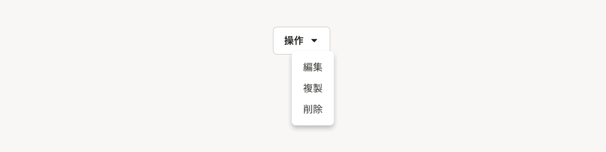
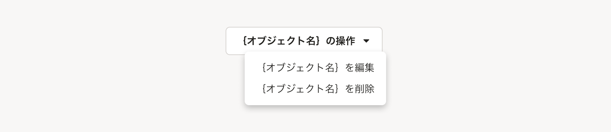
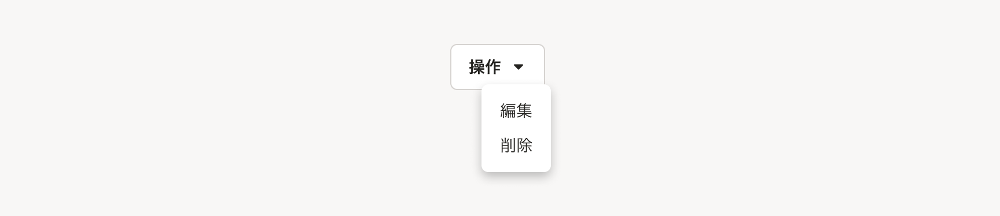
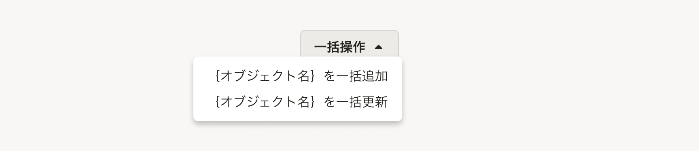

import { FaCaretDownIcon, FaEllipsisHIcon } from 'smarthr-ui'

複数の操作を1つのボタンにまとめる場合のパターンを定義します。

## 構成
複数の操作をまとめるボタンは、以下の要素で構成されています。

1. アクションボタン
2. ドロップダウン


### 1. アクションボタン
複数の操作がまとまっていることを示唆するために、[Secondaryボタン](/products/components/button/#h3-1)の`アイコン付き（右）`タイプで、「<FaCaretDownIcon visuallyHiddenText="展開" />」アイコン（`fa-caret-down`）を使用します。

### 2. ドロップダウン

[Dropdown](/products/components/dropdown/)を用いて、操作をリスト形式でまとめて表示します。  
まとめ方は、種類から用途にあったものを選択してください。

#### 操作の個数
レイアウトの一貫性やユーザーの利便性に応じて適切な個数を設定してください。ひと目で把握できるように**できるだけ少ない個数が望ましい**です。

例外として、類似する画面とのレイアウトの一貫性を保つために、操作が1つの場合（例：オブジェクトの削除のみ）でも、あえてドロップダウンの中に配置することがあります。

#### 操作の順序
**使用頻度が高い順**を推奨しますが、破壊的なアクション（例：オブジェクトの削除）に関しては、順序を下げて配置してください。  
操作の順序の典型的な例は以下のとおりです。  




## 種類
用途によって5つのパターンを定義します。

| # | パターン名 | 用途 |
| :--- | :--- | :--- |
| A | 単一のオブジェクトに対する操作 | オブジェクトに関する複数の操作をまとめるときに使用します。   |
| B | 単一のオブジェクトに対する操作（オブジェクト名省略） | 特定のオブジェクトの操作であることがレイアウト上自明なとき（例えば[よくあるテーブル](/products/design-patterns/smarthr-table/)の行の中など）に使用します。 |
| C | 同一の操作 | 同じ種類の操作をまとめるときに使用します。  |
| D | 異なる複数の操作 | 異なる複数の操作を適切に分割できなかったり、まとめ方が無いときに、異なる複数の操作をまとめるために使用します。  |
| E | 異なる複数の操作（ラベル省略） | Dのパターンに該当し、ボタンを配置するスペースを十分確保できないときに使用します。   |

### A. 単一のオブジェクトに対する操作


オブジェクトに関する操作をまとめるときに使用します。  

| 要素 | 説明 |
| :--- | :--- |
| アクションボタン | ラベルは`{オブジェクト名}の操作`とします。 |
| ドロップダウン | オブジェクトに対して行なう操作を入れます。 |

### B. 単一のオブジェクトに対する操作（オブジェクト名省略）


操作の対象になるオブジェクトがレイアウト上自明なときに使用します。（例えば[よくあるテーブル](/products/design-patterns/smarthr-table/)の行の中など）

| 要素 | 説明 |
| :--- | :--- |
| アクションボタン | 基本的に「A. 単一のオブジェクトに対する操作」のようにオブジェクト名を表示しますが、狭い場所にレイアウトするときにオブジェクト名を省略できます。ラベルは`操作`にします。  |
| ドロップダウン | オブジェクトに対して行なう操作を入れます。アクションボタンのラベルと同様にオブジェクト名を省略できます。 |

### C. 同一の操作



同じ種類の操作をまとめるときに使用します。 

| 要素 | 説明 |
| :--- | :--- |
| アクションボタン | 操作をまとめるラベルにします。 |
| ドロップダウン | 同じ種類の操作を入れます。 |

### D. 異なる複数の操作


他のA~Cのパターンに該当しないときに、異なる複数の操作をまとめるために使用します。

| 要素 | 説明 |
| :--- | :--- |
| アクションボタン | ラベルは`その他の操作`とします。 |
| ドロップダウン | 異なる複数の操作を入れます。 |

### E. 異なる複数の操作（ラベル省略）


「D. 異なる複数の操作」に該当し、ボタンを配置するスペースを十分確保できないときに使用します。   

| 要素 | 説明 |
| :--- | :--- |
| アクションボタン | [Secondaryボタン](/products/components/button/#h3-1)の`アイコンのみ`タイプで「<FaEllipsisHIcon visuallyHiddenText="その他の操作" />」アイコン（`fa-ellipsis-h`）を使用します。ラベルは視覚的に省略しますが、**必ず代替テキストを含めて**何のボタンなのかを伝えるようにしましょう。 |
| ドロップダウン | 「D. 異なる複数の操作」と同様です。 |

## レイアウト

複数の操作をまとめるボタンのレイアウトは次のとおりです。

```tsx editable withStyled
type Actions = ActionItem | ActionItem[]
// これでコンポーネントを絞れるわけではないが Button[variant=text] を使ってほしいんだよ! という気持ち
type ActionItem =
  | ReactElement<ComponentProps<typeof Button>>
  | ReactElement<ComponentProps<typeof AnchorButton>>
type Props = {
  /** 引き金となるボタンラベル。デフォルトは “その他の操作” */
  label?: string
  /** 操作群 */
  children: Actions
  /** 引き金となるボタンの大きさ */
  triggerSize?: 's'
  /** 引き金となるボタンをアイコンのみとするかどうか */
  onlyIconTrigger?: boolean
}

const DropdownButtons: React.FC<Props> = ({ label = 'その他の操作', children, triggerSize, onlyIconTrigger = false }) => {
  const triggerLabel = useMemo(() => onlyIconTrigger ? <FaEllipsisHIcon visuallyHiddenText={label} /> : label, [onlyIconTrigger, label])
  const triggerSuffix = useMemo(() => onlyIconTrigger ? <></> : <FaCaretDownIcon visuallyHiddenText="候補を開く" />, [onlyIconTrigger])

  return (
    <Dropdown>
      <DropdownTrigger>
        <Trigger suffix={triggerSuffix} size={triggerSize}>
          {triggerLabel}
        </Trigger>
      </DropdownTrigger>
      <DropdownContent>
        <ActionList>
          {React.Children.map(children, (item, i) => (
            <li key={i}>{actionItem(item)}</li>
          ))}
        </ActionList>
      </DropdownContent>
    </Dropdown>
  )
}

const Trigger = styled(Button)`
  &[aria-expanded='true'] .smarthr-ui-Icon {
    transform: rotate(0.5turn);
  }
`
const ActionList = styled(Stack).attrs({ as: 'ul', gap: 0})`
  ${({ theme: { space } }) => css`
    list-style: none;
    margin-block: 0;
    padding-block: ${space(0.5)};
    padding-inline-start: 0;

    .smarthr-ui-Button,
    .smarthr-ui-AnchorButton {
      justify-content: flex-start;

      padding-block: ${space(0.5)};
      font-weight: normal;
    }
  `}
`
const actionItem = (item: ReactElement) => cloneElement(item, { variant: 'text', wide: true})

render (
  <>
    <DropdownButtons>
      <Button>評価を開始</Button>
      <Button disabled>評価を確定</Button>
      <Button>ヒントメッセージの設定</Button>
      <AnchorButton href="#h2-2">ログアウト</AnchorButton>
    </DropdownButtons>
    <DropdownButtons onlyIconTrigger>
      <Button>評価を開始</Button>
      <Button disabled>評価を確定</Button>
      <Button>ヒントメッセージの設定</Button>
      <AnchorButton href="#h2-2">ログアウト</AnchorButton>
    </DropdownButtons>
    <DropdownButtons triggerSize="s" label="操作">
      <Button>評価を開始</Button>
      <Button disabled>評価を確定</Button>
      <Button>ヒントメッセージの設定</Button>
      <AnchorButton href="#h2-2">ログアウト</AnchorButton>
    </DropdownButtons>
    <DropdownButtons triggerSize="s" onlyIconTrigger>
      <Button>評価を開始</Button>
      <Button disabled>評価を確定</Button>
      <Button>ヒントメッセージの設定</Button>
      <AnchorButton href="#h2-2">ログアウト</AnchorButton>
    </DropdownButtons>
  </>
)
```
