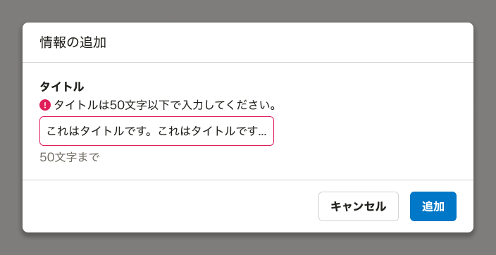
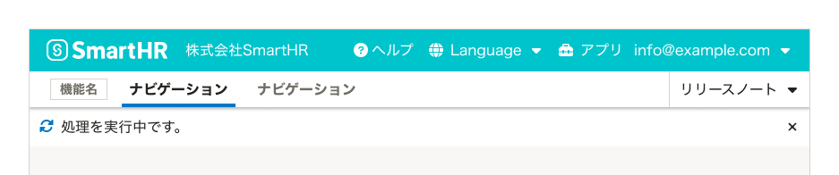
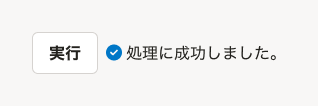
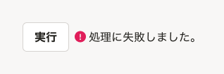
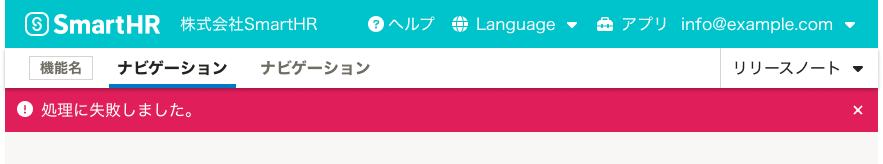
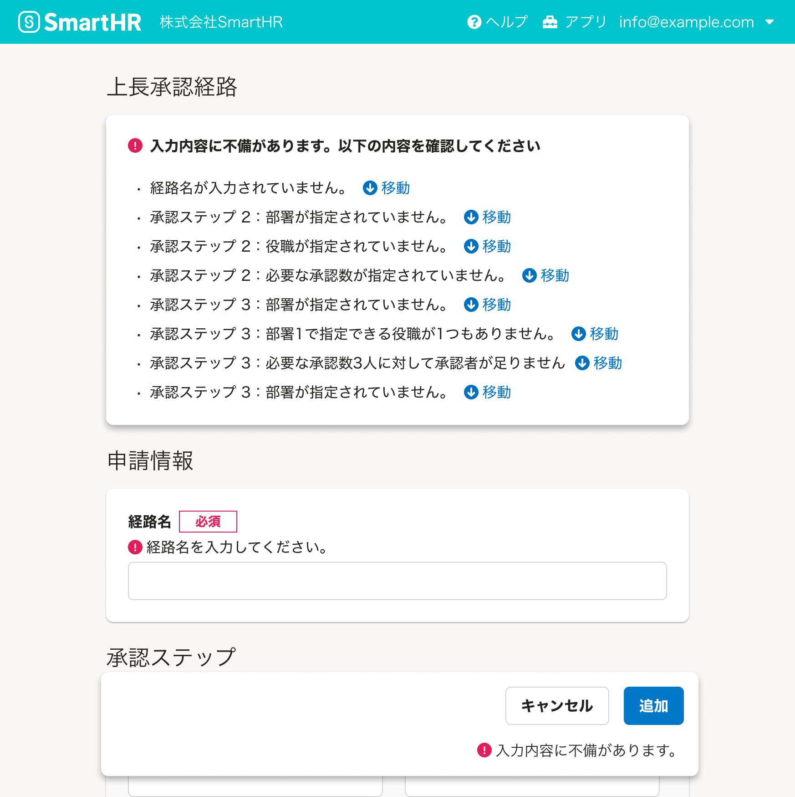
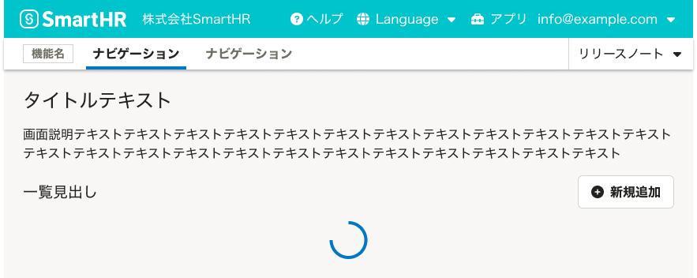
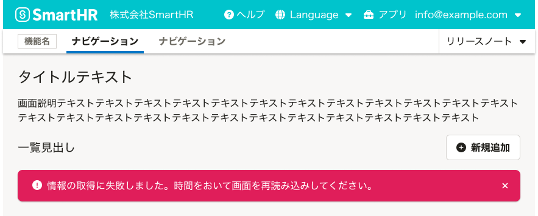

ユーザーに操作の結果を伝えるUIのルールを定義します。

## 基本的な考え方

ユーザーが行なった操作へのシステムからの応答をフィードバックと呼びます。メッセージを画面上に表示したり、コンポーネントの意匠を変更するなどの方法が取られます。

### ユーザーが受動的に結果を認識できるようにする

フィードバックはユーザーが操作の結果を理解し、次の行動を判断するために重要です。ユーザーがシステムに何らかの操作をした際は受動的にその結果を認識できるよう、素早く画面上にフィードバックのためのUIを表示してください。

### 操作部の近くでフィードバックする

ユーザーは画面の全領域の変化に常に気づくとは限りません。特に拡大鏡を利用する弱視・ロービジョンのユーザーは、拡大表示範囲外の変化を認識できません。可能な限り、直前までユーザーが操作していた要素の近くか、コンポーネント自体の変化で操作の結果をフィードバックします。

関連リンク：[弱視・ロービジョンのユーザーのウェブ利用時の課題と解決案](/accessibility/low-vision/)

### スクリーンリーダーでの読み上げ順序を考慮する

[WIP]

## 状況に応じたパターン
操作の結果をフィードバックする代表的な状況には以下の5つが挙げられます。

1. フォームを入力・送信するとき
1. 同期処理を開始したとき
1. 同期処理が完了したとき
1. ページ・要素の読み込みを開始したとき
1. ページ・要素の読み込みが完了したとき

なお、非同期処理のフィードバックについては、[バックグラウンド処理](/products/design-patterns/background-jobs-results/)を参照してください。

### フォームを入力・送信するとき

ユーザーがフォームを入力・送信するときには主に入力内容が不正である場合のエラーメッセージを表示します。

入力された値が不正である場合の例：

- 入力必須の入力要素の値が空
- データ型が異なる
- 値が許容範囲外

ユーザーがフォームを入力・送信するときに入力内容が不正であることをフィードバックするUIの考え方は以下の通りです。

#### 値が不正であることが入力時に判定できる場合

入力要素からフォーカスが外れたタイミングで、入力要素に対してエラーメッセージを表示します。値が修正され、エラーの原因が解消された場合はエラーメッセージの表示を止めます。

入力要素に対するエラーメッセージは、[FormControl](/products/components/form-control/)か[Fieldset](/products/components/fieldset/)の`errorMessages`を利用して、入力要素の付近に表示します。どの入力要素がエラーとなっているかを視覚的に見つけやすくするために、入力要素にも`error`状態を付加して意匠を変化させます。

#### 値が不正であることが入力時に判定できず、フォームの送信時に判定する場合

送信ボタンの押下後に、入力要素と送信ボタンに対してエラーメッセージを表示します。再度送信ボタンが押下された際に、エラーの原因が解消されていた場合はエラーメッセージの表示を止めます。

入力要素に対するエラーメッセージは、[FormControl](/products/components/form-control/)か[Fieldset](/products/components/fieldset/)の`errorMessages`を利用して、入力要素の付近に表示します。どの入力要素がエラーとなっているかを視覚的に見つけやすくするために、入力要素にも`error`状態を付加して意匠を変化させます。

送信ボタンに対するエラーメッセージは、`error`状態の[ResponseMessage](/products/components/response-message/)（[ActionDialog](/products/components/dialog/)の場合は`responseMessage`）を利用して表示します。

### 同期処理を開始したとき

同期処理を開始したときに、処理を開始したことおよび処理中であることをフィードバックするUIの考え方は以下の通りです。

#### 基本的な考え方

実行した[Button](/products/components/button/)を`loading`状態に変化させます。

処理が完了したら表示を切り替え、[同期処理が完了したとき](#h3-5)のフィードバックを表示します。

#### 処理を実行したButtonの状態変化で伝えることが難しい場合

例：操作後に画面全体の切り替えが発生する場合

`sync`状態の[NotificationBar](/products/components/notification-bar/)を表示します。

処理が完了したら表示を切り替え、[同期処理が完了したとき](#h3-5)のフィードバックを表示します。

### 同期処理が完了したとき

同期処理が完了したときに、処理の結果をフィードバックするUIの考え方は以下の通りです。

#### 基本的な考え方

ユーザーが直前に操作していたButtonなどの近くに、成功時には`success`状態、失敗時には`error`状態で[ResponseMessage](/products/components/response-message/)を表示します。

#### ユーザーが直前に操作していたButtonの近くに表示するのが難しい場合

例：操作後にダイアログ・画面全体の切り替えが発生する場合や、ダイアログが消えて元の画面に戻る場合

成功時には`success`状態、失敗時には`error`状態で[NotificationBar](/products/components/notification-bar/)を表示します。

#### 記載する情報が多くResponseMessageやNotificationBarでは表示しきれない場合

成功時には`success`状態、失敗時には`error`状態で[InformationPanel](/products/components/information-panel/)を表示します。

#### 例外：成功時のフィードバックの省略

成功時のフィードバックは成功したことが自明である場合は省略できますがユーザーが状態を正しく理解できるよう十分に注意してください。

例：オブジェクトの新規インスタンスを作成すると、作成された新規インスタンスの詳細画面へ自動的に移動する場合, [Switch](/products/components/switch/)など、コンポーネント自体がその状態を示す場合

### ページ・要素の読み込みを開始したとき

読み込みの対象となっている領域に[Loader](/products/components/loader/)を表示します。

処理が完了したら表示を切り替え、[ページ・要素の読み込みが完了したとき](#h3-7)のフィードバックを表示します。

### ページ・要素の読み込みが完了したとき

ページ・要素の読み込みが完了したときに、その結果をフィードバックするUIの考え方は以下の通りです。

#### ページ・要素の表示に成功した場合

要素が表示されることでその結果が自明であるため、フィードバックのためのUIは表示しません。

#### ページ全体の表示に失敗した場合

[ErrorScreen](/products/components/error-screen/)を利用します。

#### 特定の要素の表示に失敗した場合

`error`状態の[NotificationBar](/products/components/notification-bar/)を表示します。

