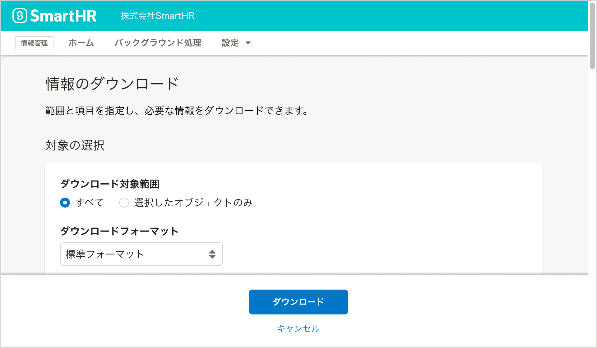
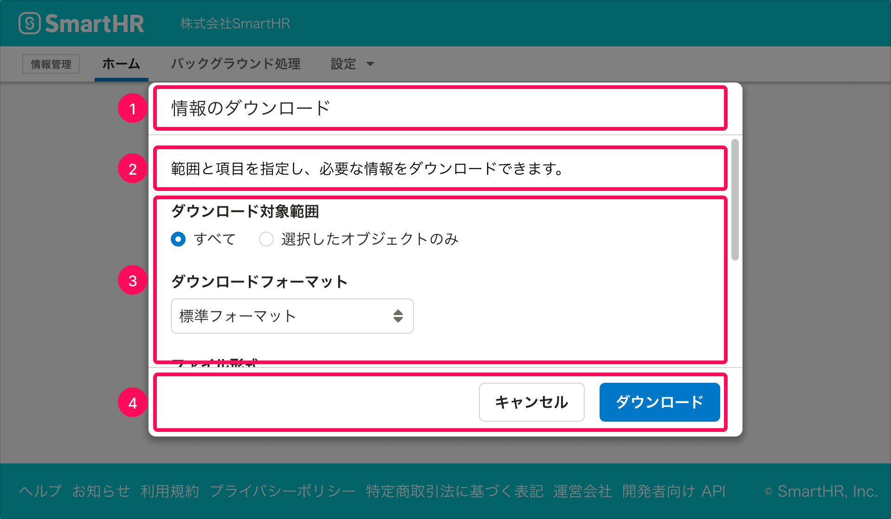

import { DoAndDont } from '@Components/DoAndDont'
import { StaticImage } from '@Components/StaticImage'
import imageUrlDo from './images/modal-ui/modal-ui_actiondialog_accessibility_error.png';
import imageUrlDont from './images/modal-ui/modal-ui_actiondialog_accessibility_disabled.png';

モーダルなUIのガイドラインとパターンをまとめています。

## 基本的な考え方
### モードとは

プロダクトが特定のタスクを実行することに特化した状態になっているとき、この状態のことを「**モード（英：mode）**」、タスク完了のために特定のモードを提供するUIを「**モーダル（英：modal）なUI**」と呼びます。モーダルなUIでは、モードの目的であるタスクを完了するか、モードから抜け出す操作をするまで、他のタスクを実行できません。

逆に、特定のモードに切り替えることなくタスクを完了できるUIは「**モードレス（英：modeless）なUI**」と呼びます。

### モーダルなUIの使いどころ

モーダルなUIを提供することで、ユーザーは特定のタスクに集中でき、複雑なタスクであっても安全に実行できます。

一方で、モーダルなUIには以下のような面でユーザビリティを低下させることがあります。

- タスクを実行する手順があらかじめ決まっていて、ユーザーが自由な手順で操作できない
- モードごとに操作方法が異なり、ユーザーの学習コストが高い
- タスクの途中で別のタスクをしたくなった際には、「モードから抜け出す」という余計な一手間が必要
- タスクの完了操作をするまでシステム上で処理が実行されないため、作業途中で誤ってモードから抜け出した場合に、それまでの作業内容が失われる

このため、原則としてはプロダクトの中心的な画面はモードレスであるように設計し、モーダルなUIはそれが特に有効である場面において限定的に提供することが推奨されます。

## 種類

モーダルなUIの主なパターンを挙げます。

### モーダルダイアログ

モーダルなUIのうち、最も典型的なものが、ダイアログを使ったモードです。これをモーダルダイアログと呼びます。

SmartHR UIでは[ActionDialog](../../components/dialog/#h3-1)と[MessageDialog](../../components/dialog/#h3-2)の2種類がありますが、基本的にはActionDialogを使います。

モーダルダイアログの表示中、ダイアログの外側の領域はスクリム（幕）で隠されています。ダイアログを閉じるか、このモードの目的であるタスクを完了するまで、ダイアログ外の操作はできません。

MessageDialogはユーザーの操作に対するフィードバックとして使用できます。ただし、モーダルな操作フィードバックはユーザーの操作を強制的に中断させるため、使用は慎重に検討します。詳しくは操作フィードバック（作成中）を参照してください。

モードレスなUIとしてダイアログを提供する場合は、[ModelessDialog](../../components/dialog/#h3-3)を使用します。

### ページ全体を使ったモード

表示する情報が多く、ダイアログではスクロールが多く発生する場合、ページ全体を使ったモードを検討します。

これは、ユーザーの環境によってはダイアログのファーストビュー以外にも情報が存在することに気づきづらかったり、スクロール（特に横スクロール）がしづらかったりして、ユーザビリティやアクセシビリティが低下するためです。

### ページの一部を使ったモード

モードのなかで提供したいUIのレイアウトが、モードレスなUIと近い場合、ページの一部を使ったモードを検討します。

例えば、[部署マスターの並べ替え機能](https://support.smarthr.jp/ja/help/articles/7e59f1f2-6df7-4c6c-9d84-fc7449a2a6d6/#%E9%83%A8%E7%BD%B2%E3%82%92%E4%B8%A6%E3%81%B9%E6%9B%BF%E3%81%88%E3%82%8B)では、[部署マスターの一覧画面](https://support.smarthr.jp/ja/help/articles/360036111074/)のレイアウトを維持したまま一部をモードにすることで、元々表示されていた部署マスターの一覧と同じ対象を操作しているという認知を促しています。

### 複数ステップの操作

タスクの完了のために複数の操作が必要な場合には、1つのモードに対してステップを複数に分けます。

詳しくは複数ステップの操作（作成中）を参照してください。

## 構成

[モーダルダイアログ（ActionDialog）](#h3-2)と[ページ全体を使ったモード](#h3-3)を例に、モーダルなUIの構成を示します。

モーダルなUIの多くは、次の要素で構成されます。

1. タイトル
2. 説明
3. 入力要素
4. モードの操作ボタン

### 1. タイトル

[見出しの書き方](/products/components/heading/#h3-5)にならって、このモードの目的であるタスクを簡潔に書きます。

### 2. 説明

機能概要や使い方、注意事項などを記載します。タイトルのすぐ後ろに限らず、必要に応じて[入力要素](#h3-8)の近くに記載することもあります。

タイトルだけで説明として十分である場合は、別途の説明を省略できます。

### 3.  入力要素

タスクを実行するためにユーザーが操作する必要のある要素です。[FormControl](../../components/form-control/)や[Fieldset](../../components/fieldset/)を使用します。

[削除ダイアログ](../delete-dialog/)のように「処理実行の前の確認」を目的としたモードの場合、入力要素が無いこともあります。

### 4. モードの操作ボタン

次の2つのアクションのためのボタンを配置します。

1. タスクを完了してモードを終えるアクション
2. タスクを中断してモードから抜け出すアクション

タスクを完了するアクションは[Primaryボタン](../../products/components/button/#h3-1)を使います。ボタンのラベルは、モードの目的であるタスクを完了するアクションであることがわかる動詞を使用します。

タスクを中断するアクションのボタンラベルは［キャンセル］とします。

どちらのボタンであっても、ボタンを押すとモードが解除され、元の画面に戻ります。

ページ全体を使ったモードの場合、[BottomFixedArea](../../components/bottom-fixed-area/)を使用してボタンを配置します。また、タスクを中断して元のページに戻る操作は［キャンセル］ボタンが担うため、[上に戻るリンク](../upward-navigation/)は配置しません。

## アクセシビリティ

モーダルなUIにおいては、「必須の入力要素が空欄になっている」などの理由でタスクを完了する条件が満たされていない場合であっても、原則として**完了ボタンは無効化せず、ユーザーに完了ボタンを押させた上で、エラーを返す**ようにします。

<DoAndDont
  type="do"
  img={<StaticImage src={imageUrlDo} alt="Do" />}
  label="必須項目が空欄のまま完了ボタンを押すとエラーが返り、どの項目にどんな問題があるかが示される。"
/>
<DoAndDont
  type="dont"
  img={<StaticImage src={imageUrlDont} alt="Dont" />}
  label="必須条件を満たさない限り完了ボタンが無効化され押せない。"
/>

これは、完了のためのボタンを無効化すると、以下の理由によりアクセシビリティやユーザビリティが低下する可能性があるためです。

- 無効化されたボタンはキーボード操作でフォーカスを当てられない
- どの入力要素が、どんな理由で完了条件を満たしていないのかが伝わりにくい

### 参考文献

- [サブミット (送信) ボタンをデフォルトで無効化しない | Accessible & Usable](https://accessible-usable.net/2021/10/entry_211014.html)