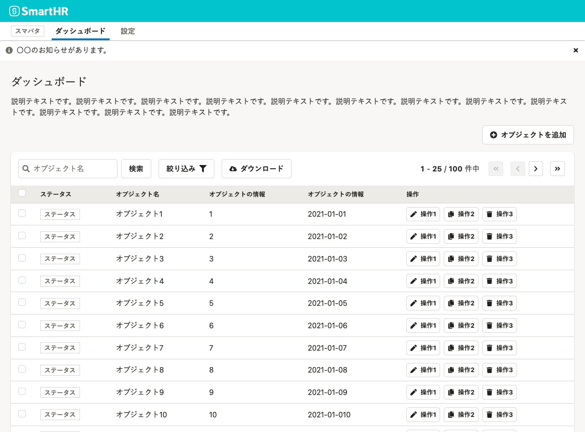

import { Button, ActionDialog, NotificationBar } from 'smarthr-ui'

ユーザーへ伝えたいフィードバックやメッセージの表し方を定義しています。

## 基本的な考え方

ユーザーへの通知方法は、操作の種類や操作後の状態などによって分類できます。

- 入力された値へフィードバックしたいとき
  - [【WIP】隣接エリアへの通知](#h2-1)
- 操作後に画面が切り替わるとき
  - [操作通知](#h2-2)
- ダイアログから操作し、画面に戻るとき
  - [操作通知](#h2-3)
- 特別で重要な情報やお知らせを出したいとき
  - [インフォメーション通知](#h2-4)

## 【WIP】隣接エリアへの通知

入力された値へフィードバックしたいときに使うパターンです。主にフォームバリデーションなどに使います。

{WIP}

## 操作通知

主に「操作後に画面全体が切り替わるとき」や「ダイアログで操作し、元の画面に戻るとき」などに使います。

- [NotificationBar](/products/components/notification-bar)コンポーネントを使ってメッセージを表示します。
- ユーザーに通知が表示されたことを示唆させやすくするために、[NotificationBar](/products/components/notification-bar)のanimationプロパティを`true`にします。
- ユーザーへのアテンションを高めるために、[NotificationBar](/products/components/notification-bar)の`bold`を`true`にすることを推奨します。
- [NotificationBar](/products/components/notification-bar)はユーザーの明示的な操作に依って非表示にします。時間に依って閉じることは非推奨です(※1)。

### 使い方

#### 操作通知の典型例

以下の動画はコレクションにオブジェクトを追加する際に[NotificationBar](/products/components/notification-bar)を使ってメッセージを出す典型的な例です。
この例ではアクションが成功したため、[NotificationBar](/products/components/notification-bar)の`type`は`success`にしていますが、エラーの場合は`error`を指定してメッセージを返します。

#### スクロール追従するNotificationBar

アクション後にスクロールが長く[NotificationBar](/products/components/notification-bar)の通知に気づきにくい問題がある場合は、`positon: sticky`でスクロールに追従した表示をすることを推奨します。
以下の動画では操作後に縦スクロールしても[NotificationBar](/products/components/notification-bar)が画面上部に表示されるようになっています。

## インフォメーション通知

主に「特別で重要な情報やお知らせを出したいとき」に使います。

- インフォメーション通知では、[NotificationBar](/products/components/notification-bar)、[InformationPanel](/products/components/information-panel)、[CompactInformationPanel](/products/components/information-panel)コンポーネントを使います。
- 基本的に[NotificationBar](/products/components/notification-bar)の`bold`は`false`で使うことを推奨します。破壊的な変更や必ず見てほしい重要情報など必要に応じて`bold`を使ってください。
- インフォメーション通知で設置するコンポーネントと表示位置は、情報構造に合わせて設計します。代表的な使い方は次項の[使い方](#h3-1)で述べています。

### 使い方

#### アプリケーション全体にメッセージを表示する例

以下の画面は[NotificationBar](/products/components/notification-bar)を使ってアプリケーション全体にメッセージを表示している例です。アプリケーション内で画面を切り替えてもメッセージが表示され続けることを表すため、[Header](/products/components/header)よりも上に配置しています。

#### ページにメッセージを表示する例

次の画面は[NotificationBar](/products/components/notification-bar)を使ってページ内にメッセージを表示している例です。この例でAppNaviの下に[NotificationBar](/products/components/notification-bar)を配置しているのは、「ダッシュボード」の配下のみにかかる情報だと示唆するためです。

#### 特定エリアにメッセージを表示する例

最後の画面は[InformationPanel](/products/components/information-panel)を使ってメッセージを表示している例です。この例ではダッシュボードのコレクションにのみ関係する情報を表示しています。なお[InformationPanel](/products/components/information-panel)は表示領域を大きく取るコンポーネントなので、表示する情報が少ない場合は[CompactInformationPanel](/products/components/information-panel)を使うことを推奨します。

## 参考文献

※1. [Web Content Accessibility Guidelines - 2.2.1 タイミング調整可能を理解する](https://waic.jp/docs/UNDERSTANDING-WCAG20/time-limits-required-behaviors.html)
