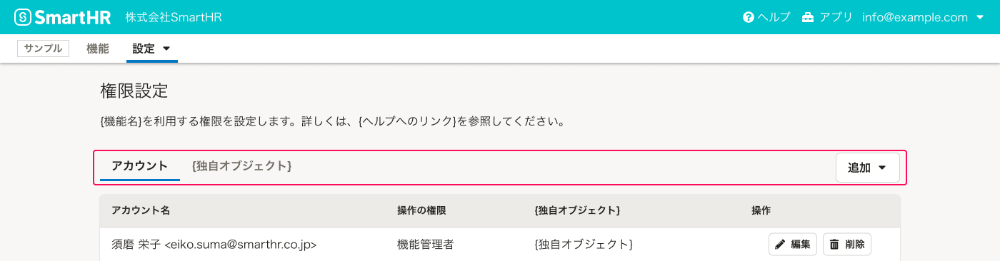
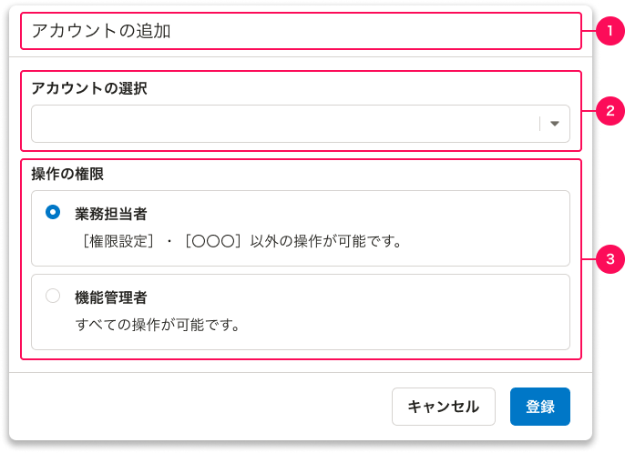
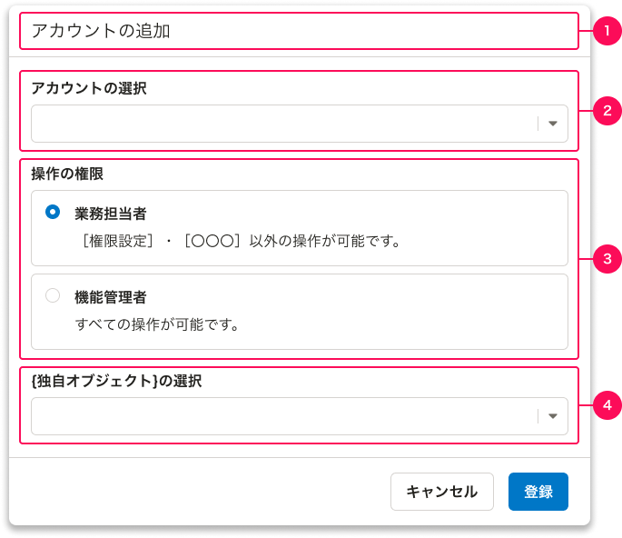

SmartHRにおける「権限設定」のパターンをまとめています。

## 基本的な考え方

プロダクトごとにアカウントの権限を管理するための画面です。画面パターンは以下のとおりです。  
基本機能についてはこの限りではありません。

- [一覧](#h2-2)
- [アカウントの詳細](#h2-3)

## 権限の分類

SmartHRにおける権限は、大きく2つに分けられます。分類によって、権限オブジェクトの考え方や画面設計が異なります。  
新しくプロダクトを作る場合は、どちらの分類になるかを理解したうえで設計を進めてください。

- [RBAC(Role-Based Access Control)パターン](#h3-0)
- [ABAC(Attribute-Based Access Control)パターン](#h3-1)

### RBAC(Role-Based Access Control)パターン

RBACは、ユーザーに役割（例：業務担当者、機能管理者）を割り当て、その役割に応じた特定の行動許可を設定するパターンです。

例えば、SmartHRにおいて対象となるプロダクトは以下のとおりです。

- [配置シミュレーション](https://smarthr.jp/function/simulation/)
- [スキル管理](https://smarthr.jp/function/skill/)
- [組織図](https://smarthr.jp/function/organization/)
- [人事評価](https://smarthr.jp/function/evaluation/)

### ABAC(Attribute-Based Access Control)パターン

ABACは、対象の属性（操作範囲）に基づいて、特定の行動（例：依頼と確認、書類のダウンロード）の許可を選択するパターンです。

例えば、SmartHRにおいて対象となるプロダクトは以下のとおりです。

- [文書配付](https://smarthr.jp/function/distribution/)
- [年末調整](https://smarthr.jp/function/nc/)

## 一覧

一覧ではアカウントを、[よくあるテーブル](/products/design-patterns/smarthr-table/)のパターンで表示します。

### 構成（RBAC）

構成は[よくあるテーブル](/products/design-patterns/smarthr-table/)のパターンに従います。
[よくあるテーブル](/products/design-patterns/smarthr-table/)の詳細はレイアウトパターンを参照してください。

** 一覧（アカウントのみ）**  

** 一覧（アカウントと独自の権限設定を扱う場合）**  

#### 1. 画面タイトル

画面タイトルは「権限設定」とします。

#### 2. 画面説明テキスト

機能の説明や操作に関する補足テキスト、ヘルプセンターへのリンクなどを書きます。特別な補足がない場合は、以下のメッセージを使ってください。

`{機能名}を利用する権限を設定します。詳しくは、{ヘルプへのリンク}を参照してください。`

#### 3. テーブル

表には以下の情報を必ず表示します。必要に応じて、列を追加しても問題ありません。

- **アカウント名**
  - `{姓} {名}<{メールアドレス}>`と表示します。メールアドレスの登録がない場合は`{姓} {名}`、姓名の登録がない場合は`{メールアドレス}`とします。
- **操作の権限**
  - 権限名を表示します。
- **操作**
  - アカウントを操作するボタンを置きます。必要に応じて、[編集]と[削除]以外のボタンを置いても問題ありません。
  - コンポーネントは[Secondaryボタン](/products/components/button/)のサイズ小を使います。

##### アカウントのみの場合

アカウントのみを扱う場合のセクションタイトルは`アカウント`、オブジェクトの追加ボタンラベルは`追加`としてください。

##### 独自の権限設定がある場合

アカウントに紐づけが必要な独自の権限設定がある場合は、[TabBar](/products/components/tab-bar/)を使って並列に表示します。

TabBarのタイトルは左から`アカウント`、`{独自オブジェクト}`とします。

それぞれのオブジェクトを追加する[DropdownMenuButton](/products/components/dropdown/dropdown-menu-button/)のラベルは`追加`とします。ドロップダウンパネル内のボタンラベルはそれぞれ、`アカウントを追加`、`{独自オブジェクト}を追加`とします。

### 構成（ABAC）

［WIP］

## アカウントの詳細

一覧の[（アカウントを）追加]、または[（アカウントを）編集]ボタンを押したときに[ActionDialog](/products/components/dialog/action-dialog/)で表示します。  
例はすべて追加時のスクリーンショットです。必要に応じて編集に読み替えてください。

### 構成（RBAC）

構成要素は次のとおりです。

- [1. ダイアログタイトル](#h4-3)
- [2. アカウントの選択](#h4-4)
- [3. 操作の権限](#h4-5)
- [4. 独自のオブジェクト設定](#h4-6)

**詳細ダイアログ（アカウントのみ）**  

**詳細ダイアログ（独自の権限設定がある場合）**  

#### 1. ダイアログタイトル

追加の場合は、「アカウントの追加」とします。編集の場合は、「アカウントの編集」とします。

#### 2. アカウントの選択

SmartHRのアカウントを選択します。単一選択の場合は[SingleComboBox](/products/components/combo-box/)を使ってください。複数まとめて追加する場合は[MultiComboBox](/products/components/combo-box/)を使ってください。

ComboBoxのパネル内の説明には`{検索対象名1}、{検索対象名2}で検索できます。`と、検索できる項目を明記します。

#### 3. 操作の権限

アカウントに対して操作の権限（役割）を設定します。以下に代表的な役割として**「機能管理者」「業務担当者」**の2つを定義します。必要に応じて見直してください。

- 機能管理者：すべての操作の権限を持つ
- 業務担当者：業務に必要な操作の権限のみを持つ

操作の権限が上記の2つ以内の場合は、[RadioButtonPanel](/products/components/radio-button-panel/)を使ってください。

**「カスタム権限」**として、操作の権限をユーザーが増やせるプロダクトもあります。この場合は[SingleComboBox](/products/components/combo-box/)や[Select](/products/components/select/)を使ってください。

#### 4. 独自の権限設定

独自の権限設定がある場合に表示します。用途に依って設定が異なるため、基準やパターンは定めません。

### 構成（ABAC）

［WIP］

## 関連リンク

- [アプリケーションにおける権限設計の課題 - kenfdev’s blog](https://kenfdev.hateblo.jp/entry/2020/01/13/115032)
