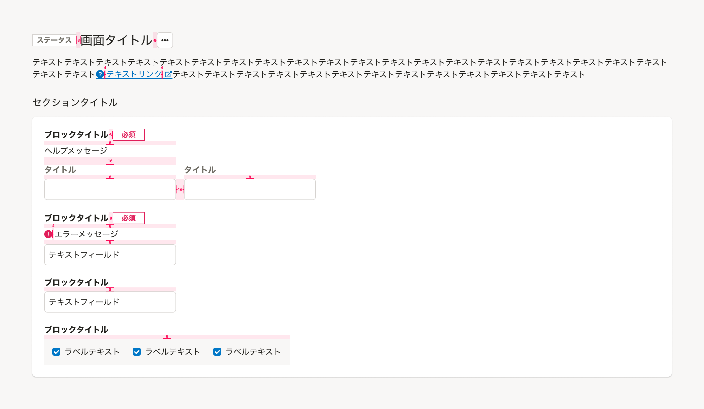
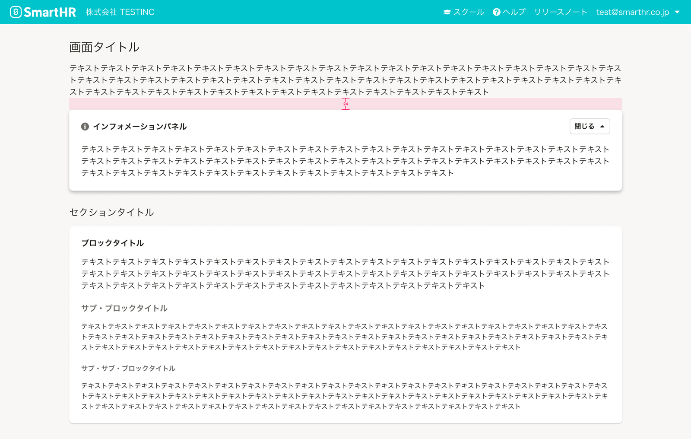
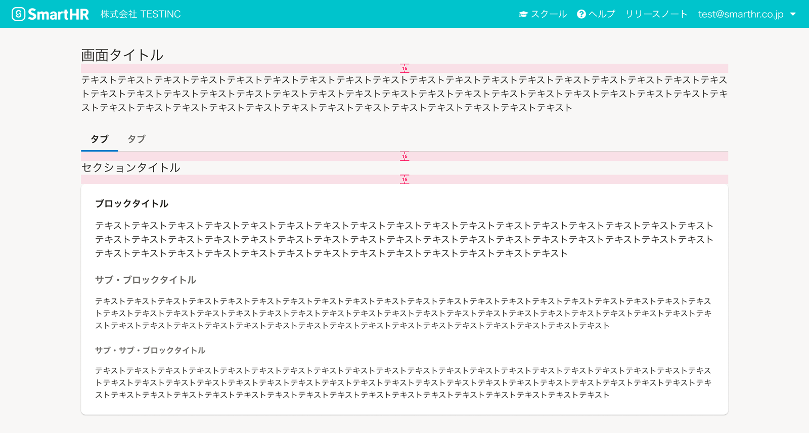
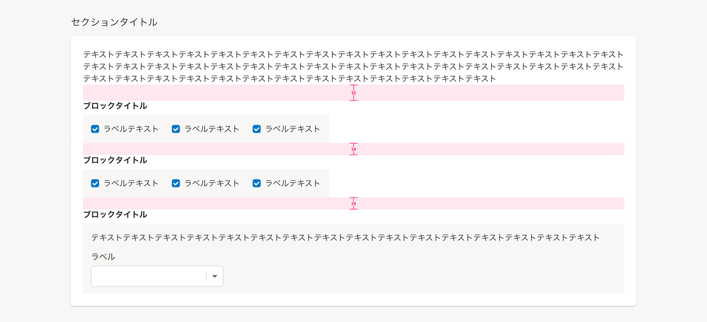
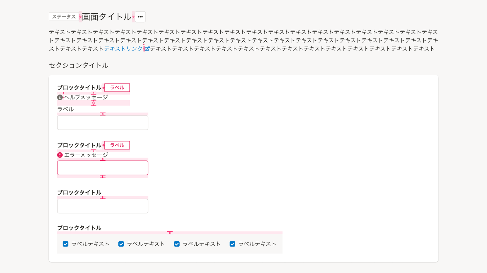
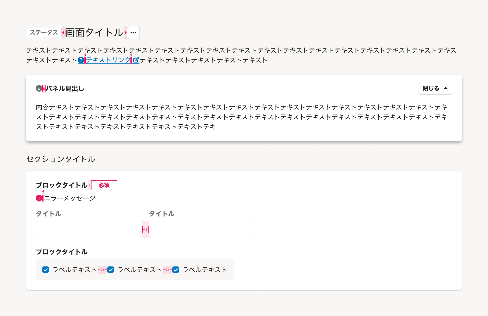
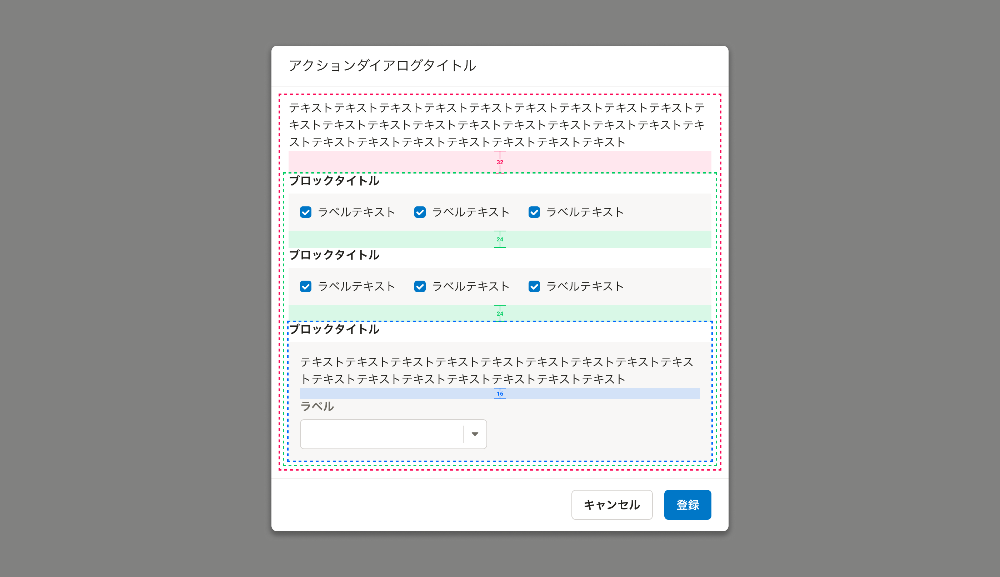
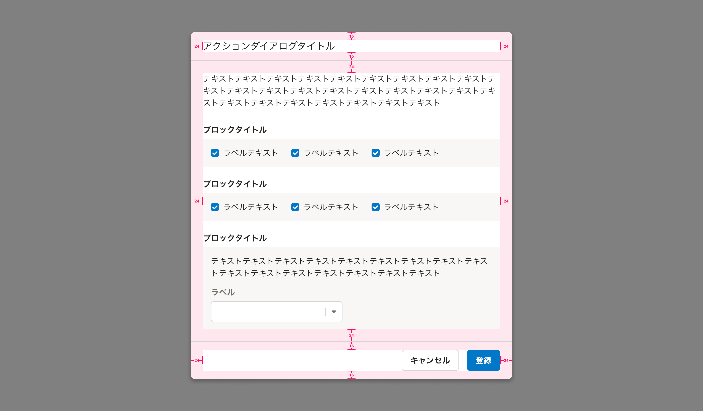

マージン（Margin）やパディング（Padding）などの余白のパターンをシーン別にまとめています。

## 基本的な考え方
余白は、要素間の距離に差をつけてかたまり（チャンク）を形成することで、要素同士の並列・内包などの関係性を視覚的に表現するために使います。

余白の値は、原則として8の倍数を使用し、画面の外側から内側にいくにつれて小さい値を段階的に使います。

## 種類
以下の余白を定義します。

- マージン（Margin）
- パディング（Padding）

## マージン（Margin）
セクションやブロックの見出しレベルや階層を下げるにつれて、`32px`、`24px`、`16px`の順で段階的に使います。
ただし、段階的に使用した結果、間隔がつまったり開きすぎてしまうなど視覚的なグルーピングが不適切と判断される場合は、段階を超えて適切な大きさを使います。

具体的な配置の基準は次の通りです。

- 原則、要素に対して上方向に適用する。
- 同じ意味階層となる要素同士は、ぞれぞれ同じ大きさのマージンを適用する。

### セクション同士の間
`32px`とします。

### 画面タイトルエリアとセクションの間
`24px`とします。

### 見出しと本文（またはBase）の間
`16px`とします。

### セクション内の要素同士の間
見出しレベルやコンテンツの階層を下げるにつれて、`32px`、`24px`、`16px`の順で段階的に適用します。

### アイコンやラベルなどの小さい要素間
アイコンやラベルといった小さい要素を組み合わせる場合は、基本的に`8px`とします。

- [InfomationPanel](/products/components/information-panel/)や[FormControl](/products/components/form-control/)、[Fieldset](/products/components/fieldset/)などのように、ブロックの見出しや[Input](/products/components/input/)にアイコンやラベルを複合的に組み合わせる場合は、`16px`と`8px`を段階的に組み合わせて適用します。
- インラインテキスト内でテキストリンクにアイコンを付加する場合は、`4px`とします。

### ダイアログの本文エリア内の要素間
見出しレベルやコンテンツの階層を下げるにつれて、`32px`、`24px`、`16px`の順で段階的に適用します。

## パディング（Padding）
原則として`24px`とします。縦長・横長になった場合や、中の要素がつまって狭くなってしまうときは、`16px`とします。

### コンテンツエリア（Base）の余白

| 対象エリア | 天地余白 | 左右余白 |
| :------- | :------- | :------- |
| コンテンツ全体 | 24px | 24px |

### コンテンツエリア内のグループ（BaseColumn）の余白
基本的に、セクション（主に[セクションタイトル](/products/components/heading/#h3-1)で括られるエリア）内で[FormControl](/products/components/form-control/)や[Fieldset](/products/components/fieldset/)などを複数配置するようなパターンで適用し、中の要素がつまったり狭くなることが想定されるため、`16px`とします。

| 対象エリア | 天地余白 | 左右余白 |
| :------- | :------- | :------- |
| コンテンツ全体 | 16px | 16px |

### ダイアログの余白
見出しとボタンエリアは横長になるため、天地左右`16px`のほうがすわりがよいですが、本文エリアの読み開始位置と一致させるため、左右を`24px`とし、天地に`16px`とします。

| 対象エリア | 天地余白 | 左右余白 |
| :------- | :------- | :------- |
| 見出しエリア | 16px | 24px |
| 本文エリア | 24px | 24px |
| ボタンエリア | 16px | 24px |

