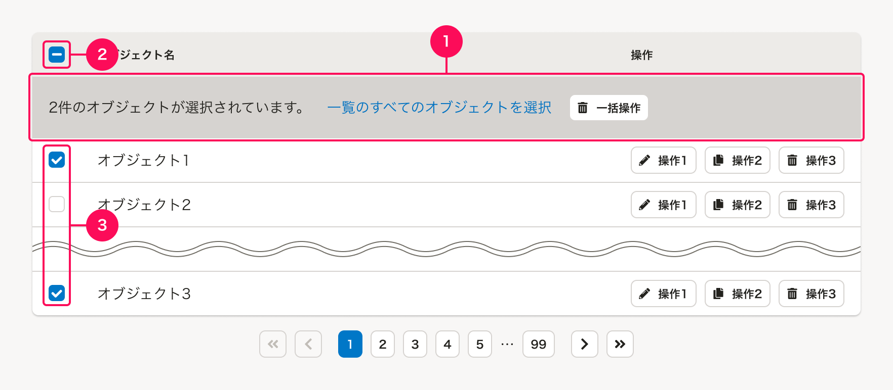
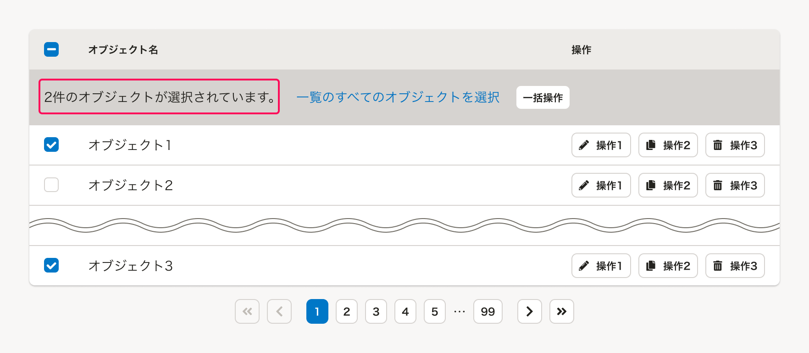
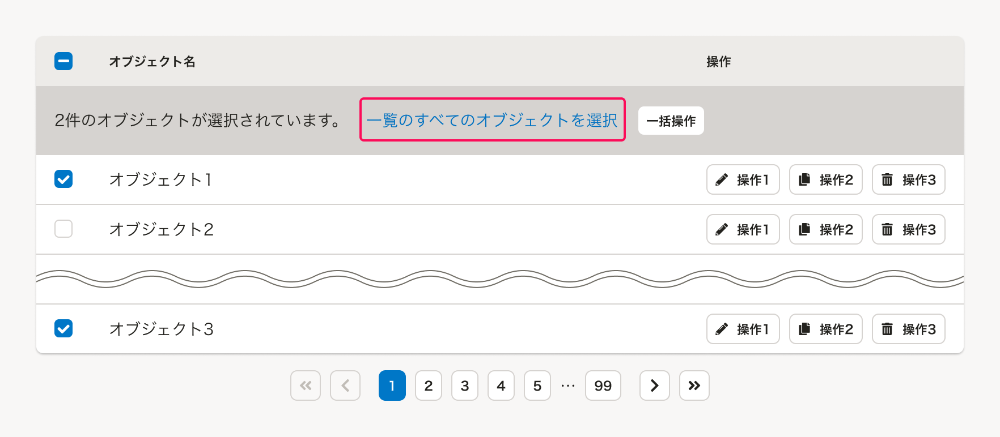
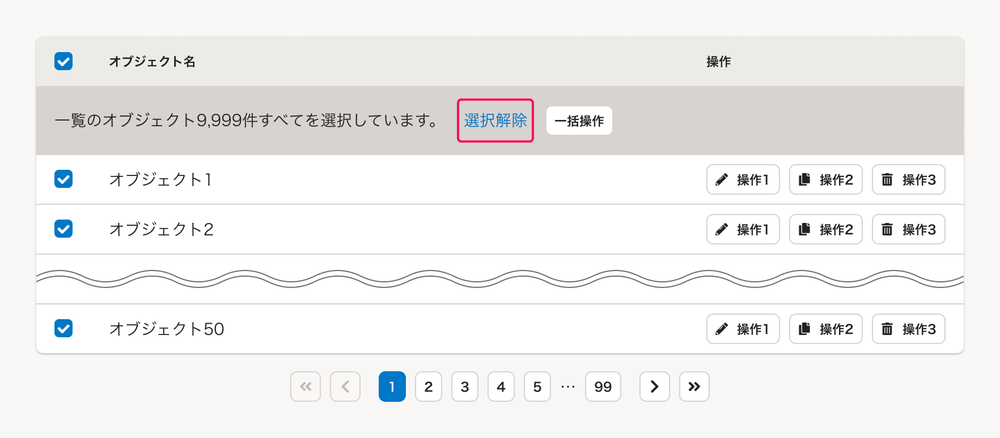
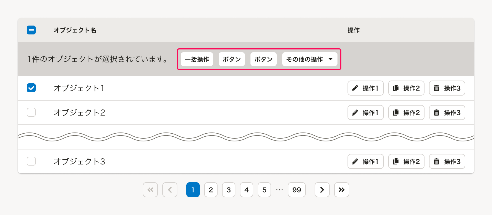
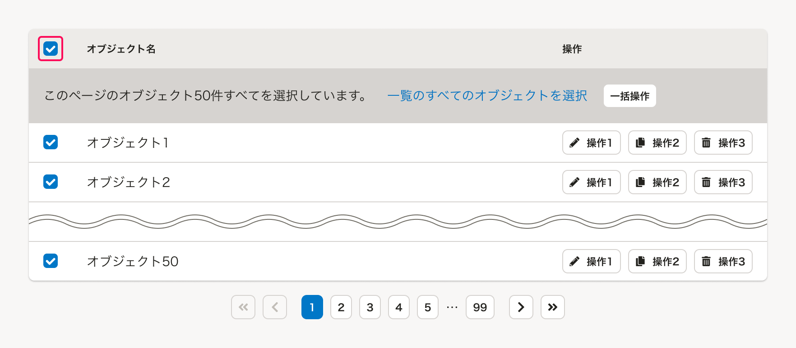
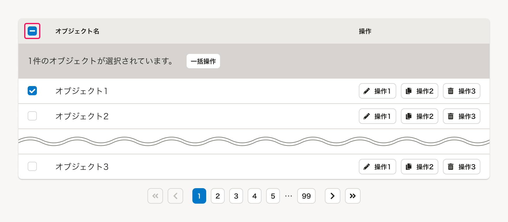
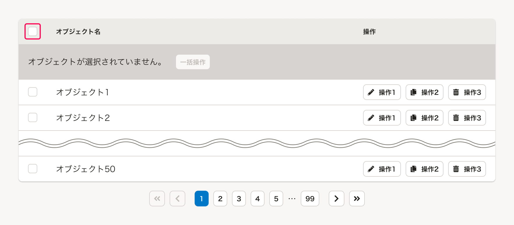
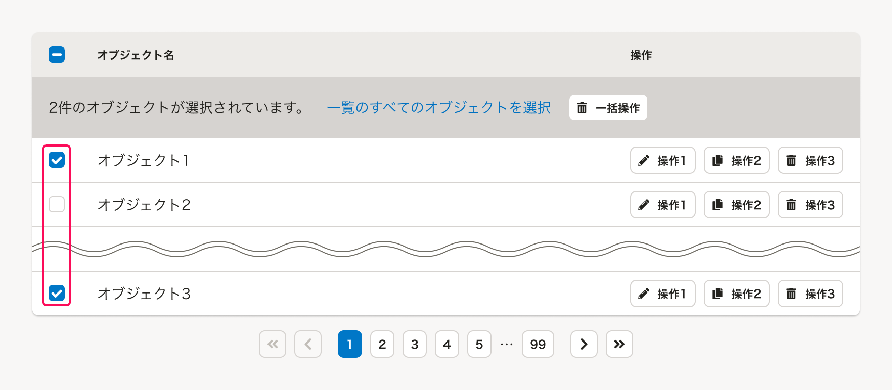
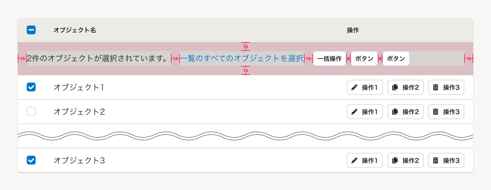

[「よくあるテーブル」](/products/design-patterns/smarthr-table/)で複数のオブジェクトに対して一括操作するUIのパターンです。

## 構成
「よくあるテーブル」のなかで、複数のオブジェクトへの一括操作に関する機能は次の構成となっています。  
テーブル内のその他の要素については、[「よくあるテーブル」の構成](/products/design-patterns/smarthr-table/#h2-0)を参照してください。

1. テーブル内の一括操作エリア
    - [オブジェクト選択状態の表示](#h4-0)
    - [わくわくチェック](#h4-1)
    - [一括操作するボタン](#h4-2)
2. 一括選択するチェックボックス（必須）
3. 個別選択するチェックボックス（必須）

### 1. テーブル内の一括操作エリア

テーブル内で選択されたオブジェクトに対して一括操作を配置するエリアです。
SmartHR UIではこのエリアを`BulkActionRow`と呼んでいます。

#### オブジェクト選択状態の表示

テーブル内でオブジェクトの選択状態を示すラベルです。

##### ラベルの表示例

オブジェクトの選択状態にあわせた表示例は以下の通りです。
- 句点を省略しないでください。
- 件数の単位は、オブジェクトの種類にあわせて「件」「名」「人」などを状況にあわせて使用してください。

| オブジェクトの選択状態 | ラベルに表示する文言 |
| :--- | :--- |
| 未選択 | `{オブジェクト名}が選択されていません。` |
| 複数選択されている | `{件数}件の{オブジェクト名}が選択されています。` |
| 表示されているものすべてが選択されている | `このページの{オブジェクト名}{件数}件すべてを選択しています。` |
| テーブルのページ送り上のすべてが選択されている | `一覧の{オブジェクト名}{件数}件すべてを選択しています。` |

#### わくわくチェック
わくわくチェックとは、テーブル上に表示される複数のオブジェクトをPaginationによって分割表示する際に、ページの枠を超えてすべてのオブジェクトを選択できる機能の通称です。

前提として、Paginationによってオブジェクトの表示件数が制御されている場合に使用します。

流れとしては、テーブル上に表示されているオブジェクトを１つ以上選択したときに「一覧のすべてのオブジェクトを選択」というテキストリンクを表示し、これをクリックすることで**Pagination上のすべてのオブジェクトを選択できる**ようにします。

わくわくチェックの適用下では、ユーザー自身で元の状態に戻せるように「一覧のすべてのオブジェクトを選択」のテキストリンクを「選択解除」に置き換え、**Pagination上のすべてのオブジェクトの選択状態を解除できる**ようにします。  

また、わくわくチェックの適用下でPagination上の遷移を行なった場合は、ユーザーに一貫した体験を提供する目的で**選択状態は維持せずにテーブルのページ送り上のすべてのオブジェクトの選択状態を解除する**挙動で統一します。

#### 一括操作するボタン

選択したオブジェクトを一括で変更するなどの、**データの削除・一括変更などに関わるアクションボタン**です。
必要なアクションに応じて、`BulkActionRow`内の一番右の要素として複数配置できます。

- アクションボタンとして、[Button](/products/components/button/)や、類似する操作をまとめた[DropdownButton](/products/components/dropdown-button/)を配置できます。
- ユーザーが操作に迷わないように、アクションボタンは**最大3つを上限とします**。それ以上設置する必要がある場合は、[ドロップダウンボタン](/products/design-patterns/dropdown-button/)を使用することを検討しましょう。

##### アクションボタンの例

ここに配置される典型的なアクションボタンの例は以下のとおりです。  
以下に限らず、扱う機能やユースケースによって、データの追加・一括変更などに関わるアクションボタンを配置できます。

| 操作名 | ボタンのラベル例 | 役割・動作 |
| :--- | :--- | :--- |
| オブジェクトへの一括操作 | `一括削除`,`一括ダウンロード` |  |
| オブジェクトに関する通知 | `通知を一括送信`,`依頼を一括送信` |  |
| タスクとしての一括操作 | `一括承認`,`一括確定`,`一括取り消し` |  |

### 2. 一括選択するチェックボックス

テーブル内の要素をすべて選択できるチェックボックスです。  

「一括選択するチェックボックス」のデフォルトは未選択状態で、クリックするとテーブル内に表示されているオブジェクトがすべて選択状態となります。
ページ上に表示されていないPagination上のオブジェクトは選択状態になりません。

「一括選択するチェックボックス」が未選択状態のときに、テーブル内のオブジェクトのうち1つ以上が個別選択された場合（選択状態と未選択状態が混ざっている場合）は、「一括選択するチェックボックス」を`mixed`が`true`の混在選択状態にします。

反対に、「一括選択するチェックボックス」の選択状態を解除すると、「わくわくチェック」適用下かどうかに関わらず、ページ上もPagination上もすべてのオブジェクトの選択状態を解除します。  

`mixed`が`true`の混在選択状態で「一括選択するチェックボックス」をクリックした場合も同様に、すべての選択状態を解除します。

### 3. 個別選択するチェックボックス

テーブル内のオブジェクトを個別選択できるチェックボックスです。  
オブジェクトを選択した状態でPaginationで遷移した場合は、選択状態は維持せずにPagination上のすべてのオブジェクトの選択状態を解除します。

## レイアウト
基本的に[余白の取り方](/products/design-patterns/spacing-layout-pattern/)に従って配置します。  
テーブル内オブジェクトの一括操作エリアの要素間の余白は以下のとおりです。

